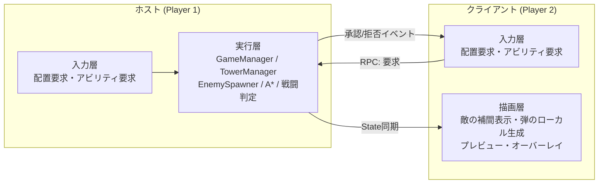
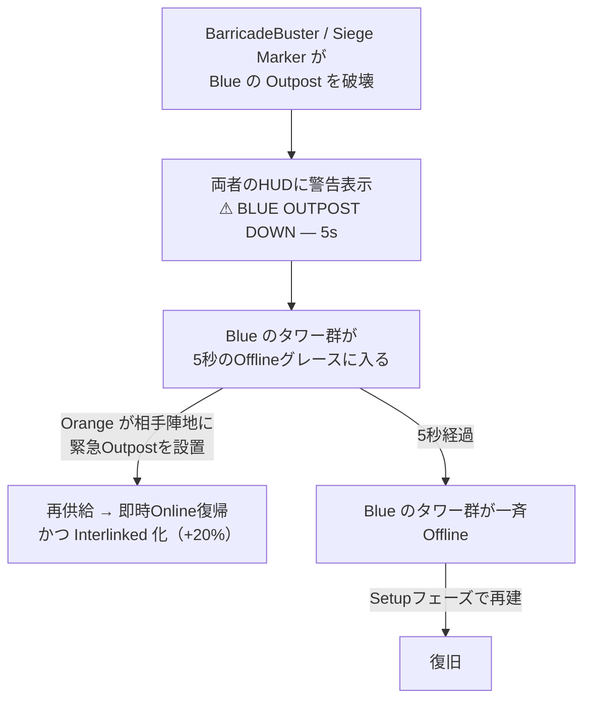
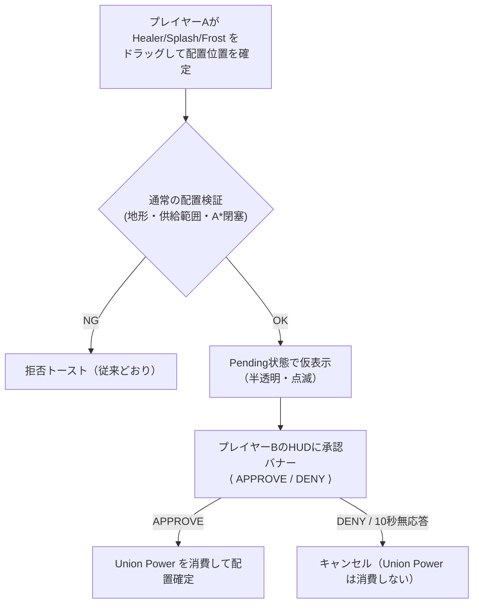

# CO-OPモード仕様書 (Step 4)

本ドキュメントは、既存のシングルプレイ用タワーディフェンスに **2人協力プレイ（CO-OPモード）** を追加するための設計仕様です。
Step 1〜3（Outpost化・供給ネットワーク・Offlineカスケード）で構築した資産を土台に、協力プレイでのみ成立するメカニクスを定義します。

> [!IMPORTANT]
> **本書は設計仕様であり、実装済みの内容ではありません。**
> 数値は既存の `ゲームバランス調整用仕様書.md` の実測値から導出した提案値です。実装後は同書と本書の双方を実測値へ更新してください。

---

## 0. 設計原則

| # | 原則 | 理由 |
| :---: | :--- | :--- |
| 1 | **協力の必然性をシステムで強制する** | 「1人プレイを2人で分担」に堕ちるのを防ぐ。単なる担当エリア分割では会話が生まれない |
| 2 | **難易度は「数」ではなく「同時性」で上げる** | 敵総数を2倍にするとWave 16で出現だけに160秒かかり冗長になる。**同時に複数箇所を守らせる**ことで2人プレイの価値を出す |
| 3 | **既存のシングルプレイを壊さない** | CO-OP用の分岐は `GameManager.IsCoop` 1箇所を基点にし、シングル時は従来値で動作させる |
| 4 | **ホストのみがシミュレートする** | 既存実装は `Random` を多用（同距離ターゲットのランダム選択、敵種別抽選、報酬抽選）しており、決定論ロックステップは同期ズレの温床になる |
| 5 | **コアとライフは共有、負けは連帯責任** | コアを2つに分けると片方が捨てゲーになり、協力の動機が消える |

---

## 1. ネットワーク方式：ホスト権威（Host-Authoritative）

### ■ 責務分担



- **実行層は必ずホストだけが動かします。** クライアント側では `GameManager.GameLoopCoroutine()`、`EnemySpawner`、`Tower.Update()` の戦闘処理、A*経路探索を一切実行しません。
- クライアントの操作は**すべて「要求（Request）」としてホストへ送られ、ホストが既存の検証ロジック（`GetPlacementRejectionReason()` 等）で判定**します。拒否理由のトーストも、ホストが要求元クライアントへ返します。
- **これにより、既存の `Random` 依存コードを一切書き換えずに済みます。** 本方式を選ぶ最大の理由です。

### ■ 同期対象と方式

| 対象 | 方式 | 帯域の見積もり |
| :--- | :--- | :--- |
| **敵** | **NetworkTransform は使わない。** ホストが 10Hz で全敵のスナップショット配列（`id: ushort` / `x, y: half` / `hp: half` / `flags: byte`＝約11バイト）を1メッセージにまとめて送信。クライアントは受信間を補間 | Wave 16（80体）で `80 × 11B × 10Hz ≒ 8.8KB/s`。実用範囲 |
| **弾** | **同期しない。** 「発射イベント（発射元タワーID・目標敵ID・エフェクト種別）」のみ送信し、クライアントは見た目の弾をローカル生成する。**命中・ダメージ判定はホストのみ**が行う | 発射頻度に比例。実質無視できる量 |
| **タワー** | イベント同期（配置確定 / 破壊 / 売却 / Online⇔Offline遷移 / 所有者）。数が少なく変化も低頻度 | 微少 |
| **供給ネットワーク** | 同期しない。**クライアント側で同じBFSを再計算**する（入力＝タワーの座標と所有者が同期済みなら結果は必ず一致する）。オーバーレイ表示のためにクライアントでも計算が必要 | ゼロ |
| **フェーズ / Wave / ライフ / 各コスト / アビリティCD** | `NetworkVariable` | 微少 |

> [!WARNING]
> **最大の改修点は「入力層と実行層の分離」です。**
> 現在 `TowerManager.Update()` は「マウス入力の取得 → 検証 → 生成」を1本の流れで行っています（`TryPlaceTowerAtMouse()`）。
> CO-OP化では、**入力取得とプレビュー表示（両者で実行）** と **検証・生成（ホストのみ）** を分離する必要があります。
> ここがネットワーク化の工数の大半を占めるため、**Step 4-1〜4-3 のゲームロジックは先にシングルプレイ上で実装・検証し、ネットワーク層は後追いで被せる**進め方を推奨します（本書 9章参照）。

### ■ シングルプレイとの共存

シングルプレイを「プレイヤー1人だけのホスト」として同一コードパスで動かします。分岐は `GameManager.IsCoop`（接続プレイヤー数 ≧ 2）のみとし、以下の値がこのフラグで切り替わります。

- コスト算出（4-3章）
- スポナー解放Wave・出現間隔・BarricadeBuster出現率（4-5章）
- Offlineグレース時間（4-2章）

---

## 2. プレイヤー識別とオーナーシップ（Step 4-1）

### ■ ownerId

- プレイヤーは `ownerId`（`0` = Blue / `1` = Orange）で識別します。シングルプレイでは常に `0` です。
- 以下のオブジェクトが `ownerId` を保持します。

| 対象 | 保持方法 | 用途 |
| :--- | :--- | :--- |
| `Tower` | `SpawnTower()` 時に要求元プレイヤーのIDを書き込み、以後不変 | 供給ネットワークの色分け、売却権限、Personal Buff の適用対象 |
| `Bullet` | `Tower.Shoot()` から発射元の `ownerId` を伝播 | 撃破ボーナスの帰属 |
| `Enemy` | `lastDamageOwnerId`（最後に自身へダメージを与えた `ownerId`） | 撃破ボーナスの帰属 |

### ■ 撃破ボーナスの帰属（Last Hit方式）

現在の `Enemy.Die()` は `GameManager.AddKill()` を引数なしで呼んでいます（[Enemy.cs:344](Assets/Scripts/Enemy.cs#L344)）。これを **`AddKill(int ownerId)`** に拡張し、`lastDamageOwnerId` を渡します。

- **Last Hit（最後にダメージを与えた側）方式**を採用します。ダメージ量按分（Assist配分）は実装が重い割に体感差が小さいためです。
- `Bullet.Seek()` は現在 `ownerId` を持たないため、`BulletEffects` 構造体に `OwnerId` フィールドを追加して伝播させます。
- **範囲ダメージ・貫通ダメージ**（`ApplySplashDamage()` / `ApplyPiercingDamage()`）で倒した敵も、その弾の `OwnerId` に帰属します。
- **Operator Ability による撃破**（Sync Combo の Shatter 等）は、発動者に帰属します。Sync Combo の場合は**両者に1カウントずつ**加算します（協力へのインセンティブ）。

### ■ 売却・削除の権限

| 操作 | 権限 |
| :--- | :--- |
| 自分のタワーの売却・削除 | **可能**（返還先は自分の Personal Cost） |
| 相手のタワーの売却・削除 | **不可**（右クリックしても反応しない。トースト `Not your tower` を表示） |
| 相手のタワーの射程表示トグル（左クリック） | **可能**（情報共有は制限しない） |

> [!NOTE]
> 相手タワーの売却を許可すると「勝手に売られた」という事故が起きます。CO-OPで最も避けるべき体験のため、**破壊的操作は必ず所有者本人に限定**します。

### ■ 視覚表現

- タワーのスプライトに **所有者カラーのアウトライン**（Blue: `(0.3, 0.6, 1.0)` / Orange: `(1.0, 0.6, 0.2)`）を付与します。
- 既存の色制御は `Tower.UpdateVisuals()` の1箇所に集約されている（フェーズ基礎色 × 供給状態）ため、**所有者カラーは `spriteRenderer.color` ではなくアウトライン（別スプライト or マテリアル）で表現**し、既存の合成ロジックに干渉させません。

---

## 3. Dual Supply Network（Step 4-2）

CO-OPの中核です。**供給ネットワークをプレイヤーごとに二重化**し、二人のネットワークをどこで噛み合わせるかを毎ウェーブの判断材料にします。

### ■ BFSの二系統化

`TowerManager.RecalculateSupplyNetwork()`（[TowerManager.cs:167](Assets/Scripts/TowerManager.cs#L167)）を **プレイヤーごとに2回走らせ**、結果を2組のキャッシュに保持します。

```csharp
// 現行: 単一のキャッシュ
private readonly HashSet<Tower> suppliedTowers;
private readonly Dictionary<Tower, int> supplyHops;

// CO-OP: プレイヤーごとに配列化（要素数はシングル時1、CO-OP時2）
private readonly HashSet<Tower>[] suppliedTowersByOwner;
private readonly Dictionary<Tower, int>[] supplyHopsByOwner;
```

- **始点:** プレイヤー `p` のBFSは、**`ownerId == p` のOutpostのみ**を深さ0の始点とします。
- **辺の張り方:** 供給半径 `2.5` は現行どおり。**所有者を問わず、あらゆるタワーを中継点にできます**（相手のタワーも中継可）。
- **計算量:** 現行BFSは `activeTowers` の全走査を含むため $O(N^2)$ です。これが2倍になりますが、呼び出しはタワー構成の変化時のみ（毎フレームではない）のため実用上問題ありません。

### ■ Relay Extension（相手経由でホップ上限が伸びる）

> [!IMPORTANT]
> **BFSの経路上で「相手所有のタワー」を1回以上経由した場合に限り、そのプレイヤーの `maxSupplyHops` が 2 → 3 に拡張されます。**

- BFSのノードに `usedAllyRelay: bool` を持たせ、相手所有タワーを踏んだ時点で `true` に切り替えます。
- 打ち切り判定を `currentHops >= (usedAllyRelay ? maxSupplyHops + 1 : maxSupplyHops)` に変更します。
- **設計意図:** 「二人で組むとネットワークが遠くまで伸びる」という協力の見返りを、既存パラメータの延長線上で表現します。単独プレイでは絶対に届かない位置に拠点を作れるため、**二人のOutpost配置を意図的に近づける動機**が生まれます。

### ■ Interlink（相互供給ノード）

**両プレイヤーの供給集合の両方に含まれるタワー**を **Interlinked** と定義します。

| 効果 | 内容 | 設計意図 |
| :--- | :--- | :--- |
| **Offline耐性** | 片方のネットワークから切断されても、もう片方から供給されている限り Online を維持 | Outpost破壊のリスクを二人で分散できる |
| **攻撃速度 +20%** | `fireRate × 1.2`（ヒーラーの回復速度にも適用） | 協力の見返りを数値で明示する |
| **視覚表現** | アウトラインを Blue/Orange のグラデーションで描画 | 一目で「噛み合っている」ことが分かる |

- 判定は `TowerManager.IsInterlinked(Tower)` として公開し、`Tower.UpdateStatsFromRewards()` の倍率計算に組み込みます。
- **Outpost自身は Interlink の対象外**です（供給元は常時稼働のため、概念が成立しません）。

### ■ Rescue（救援）

> [!IMPORTANT]
> **CO-OPモードでは、防衛フェーズ中のOutpost緊急設置を「相手の陣地でも」行えます。**
> 加えて、`Tower.offlineGraceDuration` を **CO-OP時のみ 3.0秒 → 5.0秒** に延長します。

- **延長の理由:** 3秒では「相方に気づいてもらい、口頭で伝え、カーソルを移動して設置する」時間が足りません。5秒あれば「叫んで助けを求める」体験が成立します。
- 相手のOutpostが破壊された瞬間、**両者のHUDに警告を表示**します（`⚠ ORANGE OUTPOST DOWN — 5s`）。カウントダウン付きで、画面外の場合は方向矢印を出します。
- 救援で設置したOutpostの**所有者は設置者本人**です。結果として、救援後は相手のタワー群が自分のネットワークにぶら下がる（＝Interlinkが自然発生する）ため、**救援そのものが Interlink ボーナスを生む**構造になります。



### ■ 配置判定への影響

`IsWithinSupplyRange()`（[TowerManager.cs:225](Assets/Scripts/TowerManager.cs#L225)）は、**要求元プレイヤーのネットワークのみ**を見て判定します。

- 「自分のタワーは自分のネットワークからしか置けない」が原則です。
- ただし**中継可能タワー（`CanRelaySupply`）の判定には相手のタワーも含まれる**ため、相手のタワーの隣に自分のタワーを置くことは可能です（Relay Extension が効く条件）。
- **供給範囲オーバーレイは、自分のネットワークのみを緑で表示**します。相手のネットワークは**薄いグレーの点線**で常時表示し、噛み合わせ位置を視認できるようにします。

### ■ 詰み防止（既存ルールの拡張）

現行の「盤面にOutpostが0個の間は供給チェックをスキップ」（`HasAnyOutpost()`）を、**プレイヤーごとの判定**に変更します。

- `HasAnyOutpost(int ownerId)` … そのプレイヤーのOutpostが0個の間だけ、そのプレイヤーの配置チェックをスキップ。
- `Tower.requiresSupply` も同様に、**配置時点で「配置者本人の」Outpostが存在したか**で確定させます。
- **これがないと、「相方がOutpostを置いた瞬間に、自分がOutpost無しで置いていたタワーが全滅する」という理不尽が発生します。** Step 3で単独プレイ向けに用意した猶予ルールと同じ問題が、CO-OPでは相手起因で起きうるためです。

---

## 4. リソース設計（Step 4-3）

### ■ 二層コスト

| 層 | 使用対象 | 所有 |
| :--- | :--- | :--- |
| **Personal Cost** | Outpost / Normal / Tank | プレイヤーごとに独立 |
| **Union Power** | Healer / Splash / Frost | 両者で共有（消費には**相手の承認が必要**） |

> [!NOTE]
> **なぜこの分け方か。**
> Outpost / Normal / Tank は「自分の陣地を成立させる最低限」であり、個人の裁量で即断すべきものです。
> 対して Healer / Splash / Frost は**射程・範囲・支援効果が盤面全体に及ぶ**ため、どちらの陣地に置くかで戦局が変わります。ここに承認を挟むことで、**Setupフェーズに必ず会話が発生**します。

### ■ 算出式

- **Personal Cost（各プレイヤー、Setupフェーズ開始時にリセット）**

  $$\text{Personal} = \left\lceil \frac{\min(6 + \min(\lfloor \text{Wave}/3 \rfloor,\ 4),\ 10)}{2} \right\rceil + \min\left(\left\lfloor \frac{\text{自分の前ウェーブ撃破数}}{10} \right\rfloor,\ 3\right)$$

  - 第1項は既存の `GetMaxCostForWave()` の**半分（切り上げ）**です。
  - 第2項は既存の撃破ボーナスと同一式ですが、**自分が倒した敵のみ**をカウントします（2章の帰属ルール）。

- **Union Power（共有、Wave 3以降。Setupフェーズ開始時にリセット）**

  $$\text{Union} = \begin{cases} 0 & (\text{Wave} \le 2) \\ 3 + \min(\lfloor \text{Wave}/3 \rfloor,\ 4) & (\text{Wave} \ge 3) \end{cases}$$

- **ウェーブ別の実効値:**

| Wave | シングル総コスト | Personal（各） | Union | **CO-OP総額** | 対シングル比 |
| :---: | :---: | :---: | :---: | :---: | :---: |
| 1-2 | `6` | `3` | `0` | **`6`** | ×1.00 |
| 3-5 | `7` | `4` | `4` | **`12`** | ×1.71 |
| 6-8 | `8` | `4` | `5` | **`13`** | ×1.63 |
| 9-11 | `9` | `5` | `6` | **`16`** | ×1.78 |
| 12+ | `10` | `5` | `7` | **`17`** | ×1.70 |

> [!IMPORTANT]
> **リソースは約1.7倍、圧力は約2倍（同時2レーン）に設定しています。**
> CO-OPをシングルよりやや厳しくすることで、Interlink ボーナスや Sync Combo を「取らないと足りない」状態にし、協力を必須化します。
> Wave 1-2 が ×1.00 なのは、この時点ではまだ1WAY（スポナー③のみ）であり、圧力が増えていないためです。
> Union Power が Wave 3 開始なのは、Healer の解禁Waveが 3 だからです（Wave 1-2 では使い道がありません）。

### ■ Union Power の承認フロー



- Pending中のタワーは**盤面を占有しません**（A*にも影響しません）。承認された瞬間に初めて実体化します。
- **同時に複数のPendingは持てません**（1件ずつ）。ロック中は両者のカードが一時的に操作不可になります。
- **自分が要求したものを自分で承認することはできません。** シングルプレイ時は Union Power の概念自体を無効化し、従来どおり単一コストで全種別を配置します。

> [!WARNING]
> **承認フローは「テンポを殺すリスク」があります。**
> 実装時は必ず**キーボードショートカット（例: `F` = APPROVE）**を用意し、10秒の無応答タイムアウトを設けてください。
> テンポ悪化が許容できない場合は、承認フローを外して「Union Power は先着順で消費できる共有プール」に退避する案（後述の代替案）へ切り替えます。

### ■ Transfer（コスト譲渡）

- Setupフェーズ中のみ、自分の Personal Cost を **1ずつ、1ウェーブ最大3**まで相手へ譲渡できます。
- 譲渡先での上限クランプは適用しません（受け取った側は Personal 上限を超過できる）。既存の `AddCost()` が上限クランプする実装（[GameManager.cs:191](Assets/Scripts/GameManager.cs#L191)）とは別経路にします。
- **設計意図:** 「今回のウェーブは君の側が本命だから任せる」という譲り合いを可能にします。承認フローより軽量なため、**Union Power が重すぎた場合の代替案としても機能します。**

### ■ 代替案（Union Power が機能しなかった場合）

承認フローのテンポ悪化が許容できない場合、以下へ段階的に後退できます。

1. **承認なしの共有プール** … Union Power は先着順で自由に消費可。会話は減るが取り合いの緊張感は残る
2. **Union Power 廃止＋ Transfer のみ** … 全タワーを Personal Cost で購入。Personal を $\lceil \text{base} \times 0.85 \rceil$ に引き上げて補填

---

## 5. Operator Ability（Step 4-4）

> [!IMPORTANT]
> **現状、防衛フェーズはOutpost緊急設置以外は観戦のみです。1人なら成立しますが、2人だと片方が完全に手持ち無沙汰になります。**
> CO-OP化で体感が最も変わるのがこの部分です。

### ■ 基本ルール

- 各プレイヤーはゲーム開始時に、下記4種から **2種を選択**します（非対称なビルドを促す）。
- **防衛（Defense）フェーズ中のみ**発動可能です。Setup / Reward フェーズでは使用できません。
- クールダウンは `Time.deltaTime` ベースで進行させ、**ゲーム速度倍率（x1.2〜x3.0）に自動追随**させます（既存のOfflineグレースと同方式）。
- 発動はホストが検証・実行します（クライアントは要求を送るのみ）。

### ■ アビリティ一覧

| 名称 | 効果 | 範囲 | CD |
| :--- | :--- | :---: | :---: |
| **Overcharge** | 指定タワー1基の攻撃速度を **×2.0 / 5秒**。ヒーラーの回復速度にも適用 | 単体 | `25秒` |
| **Field Repair** | 範囲内の全タワーを**最大HPの30%**即時回復。**被回復キャップ（15%/秒）を無視**する | 半径 `3.0` | `30秒` |
| **Freeze Zone** | 範囲内の全エネミーに **50%スロウ / 3秒**。既存の `Enemy.ApplySlow()` を経由するため、フロストタワーとの重ね掛けルール（強い方・長い方が優先）がそのまま適用される | 半径 `3.0` | `35秒` |
| **Taunt Beacon** | 範囲内の全エネミーのターゲットを指定地点へ **5秒間固定**。**ボスのエンレイジスタックをリセット**する | 半径 `4.0` | `45秒` |

> [!NOTE]
> **Taunt Beacon はボスのエンレイジ機構（5秒ごとに攻撃力 ×1.3 複利）への明確な対抗手段です。**
> 現状、エンレイジは「膠着を防ぐ」ために一方的に強化されるのみで、プレイヤー側に介入手段がありません。CO-OPではここに能動的な選択肢を与えます。
> ただし**上昇済みの `damage` 値は元に戻さず、スタックカウントとロック継続時間のみをリセット**します（既存のリセット条件と同じ挙動）。

### ■ Sync Combo

> [!IMPORTANT]
> **2人が「2秒以内」に「半径3.0以内」でアビリティを使用すると、強化版が発動します。**
> CO-OPらしさの核であり、「せーの！」という掛け声を生むための仕組みです。

| 組み合わせ | Combo名 | 効果 |
| :--- | :--- | :--- |
| Overcharge × Overcharge | **Full Burst** | 範囲 `3.0` 内の**全タワー**が攻撃速度 ×2.0 / 5秒 |
| Freeze Zone × Freeze Zone | **Deep Freeze** | 範囲 `3.0` 内の全エネミーが **70%スロウ / 8秒** |
| Field Repair × Field Repair | **Full Restore** | 範囲 `3.0` 内の全タワーを**全回復**し、Offlineグレースタイマーをリセット |
| Overcharge × Freeze Zone | **Shatter** | スロウ中のエネミーへ**追加固定ダメージ**（Wave基準HPの40%相当） |
| Taunt Beacon × 任意 | **Focus Fire** | Tauntで集めた敵に対し、もう一方の効果の**範囲を1.5倍**に拡大 |
| Field Repair × 任意 | **Reinforce** | 回復に加え、範囲内タワーのアーマー **+20% / 8秒**（上限90%は維持） |

- Combo成立時は**両者のCDを20%短縮**します（協力へのさらなるインセンティブ）。
- Combo成立を大きな画面エフェクトと効果音で明示します。**成功体験の可視化が最重要**です。
- 発動可能な組み合わせが揃っている間、相手のカーソル位置に**Combo可能インジケータ**を表示します。

---

## 6. 敵側の調整と新規エネミー（Step 4-5）

### ■ 調整方針：同時多方向圧（Split Pressure）

**総数は据え置き、スポナー解放を前倒しして「同時に守る箇所」を増やします。**

| 項目 | シングル | **CO-OP** | 根拠 |
| :--- | :---: | :---: | :--- |
| 総出現数 | `5 × Wave` | **据え置き** | 総数2倍はWave 16で出現に160秒かかり冗長 |
| 出現間隔 (`spawnInterval`) | `1.0秒` | **`0.7秒`** | 同数を短時間に集中させ、密度で圧力を出す。Wave 16 は 80秒 → 56秒 |
| 2WAY化（スポナー②） | Wave 7 | **Wave 4** | 2人なら2レーンを同時に守れる。CO-OPの前提を早期に成立させる |
| 3WAY化（スポナー④） | Wave 8 | **Wave 6** | 〃 |
| 4WAY化（スポナー①） | Wave 15 | **Wave 10** | 〃 |
| 5WAY化（スポナー⑤） | Wave 16 | **Wave 13** | 〃 |
| BarricadeBuster 出現率 | `8%` | **`12%`** | Offlineカスケード＝Rescue イベントをCO-OPの見せ場として頻発させる |
| BarricadeBuster 解禁Wave | `4` | **据え置き** | フロストタワー解禁と揃える設計意図を維持 |

> [!WARNING]
> **スポナー解放の前倒しには、`MapManager.ExpandMap()` の壁削除スケジュールの同期が必須です。**
> 現行の壁削除は $\text{minY} = -(\lfloor N/2 \rfloor + 1)$ / $\text{maxY} = \lfloor (N+1)/2 \rfloor$ という式で導出されており、
> **Wave 4 時点では $-3 \le y \le 2$ しか開放されていないため、スポナー②（`y = 3`）へ通じる隣接壁 `(-16, 4)` に届きません。**
> CO-OP時は式ではなく**明示的なテーブル**で壁削除範囲を定義し、スポナー解放Waveと整合させてください。

- **CO-OP時の壁削除テーブル（提案）:**

| クリアWave | 削除するY範囲 | 解放される壁 | アクティブスポナー |
| :---: | :--- | :--- | :--- |
| 1-2 | $-2 \le y \le 1$ | - | ③（1WAY） |
| 3 | $-3 \le y \le 4$ | 中上壁 `(-16, 4)` | ③ → **②③（2WAY）** |
| 4-5 | $-5 \le y \le 4$ | 中下壁 `(-16, -5)` | **②③④（3WAY）** |
| 6-9 | $-6 \le y \le 6$ | - | 3WAY |
| 10-12 | $-8 \le y \le 8$ | 上壁 `(-16, 8)` | **①②③④（4WAY）** |
| 13+ | $-9 \le y \le 8$ | 下壁 `(-16, -9)` | **全5WAY** |

### ■ 新規エネミー: Siege Marker

> [!IMPORTANT]
> **CO-OP専用の脅威です。特定のOutpostを「名指しで」「予告付きで」狙うことで、口頭連絡と事前準備の判断を強制します。**

| 項目 | 値 | 設計意図 |
| :--- | :---: | :--- |
| 解禁Wave | `6` | Rescue（4-2章）とアビリティ（4-4章）が揃った後 |
| 出現率 | `6%` | BarricadeBuster（12%）との合計18%。Wave 10（50体）で期待値3体 |
| 移動速度 | `1.2` | **遅い。** 予告から到達までに反応時間を作るため |
| 最大HP | `12.0` | Enemy3 相当。通常のウェーブスケーリングを適用 |
| 攻撃力 | `4.0` | Outpost（HP `20.0`）を**5発＝約10秒**で破壊。「間に合うかどうか」の緊張感を作る |
| 攻撃速度 | `0.5回/秒` | 〃 |
| 攻撃範囲 | `1.5` | BarricadeBuster と同じく、タワー射程 `3.0` の内側で停止させる |
| `ignoreTowers` | `false` | 障害物は迂回する |
| `avoidThreats` | `false` | 砲火を避けず直行する（予告どおりに来ることが重要） |

- **挙動:** 出現時に盤面のOutpostから1つをランダムに選び、**マーク**します。A*の目標をコアではなく**そのOutpost**に設定して直行し、到達後は破壊するまで攻撃を続けます。
- **マーク対象が消失した場合**（先に破壊された／売却された）は、**再マークせずコアへ向かいます**（挙動が読めなくなるのを防ぐため）。
- **BarricadeBuster との差別化:**

| | BarricadeBuster | **Siege Marker** |
| :--- | :--- | :--- |
| 狙う対象 | 進路上でたまたま射程に入ったOutpost | **特定のOutpostを名指し** |
| 予告 | なし | **あり**（出現と同時にHUD警告） |
| 破壊速度 | 約3秒で一撃 | 約10秒（5発） |
| 求められる対応 | 反射的な迎撃 | **事前の火力集中・アビリティ温存の判断** |

- **HUD警告:** 出現と同時に、両者の画面に `⚠ SIEGE INBOUND — BLUE OUTPOST (3)` のように**対象の所有者と識別番号**を表示し、対象Outpostに追跡マーカーを重ねます。画面外の場合は方向矢印を出します。

---

## 7. 報酬フェーズの暫定ルール

> [!NOTE]
> **報酬ドラフト（Personal Buff / Global Buff の分離、交互ピック）は今回の実装スコープ外ですが、2人になる以上、最低限の取り決めが必要です。**

- **暫定ルール:** 現行どおり3枚提示・1枚選択とし、**選択権をウェーブごとに交互**に持たせます（奇数Wave = Player 1 / 偶数Wave = Player 2）。
- 選択権のないプレイヤーの画面にもカードは表示され、**選択権者のホバー位置がリアルタイムで共有**されます（相談を可能にするため）。
- 効果は現行どおり**両プレイヤーの全タワーに適用**されます（Global扱い）。
- 将来的にドラフト制へ拡張する場合の想定は本書 10章の未決事項に記載します。

---

## 8. HUD / UI の追加要素

| 要素 | 内容 |
| :--- | :--- |
| **二人分のコスト表示** | 自分の Personal Cost を大きく、相手のものを小さく表示。Union Power は中央に共有ゲージとして配置 |
| **配置カードの状態** | Union Power で買う3種（Healer / Splash / Frost）はカード枠色を変え、Union残量で活性/非活性を切り替える |
| **相手カーソル** | 相手のマウス位置を所有者カラーのゴーストカーソルで常時表示。**「そこに置いて」が指差しで伝わる**ため、CO-OPでは費用対効果が非常に高い |
| **Union 承認バナー** | 画面中央上にPending内容（種別・位置プレビュー）と `APPROVE (F) / DENY (G)` を表示 |
| **アビリティバー** | 選択済み2種のアイコンとCDゲージ。Combo可能時は相手のアイコンが発光 |
| **警告レイヤー** | Outpost破壊警告（5秒カウントダウン）、Siege 予告、Offline発生通知。**画面外対象には方向矢印** |
| **貢献表示** | ウェーブ終了時に各プレイヤーの撃破数・与ダメージ・救援回数を表示。**協力ゲームでは貢献の可視化がモチベーションを支える** |

---

## 9. 実装ステップと影響範囲

### ■ 推奨する進め方

> [!IMPORTANT]
> **ネットワーク層（4-0）を最初に完成させないでください。**
> Step 4-1〜4-3 のゲームロジックは**シングルプレイ上で「所有者を切り替えながら1人で両方操作する」形で実装・検証**でき、その方がバランス調整の反復が圧倒的に速く回ります。
> ネットワーク層は 4-1〜4-3 が固まってから被せるのが最も安全です。

| Step | 内容 | 依存 | ネットワーク依存 |
| :---: | :--- | :--- | :---: |
| **4-1** | `ownerId` の導入、撃破ボーナスの帰属、売却権限、所有者アウトライン | なし | なし |
| **4-2** | Dual Supply Network（BFS二系統化 / Relay Extension / Interlink / Rescue / 詰み防止のプレイヤー別化） | 4-1 | なし |
| **4-3** | Personal Cost / Union Power / Transfer、HUD二人分表示 | 4-1 | 承認フローのみ要 |
| **4-4** | Operator Ability と Sync Combo | 4-2 | なし（発動位置のみ同期） |
| **4-5** | 敵側の調整、壁削除テーブル、Siege Marker | なし | なし |
| **4-0** | ネットワーク基盤（Netcode導入、入力層/実行層の分離、スナップショット同期、承認フロー） | 4-1〜4-5 | — |

### ■ 影響ファイル一覧

| ファイル | 主な改修内容 | Step |
| :--- | :--- | :---: |
| `GameManager.cs` | `IsCoop` フラグ、Personal/Union の二層コスト、`AddKill(int ownerId)`、コスト算出式の分岐 | 4-1 / 4-3 |
| `TowerManager.cs` | BFSの二系統化、`Relay Extension`、`IsInterlinked()`、`HasAnyOutpost(int)`、`IsWithinSupplyRange()` のプレイヤー別化、入力層/実行層の分離、Union承認フロー | 4-2 / 4-3 / 4-0 |
| `Tower.cs` | `ownerId`、`requiresSupply` のプレイヤー別確定、Interlinkによる `fireRate` 補正、CO-OP時のグレース5秒、所有者アウトライン、売却権限判定 | 4-1 / 4-2 |
| `Bullet.cs` | `BulletEffects` へ `OwnerId` を追加し、直撃・範囲・貫通の各ダメージ経路へ伝播 | 4-1 |
| `Enemy.cs` | `lastDamageOwnerId`、Siege Marker の挙動（`SetupSiegeMarker()`）、Taunt Beacon への応答、`AddKill(ownerId)` 呼び出し | 4-1 / 4-4 / 4-5 |
| `EnemySpawner.cs` | CO-OP時の `spawnInterval`、Siege Marker の抽選、BarricadeBuster出現率の分岐 | 4-5 |
| `MapManager.cs` | CO-OP時の壁削除テーブル（式ではなくテーブル駆動へ）、スポナー解放Waveの分岐 | 4-5 |
| `HUDManager.cs` | 二人分コスト表示、Union承認バナー、アビリティバー、警告レイヤー、相手カーソル、貢献表示 | 全般 |
| `RewardManager.cs` | 選択権の交互制御、ホバー位置の共有 | 4-3 |
| **新規** `OperatorAbilityManager.cs` | アビリティの発動・CD管理・Sync Combo判定 | 4-4 |
| **新規** `CoopSessionManager.cs` | プレイヤー登録、`ownerId` 割り当て、接続管理 | 4-0 |
| **新規** `NetworkSyncManager.cs` | 敵スナップショット送信、発射イベント、要求RPC群 | 4-0 |

---

## 10. 未決事項

| # | 項目 | 選択肢 |
| :---: | :--- | :--- |
| 1 | **Union Power の承認フロー** | テンポ悪化が許容できない場合、4-3章の代替案（先着共有プール / 廃止＋Transfer強化）へ後退する。**実機での検証が必須** |
| 2 | **報酬ドラフト（旧案5）の採否** | Personal Buff（効果1.5〜2倍・自分のタワーのみ）と Global Buff の分離、5枚提示の交互ピック。**取得総量が増えるためインフレ検証が必要** |
| 3 | **アビリティの選択タイミング** | ゲーム開始時に固定 / ウェーブごとに変更可 / 報酬で解禁していく |
| 4 | **切断時の挙動** | ホスト切断＝セッション終了。クライアント切断時に、残ったプレイヤーがそのタワー群を継承するか、Offlineのまま放置するか |
| 5 | **3人以上への拡張** | 本仕様は2人前提（Interlink・Sync Combo が2人固定）。3人以上は当面対象外とする |
| 6 | **Siege Marker の対象選択** | 完全ランダム / 「最も多くのタワーを供給しているOutpost」を狙う（＝より痛い場所を突く）。後者は理不尽になりやすいため要検証 |
