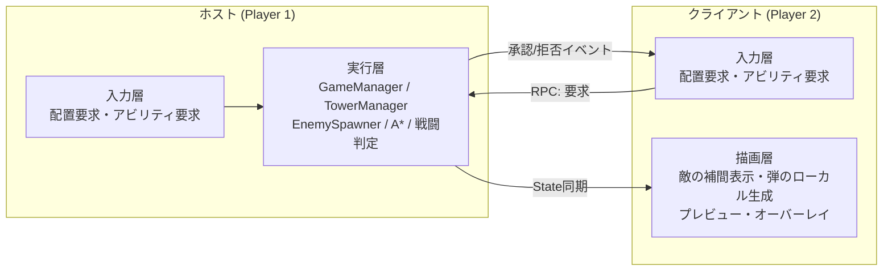
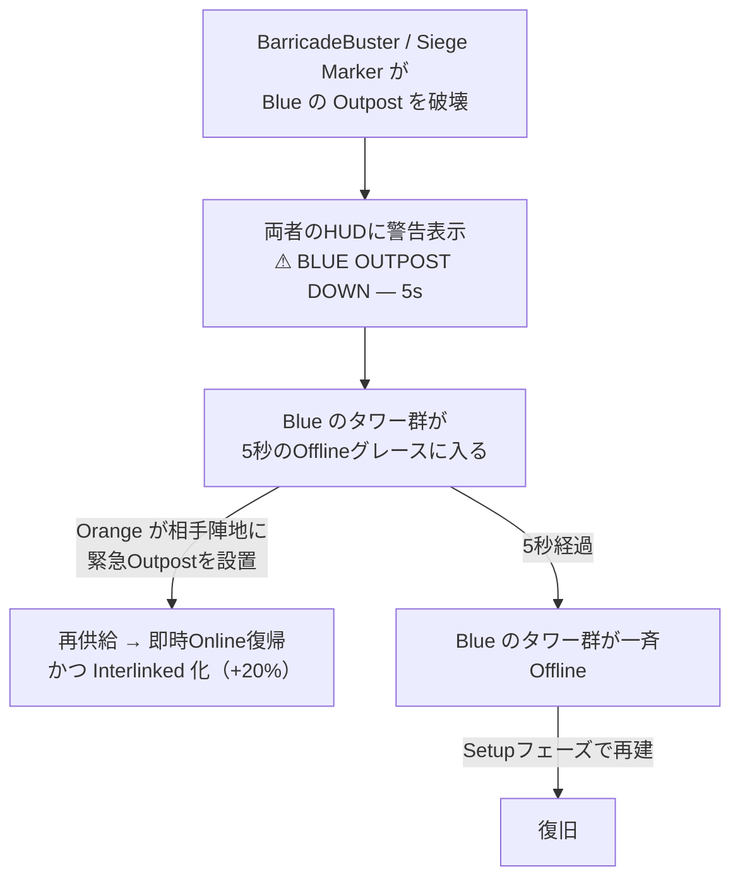
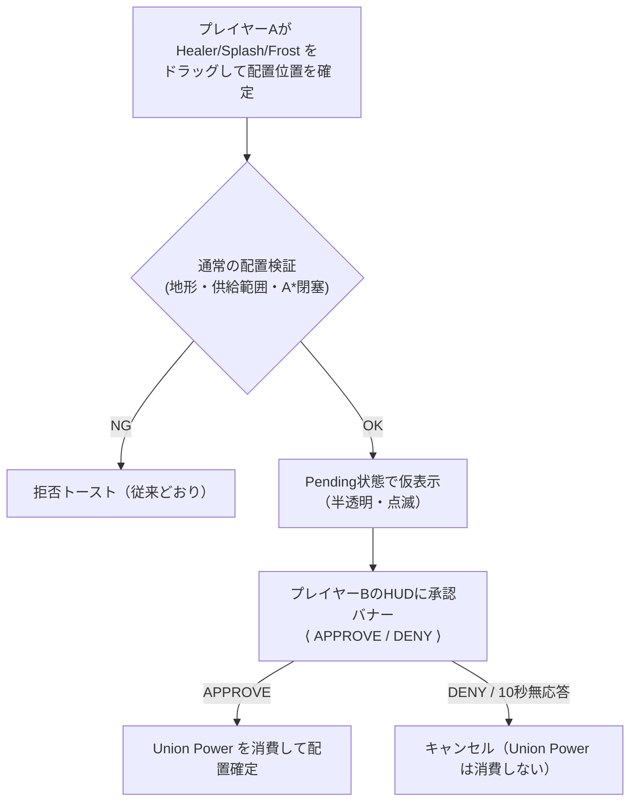

# CO-OPモード仕様書 (Step 4)

本ドキュメントは、既存のシングルプレイ用タワーディフェンスに **2人協力プレイ（CO-OPモード）** を追加するための設計仕様です。
Step 1〜3（Outpost化・供給ネットワーク・Offlineカスケード）で構築した資産を土台に、協力プレイでのみ成立するメカニクスを定義します。

> [!IMPORTANT]
> **本書は設計仕様であり、実装済みの内容ではありません。**
> 数値は既存の `ゲームバランス調整用仕様書.md` の実測値から導出した提案値です。実装後は同書と本書の双方を実測値へ更新してください。

---

## 0. 設計原則

| # | 原則 | 理由 |
| :---: | :--- | :--- |
| 1 | **協力の必然性をシステムで強制する** | 「1人プレイを2人で分担」に堕ちるのを防ぐ。単なる担当エリア分割では会話が生まれない |
| 2 | **難易度は「数」ではなく「同時性」で上げる** | 敵総数を2倍にするとWave 16で出現だけに160秒かかり冗長になる。**同時に複数箇所を守らせる**ことで2人プレイの価値を出す |
| 3 | **既存のシングルプレイを壊さない** | CO-OP用の分岐は `GameManager.IsCoop` 1箇所を基点にし、シングル時は従来値で動作させる |
| 4 | **ホストのみがシミュレートする** | 既存実装は `Random` を多用（同距離ターゲットのランダム選択、敵種別抽選、報酬抽選）しており、決定論ロックステップは同期ズレの温床になる |
| 5 | **コアとライフは共有、負けは連帯責任** | コアを2つに分けると片方が捨てゲーになり、協力の動機が消える |

---

## 1. ネットワーク方式：ホスト権威（Host-Authoritative）

### ■ 責務分担



- **実行層は必ずホストだけが動かします。** クライアント側では `GameManager.GameLoopCoroutine()`、`EnemySpawner`、`Tower.Update()` の戦闘処理、A*経路探索を一切実行しません。
- クライアントの操作は**すべて「要求（Request）」としてホストへ送られ、ホストが既存の検証ロジック（`GetPlacementRejectionReason()` 等）で判定**します。拒否理由のトーストも、ホストが要求元クライアントへ返します。
- **これにより、既存の `Random` 依存コードを一切書き換えずに済みます。** 本方式を選ぶ最大の理由です。

### ■ 同期対象と方式

| 対象 | 方式 | 帯域の見積もり |
| :--- | :--- | :--- |
| **敵** | **NetworkTransform は使わない。** ホストが 10Hz で全敵のスナップショット配列（`id: ushort` / `x, y: half` / `hp: half` / `flags: byte`＝約11バイト）を1メッセージにまとめて送信。クライアントは受信間を補間 | Wave 16（80体）で `80 × 11B × 10Hz ≒ 8.8KB/s`。実用範囲 |
| **弾** | **同期しない。** 「発射イベント（発射元タワーID・目標敵ID・エフェクト種別）」のみ送信し、クライアントは見た目の弾をローカル生成する。**命中・ダメージ判定はホストのみ**が行う | 発射頻度に比例。実質無視できる量 |
| **タワー** | イベント同期（配置確定 / 破壊 / 売却 / Online⇔Offline遷移 / 所有者）。数が少なく変化も低頻度 | 微少 |
| **供給ネットワーク** | 同期しない。**クライアント側で同じBFSを再計算**する（入力＝タワーの座標と所有者が同期済みなら結果は必ず一致する）。オーバーレイ表示のためにクライアントでも計算が必要 | ゼロ |
| **フェーズ / Wave / ライフ / 各コスト / アビリティCD** | `NetworkVariable` | 微少 |

> [!WARNING]
> **最大の改修点は「入力層と実行層の分離」です。**
> 現在 `TowerManager.Update()` は「マウス入力の取得 → 検証 → 生成」を1本の流れで行っています（`TryPlaceTowerAtMouse()`）。
> CO-OP化では、**入力取得とプレビュー表示（両者で実行）** と **検証・生成（ホストのみ）** を分離する必要があります。
> ここがネットワーク化の工数の大半を占めるため、**Step 4-1〜4-3 のゲームロジックは先にシングルプレイ上で実装・検証し、ネットワーク層は後追いで被せる**進め方を推奨します（本書 9章参照）。

### ■ シングルプレイとの共存

シングルプレイを「プレイヤー1人だけのホスト」として同一コードパスで動かします。分岐は `GameManager.IsCoop`（接続プレイヤー数 ≧ 2）のみとし、以下の値がこのフラグで切り替わります。

- コスト算出（4-3章）
- スポナー解放Wave・出現間隔・BarricadeBuster出現率（4-5章）
- Offlineグレース時間（4-2章）

---

## 2. プレイヤー識別とオーナーシップ（Step 4-1）

### ■ ownerId

- プレイヤーは `ownerId`（`0` = Blue / `1` = Orange）で識別します。シングルプレイでは常に `0` です。
- 以下のオブジェクトが `ownerId` を保持します。

| 対象 | 保持方法 | 用途 |
| :--- | :--- | :--- |
| `Tower` | `SpawnTower()` 時に要求元プレイヤーのIDを書き込み、以後不変 | 供給ネットワークの色分け、売却権限、Personal Buff の適用対象 |
| `Bullet` | `Tower.Shoot()` から発射元の `ownerId` を伝播 | 撃破ボーナスの帰属 |
| `Enemy` | `lastDamageOwnerId`（最後に自身へダメージを与えた `ownerId`） | 撃破ボーナスの帰属 |

### ■ 撃破ボーナスの帰属（Last Hit方式）

現在の `Enemy.Die()` は `GameManager.AddKill()` を引数なしで呼んでいます（[Enemy.cs:344](Assets/Scripts/Enemy.cs#L344)）。これを **`AddKill(int ownerId)`** に拡張し、`lastDamageOwnerId` を渡します。

- **Last Hit（最後にダメージを与えた側）方式**を採用します。ダメージ量按分（Assist配分）は実装が重い割に体感差が小さいためです。
- `Bullet.Seek()` は現在 `ownerId` を持たないため、`BulletEffects` 構造体に `OwnerId` フィールドを追加して伝播させます。
- **範囲ダメージ・貫通ダメージ**（`ApplySplashDamage()` / `ApplyPiercingDamage()`）で倒した敵も、その弾の `OwnerId` に帰属します。
- **Operator Ability による撃破**（Sync Combo の Shatter 等）は、発動者に帰属します。

> [!NOTE]
> **実装時の変更（Step 4-4）:** 当初案の「Sync Combo による撃破は両者に1カウントずつ加算する」は実装していません。
> 既存の撃破カウントは `Enemy.lastDamageOwnerId` による Last Hit 方式の1経路のみで、両者加算のためにこの経路を改造するのは実装コストに見合わないためです。
> 代わりに、**Shatter 等の Sync Combo ダメージによる撃破は「コンボを成立させた側（2人目に発動したプレイヤー）」に帰属**させます。`OperatorAbilityManager` がコンボ効果を適用する直前に `Enemy.SetLastDamageOwner(triggeringOwnerId)` を呼んでから `Enemy.TakeDamage()` を呼ぶことで、既存の Last Hit 経路をそのまま再利用しています。1人目の発動者には撃破カウントが入りませんが、Combo成立自体のCD短縮・大きな画面演出が協力へのインセンティブとして機能する設計です。詳細は5章末尾の実装状況を参照してください。

### ■ 売却・削除の権限

| 操作 | 権限 |
| :--- | :--- |
| 自分のタワーの売却・削除 | **可能**（返還先は自分の Personal Cost） |
| 相手のタワーの売却・削除 | **不可**（右クリックしても反応しない。トースト `Not your tower` を表示） |
| 相手のタワーの射程表示トグル（左クリック） | **可能**（情報共有は制限しない） |

> [!NOTE]
> 相手タワーの売却を許可すると「勝手に売られた」という事故が起きます。CO-OPで最も避けるべき体験のため、**破壊的操作は必ず所有者本人に限定**します。

### ■ 視覚表現

- タワーのスプライトに **所有者カラーのアウトライン**（Blue: `(0.3, 0.6, 1.0)` / Orange: `(1.0, 0.6, 0.2)`）を付与します。
- 既存の色制御は `Tower.UpdateVisuals()` の1箇所に集約されている（フェーズ基礎色 × 供給状態）ため、**所有者カラーは `spriteRenderer.color` ではなくアウトライン（別スプライト or マテリアル）で表現**し、既存の合成ロジックに干渉させません。
- **所有者カラーのバッジ（Step 4-6・追加実装）:** アウトラインに加えて、タワー右上に所有者カラーの小さな正方形バッジをタワー本体より手前に表示します。通常タワー（`Tower.prefab`）のスプライトが青色であるため、Blue所有者のアウトラインがスプライト自体の色と同化して視認できない不具合が実機確認で見つかったための対策です。バッジはタワー本体より必ず手前（`sortingOrder`が親より大きい）に描画するため、スプライトの色に関係なく所有者を判別できます。

### ■ 実装状況（Step 4-1・実装済み）

> 本節のみ実装済みです。他章（3章以降）は引き続き設計仕様のままです。

| 項目 | 実装箇所 | 内容 |
| :--- | :--- | :--- |
| CO-OPフラグ | `GameManager.forceCoopMode`（`[SerializeField]`） / `GameManager.IsCoop` | Inspector上のGameManagerコンポーネントで手動ON/OFF。ネットワーク層(Step 4-0)実装までのローカルデバッグ用 |
| 操作プレイヤー切替 | `GameManager.ActiveOwnerId` / `GameManager.OnActiveOwnerChanged` | CO-OP時のみ **Tabキー**で0⇔1をトグル（`GameManager.Update()`内） |
| 撃破カウント | `GameManager.AddKill(int ownerId)` / `GameManager.GetKillCount(int ownerId)` / `GameManager.KillCount`（合計、既存互換） | 内部は `private int[] killCounts = new int[2]`。Setup開始時に両要素を0リセット。撃破ボーナス計算は仕様通り合計値を使用（Step 4-3まで未分離） |
| タワー所有者 | `Tower.OwnerId`（`{ get; private set; } = 0`） / `Tower.SetOwner(int ownerId)` | `TowerManager.SpawnTower()` が `Instantiate()` 直後（`Start()`実行前）に `SetOwner(GameManager.Instance.ActiveOwnerId)` を呼ぶ |
| 売却・削除の権限制御 | `Tower.OnMouseOver()` | CO-OP時、`OwnerId != GameManager.Instance.ActiveOwnerId` なら右クリックの売却処理を中断し `HUDManager.Instance.ShowToast("Not your tower")` を表示。左クリックの射程トグルは無制限のまま |
| 所有者アウトライン | `Tower.CreateOwnerOutline()` / `Tower.UpdateOwnerOutlineAlpha()` | CO-OP時のみ `Start()` で子`SpriteRenderer`（`OwnerOutline`、`localScale ×1.18`、`sortingOrder`は親-1）を生成。`UpdateVisuals()`から毎回アルファのみ親に追随させ、色は`spriteRenderer.color`と完全に独立させている。シングルプレイでは生成されない |
| 所有者バッジ（Step 4-6追加） | `Tower.CreateOwnerBadge()` / `Tower.UpdateOwnerBadgeVisual()` / `Tower.GetOrCreateBadgeSprite()` | 通常タワーのスプライト色（青）とBlueのアウトライン色が同化して判別できない問題への対策。CO-OP時のみ `Start()` で子`SpriteRenderer`（`OwnerBadge`、右上 `localPosition (0.32, 0.32, -1)`、`localScale 0.3`、`sortingOrder`は親+2で本体より必ず手前）を生成し、視認性向上のため背後にわずかに大きい黒縁（`OwnerBadgeBorder`、`localScale 0.36`、`sortingOrder`は親+1）を重ねる。正方形スプライトは外部アセットに依存せず`Texture2D`から実行時生成し、全タワーで1枚だけ共有する静的キャッシュとしてリークを防ぐ。色・アルファの更新経路はアウトラインと共通化（`ComputeOwnerVisualColorRGB()`）し、Interlink中の脈動もアウトラインと同じ位相になる。`Barricade`（Outpost）にも生成され、既存の識別番号ラベル（`OutpostNumberLabel`、下部）とは表示位置が重ならない |
| 撃破帰属（Last Hit） | `BulletEffects.OwnerId` / `Bullet.HitTarget()` / `Bullet.ApplySplashDamage()` / `Bullet.ApplyPiercingDamage()` / `Enemy.SetLastDamageOwner(int)` / `Enemy.lastDamageOwnerId` | `Tower.Shoot()`が発射時に`OwnerId`を`BulletEffects`へ積む。`Bullet`は直撃・範囲・貫通の3経路すべてで、`Enemy.TakeDamage()`を呼ぶ直前に`SetLastDamageOwner(effects.OwnerId)`を呼ぶ。`Enemy.Die()`は`GameManager.Instance.AddKill(lastDamageOwnerId)`を呼ぶ |
| HUD表示 | `HUDManager.Instance`（静的参照） / `HUDManager.CreateActiveOwnerIndicator()` / `HUDManager.UpdateActiveOwnerIndicator(int)` | CO-OP時のみトップバー中央（PhaseTextとCostTextの間）に `PLAYER 1 (BLUE)` / `PLAYER 2 (ORANGE)` を所有者カラーで表示。`OnActiveOwnerChanged`購読で更新。二人分のコスト表示・Union承認バナー等（Step 4-3）は未実装 |

**動作確認手順（Unity Editor）**

1. Hierarchy上のGameManagerを選択し、Inspectorの `Force Coop Mode` にチェックを入れる（再生前でも再生中でも可）
2. プレイ再生後、Tabキーを押すたびに画面上部中央のインジケータが `PLAYER 1 (BLUE)` ⇔ `PLAYER 2 (ORANGE)` に切り替わることを確認する
3. 各プレイヤーでタワーを設置し、子オブジェクトに所有者カラーの縁取りと、右上の所有者カラーバッジが付くことを確認する（特に通常タワーはスプライトが青いため、Blueのアウトラインだけでは判別しづらいことがあるが、バッジで判別できることを確認する）
4. 相手プレイヤーとして操作中に、自分以外が置いたタワーを右クリックしても売却されず、トースト `Not your tower` が出ることを確認する（左クリックの射程表示は誰のタワーでも切り替えられる）
5. `Force Coop Mode` を外した状態（シングルプレイ）では、アウトラインもバッジも生成されず、Tabキーも無反応で、右クリック売却が誰のタワーでも従来通り機能することを確認する

**仕様との差分**

- `HUDManager` は既存実装で `SingletonBehaviour<T>` を継承していないため、仕様書中の疑似コード的表現 `HUDManager.ShowToast(...)` は実装上 `HUDManager.Instance.ShowToast(...)` となる（`HUDManager`に最小限の静的`Instance`参照を追加）。他は仕様どおり。

---

## 3. Dual Supply Network（Step 4-2）

CO-OPの中核です。**供給ネットワークをプレイヤーごとに二重化**し、二人のネットワークをどこで噛み合わせるかを毎ウェーブの判断材料にします。

### ■ BFSの二系統化

`TowerManager.RecalculateSupplyNetwork()`（[TowerManager.cs:167](Assets/Scripts/TowerManager.cs#L167)）を **プレイヤーごとに2回走らせ**、結果を2組のキャッシュに保持します。

```csharp
// 現行: 単一のキャッシュ
private readonly HashSet<Tower> suppliedTowers;
private readonly Dictionary<Tower, int> supplyHops;

// CO-OP: プレイヤーごとに配列化（要素数はシングル時1、CO-OP時2）
private readonly HashSet<Tower>[] suppliedTowersByOwner;
private readonly Dictionary<Tower, int>[] supplyHopsByOwner;
```

- **始点:** プレイヤー `p` のBFSは、**`ownerId == p` のOutpostのみ**を深さ0の始点とします。
- **辺の張り方:** 供給半径 `2.5` は現行どおり。**所有者を問わず、あらゆるタワーを中継点にできます**（相手のタワーも中継可）。
- **計算量:** 現行BFSは `activeTowers` の全走査を含むため $O(N^2)$ です。これが2倍になりますが、呼び出しはタワー構成の変化時のみ（毎フレームではない）のため実用上問題ありません。

### ■ Relay Extension（相手経由でホップ上限が伸びる）

> [!IMPORTANT]
> **BFSの経路上で「相手所有のタワー」を1回以上経由した場合に限り、そのプレイヤーの `maxSupplyHops` が 2 → 3 に拡張されます。**

- BFSのノードに `usedAllyRelay: bool` を持たせ、相手所有タワーを踏んだ時点で `true` に切り替えます。
- 打ち切り判定を `currentHops >= (usedAllyRelay ? maxSupplyHops + 1 : maxSupplyHops)` に変更します。
- **設計意図:** 「二人で組むとネットワークが遠くまで伸びる」という協力の見返りを、既存パラメータの延長線上で表現します。単独プレイでは絶対に届かない位置に拠点を作れるため、**二人のOutpost配置を意図的に近づける動機**が生まれます。

### ■ Interlink（相互供給ノード）

**両プレイヤーの供給集合の両方に含まれるタワー**を **Interlinked** と定義します。

| 効果 | 内容 | 設計意図 |
| :--- | :--- | :--- |
| **Offline耐性** | 片方のネットワークから切断されても、もう片方から供給されている限り Online を維持 | Outpost破壊のリスクを二人で分散できる |
| **攻撃速度 +20%** | `fireRate × 1.2`（ヒーラーの回復速度にも適用） | 協力の見返りを数値で明示する |
| **視覚表現** | アウトラインの色をBlue/Orangeの間で時間経過とともに脈動（Lerp）させる | 一目で「噛み合っている」ことが分かる |

> [!NOTE]
> **実装時の変更（Step 4-2）:** 当初案の「グラデーション描画」は、既存のOwnerOutline（単色SpriteRenderer）へ実装するには複数色を同時に表現する手段（マテリアル分割やシェーダー）が別途必要で工数が重いため、**単色を時間経過でLerpさせる脈動方式**に変更しました。実装コストが低いうえ、静止画のグラデーションより視認性が高いため採用しています。

- 判定は `TowerManager.IsInterlinked(Tower)` として公開し、`Tower.UpdateStatsFromRewards()` の倍率計算に組み込みます。
- **Outpost自身は Interlink の対象外**です（供給元は常時稼働のため、概念が成立しません）。

### ■ Rescue（救援）

> [!IMPORTANT]
> **CO-OPモードでは、防衛フェーズ中のOutpost緊急設置を「相手の陣地でも」行えます。**
> 加えて、`Tower.offlineGraceDuration` を **CO-OP時のみ 3.0秒 → 5.0秒** に延長します。

- **延長の理由:** 3秒では「相方に気づいてもらい、口頭で伝え、カーソルを移動して設置する」時間が足りません。5秒あれば「叫んで助けを求める」体験が成立します。
- 相手のOutpostが破壊された瞬間、**両者のHUDに警告を表示**します（`⚠ ORANGE OUTPOST DOWN — 5s`）。カウントダウン付きで表示されます。
- 救援で設置したOutpostの**所有者は設置者本人**です。結果として、救援後は相手のタワー群が自分のネットワークにぶら下がる（＝Interlinkが自然発生する）ため、**救援そのものが Interlink ボーナスを生む**構造になります。

> [!NOTE]
> **実装時の変更（Step 4-2）:** 当初案にあった「画面外の場合は方向矢印を出す」は実装していません。本プロジェクトの `CameraFitter` はフィールド全域を常に画面内に収める設計のため、警告対象（Outpost）が画面外になることは構造上あり得ず、方向矢印が必要になる状況が発生しません。



### ■ 配置判定への影響

`IsWithinSupplyRange()`（[TowerManager.cs:225](Assets/Scripts/TowerManager.cs#L225)）は、**要求元プレイヤーのネットワークのみ**を見て判定します。

- 「自分のタワーは自分のネットワークからしか置けない」が原則です。
- ただし**中継可能タワー（`CanRelaySupply`）の判定には相手のタワーも含まれる**ため、相手のタワーの隣に自分のタワーを置くことは可能です（Relay Extension が効く条件）。
- **供給範囲オーバーレイは、自分のネットワークを従来どおり緑で表示**します。相手のネットワークは**薄いグレーの塗りつぶし**で、**自分がドラッグ中のときのみ**重ねて表示し、噛み合わせ位置を視認できるようにします。

> [!NOTE]
> **実装時の変更（Step 4-2）:** 当初案の「常時表示」「点線」は以下の理由で変更しました。
> - **常時表示 → ドラッグ中のみ表示:** 噛み合わせ位置を検討するのはタワー配置のドラッグ中だけであり、常時表示すると盤面が煩雑になるため。
> - **点線 → 低アルファの塗りつぶし:** 既存の `TowerRangeIndicator`（塗りつぶし円）を流用しており、点線表現への変更は別途描画実装が必要で工数が重いため、色とアルファ値（`(0.7, 0.7, 0.7, 0.18)`）だけで自分のネットワーク（緑）と区別する方式にしました。

### ■ 詰み防止（既存ルールの拡張）

現行の「盤面にOutpostが0個の間は供給チェックをスキップ」（`HasAnyOutpost()`）を、**プレイヤーごとの判定**に変更します。

- `HasAnyOutpost(int ownerId)` … そのプレイヤーのOutpostが0個の間だけ、そのプレイヤーの配置チェックをスキップ。
- `Tower.requiresSupply` も同様に、**配置時点で「配置者本人の」Outpostが存在したか**で確定させます。
- **これがないと、「相方がOutpostを置いた瞬間に、自分がOutpost無しで置いていたタワーが全滅する」という理不尽が発生します。** Step 3で単独プレイ向けに用意した猶予ルールと同じ問題が、CO-OPでは相手起因で起きうるためです。

### ■ 実装状況（Step 4-2・実装済み）

> 本節までが実装済みです。4章以降は引き続き設計仕様のままです。

| 項目 | 実装箇所 | 内容 |
| :--- | :--- | :--- |
| BFSの二系統化 | `TowerManager.suppliedTowersByOwner[2]` / `supplyHopsByOwner[2]` / `relayableTowersByOwner[2]` / `RecalculateSupplyNetwork()` / `RecalculateSupplyNetworkForOwner(int ownerId)` | 要素数2固定の配列。`RecalculateSupplyNetwork()`は`GameManager.IsCoop`を見て、シングル時はowner 0のみ、CO-OP時は0と1の両方で`RecalculateSupplyNetworkForOwner()`を実行する。各プレイヤーのBFSは`IsBarricade && OwnerId == p`のOutpostのみを深さ0の始点とし、中継点は所有者を問わない |
| Relay Extension | `RecalculateSupplyNetworkForOwner()`内の`Queue<(Tower tower, bool usedAllyRelay)> frontier`、`Dictionary<Tower, int>[] hopsByState`、`CanRelaySupply(Tower, int)` | ノード拡張時に`neighborAllyRelay = currentAllyRelay \|\| other.OwnerId != ownerId`で伝播させ、展開の打ち切り判定を`currentHops >= (usedAllyRelay ? maxSupplyHops + 1 : maxSupplyHops)`に変更。FIFOキューで各状態について最初に確定した深さを上書きしない性質は維持している。**探索状態の管理方法は下記「不具合修正（コードレビュー対応）」を参照** |
| 公開API改修 | `TowerManager.IsTowerSupplied(Tower)` / `IsTowerSuppliedBy(Tower, int)`（新規） / `IsInterlinked(Tower)`（新規） / `GetSupplyHops(Tower)` / `CanRelaySupply(Tower, int)`（シグネチャ変更） / `HasAnyOutpost(int)`（シグネチャ変更、引数なし版も「どちらかにOutpostがあるか」として残置） / `IsWithinSupplyRange(TowerType, Vector3Int, int)`（シグネチャ変更、private） | `IsTowerSupplied`は`suppliedTowersByOwner[0] \|\| [1]`のOR判定に変更（＝Interlinkの Offline耐性はこの定義だけで自動的に成立する）。`IsInterlinked`は両方の集合に含まれるか（Outpost自身とシングルプレイでは常にfalse）。`GetSupplyHops`は両ネットワークの最小値を返す |
| 配置判定のプレイヤー別化 | `TowerManager.GetPlacementRejectionReason()` / `IsWithinSupplyRange()` | 要求元プレイヤー（`GameManager.Instance.ActiveOwnerId`）のネットワークのみで供給範囲を判定する。詰み防止も`HasAnyOutpost(ownerId)`によりプレイヤー別に判定する |
| `requiresSupply`のプレイヤー別確定 | `Tower.Start()` | `TowerManager.HasAnyOutpost()`（引数なし）から`HasAnyOutpost(OwnerId)`（配置者本人のOutpostの有無）に変更 |
| Interlink・攻撃速度+20% | `Tower.UpdateStatsFromRewards()` / `Tower.ApplyRewardStats()`（報酬バフ算出部を分離） / `Tower.wasInterlinked` | 報酬バフ確定後の最後に`if (TowerManager.Instance.IsInterlinked(this)) fireRate *= 1.2f;`を掛ける。`Tower.Update()`で毎フレーム`IsInterlinked()`を安価に参照し、前フレームと状態が変わった時だけ`UpdateStatsFromRewards()`を呼び直す（毎フレーム呼ばない） |
| Interlink・視覚表現（脈動） | `Tower.UpdateOwnerOutlineVisual()`（旧`UpdateOwnerOutlineAlpha()`から改名・拡張） | Interlink中は`Color.Lerp(OwnerColorBlue, OwnerColorOrange, (Mathf.Sin(Time.time * 3f) + 1f) * 0.5f)`でアウトライン色を脈動させる。非Interlink時は従来どおり所有者カラー固定 |
| Rescue・グレースタイム延長 | `Tower.coopOfflineGraceDuration`（`[SerializeField]`、既定5.0秒） / `Tower.EffectiveOfflineGraceDuration`（プロパティ） | CO-OP時のみ5秒、シングル時は従来の`offlineGraceDuration`（既定3.0秒）を使う。両方ともInspectorで個別に調整可能 |
| Rescue・HUD警告バナー | `HUDManager.ShowOutpostDownWarning(int ownerId)` / `HUDManager.CreateOutpostWarningBanner()` / `Tower.Die()` | CO-OP時、Outpost破壊の瞬間に`Tower.Die()`から呼ばれる。画面中央上部（Wave Startボタン下）に`⚠ BLUE OUTPOST DOWN — 5s`／`⚠ ORANGE OUTPOST DOWN — 5s`を所有者カラーで表示し、`Time.deltaTime`ベースでカウントダウンして0で消える |
| Rescue・相手陣地への緊急設置 | 追加実装なし（既存の`IsWithinSupplyRange()`が`TowerType.Barricade`を常に`true`で返す仕様のまま） | Outpostは供給範囲チェックの対象外のため、CO-OP時に相手陣地へ緊急設置しても元から拒否されない。動作確認手順で実機確認済み |
| 供給範囲オーバーレイの2色化 | `TowerManager.supplyZoneIndicatorsOwn` / `supplyZoneIndicatorsAlly` / `UpdateSupplyZoneOverlay()` | 自分のネットワークは従来どおり緑（`(0.3, 1, 0.4, 0.35)`）、CO-OP時は相手のネットワークを薄いグレー（`(0.7, 0.7, 0.7, 0.18)`）で重ねて表示する。相手側の表示は`UpdateSupplyZoneOverlay()`自体がドラッグ中しか呼ばれないため、自然に「ドラッグ中のみ」表示になる |

### ■ 不具合修正（コードレビュー対応）

Step 4-2実装後のコードレビューで2件の不具合が見つかり、以下の通り修正しました。

**不具合1: Interlinkの攻撃速度+20%が多重適用され、際限なく増幅する**

- **原因:** `Tower.ApplyRewardStats()`は`Speed UP`報酬を1回も取得していない場合、`fireRate`の再計算分岐（`counts.TryGetValue(...)`が`false`）を素通りしていた。一方`Tower.UpdateStatsFromRewards()`はInterlink成立時に`fireRate *= 1.2f`と**現在値への乗算**で+20%を適用していたため、`Speed UP`未取得の状態でInterlinkのON/OFFが繰り返されるたびに`fireRate`が1.2倍・1.44倍…と複利で増幅し続けていた。
- **修正:** `ApplyRewardStats()`の攻撃速度分岐を、報酬未取得（`frCount == 0`）でも必ず`fireRate = baseFireRate * (1f + frCount * 0.1f)`が実行される形に変更（`TryGetValue`の結果を`frCount`のデフォルト値0に反映するだけで、常に`baseFireRate`から再構築する）。あわせて`UpdateStatsFromRewards()`の`RewardManager.Instance == null`経路でも`fireRate = baseFireRate;`でリセットしてからInterlink倍率を掛けるようにした。これにより`fireRate`は毎回必ず`baseFireRate × 報酬倍率 × (Interlink中なら1.2)`に収束し、ON/OFFを繰り返しても増幅しない。damage / Range / maxHp / armorの分岐は今回の修正対象外で変更していない。

**不具合2: Relay Extensionの発動がタワーの配置順に依存して不安定**

- **原因:** `RecalculateSupplyNetworkForOwner()`のBFSは、訪問済み判定と`usedAllyRelay`フラグの確定を**「タワー単体」**を訪問状態として行っていた。同じ深さのノードへ「自チーム経由（`usedAllyRelay = false`）」と「相手タワー経由（`usedAllyRelay = true`）」の2つの経路が両方存在する場合、`activeTowers`の走査順（＝タワーの配置順）次第でどちらが先にキューから取り出され確定するかが変わり、`CanRelaySupply()`の結果、ひいてはRelay Extensionの発動可否が配置順に左右されていた。
- **修正:** BFSの訪問状態を**「タワー単体」ではなく「(タワー, usedAllyRelayフラグ) の組」**として扱うよう変更。具体的には`Dictionary<Tower, int> hopsByState[0]`（`usedAllyRelay = false`側）と`hopsByState[1]`（`usedAllyRelay = true`側）の2本を独立に持ち、`Queue<(Tower tower, bool usedAllyRelay)>`でその組をキューに積んで幅優先探索する。各状態は最初に確定したホップ数（＝最小ホップ数）を上書きしない。探索完了後、2状態を統合して以下を導出する。
  - **供給済みか（`suppliedTowersByOwner`）:** いずれかの状態で到達していれば供給済み
  - **ホップ数（`supplyHopsByOwner`）:** 到達した状態のうち最小のホップ数
  - **中継可能か（新設のキャッシュ`relayableTowersByOwner`、`CanRelaySupply()`が参照）:** 到達した**いずれかの状態**が「ホップ数 < その状態の上限（`usedAllyRelay = false`なら`maxSupplyHops`、`true`なら`maxSupplyHops + 1`）」を満たせば中継可能。「`usedAllyRelay = false`で深さ2（上限2なので中継不可）」と「`usedAllyRelay = true`で深さ2（上限3なので中継可）」の両方に到達している場合も正しく中継可能と判定される
  - これにより、盤面の見た目（タワーの位置関係）が同じであれば、配置順によらず常に同じ判定結果になる。
- **シングルプレイでの一致確認:** シングルプレイ（`GameManager.IsCoop == false`）では`RecalculateSupplyNetworkForOwner(0)`しか実行されず、盤面上のタワーは全て`OwnerId == 0`である（相手タワーが存在しない）。このため`neighborAllyRelay = currentAllyRelay || other.OwnerId != ownerId`の`other.OwnerId != ownerId`は恒常的に`false`となり、`usedAllyRelay`は始点（Outpost、常に`false`）から一切`true`に遷移しない。結果として`hopsByState[1]`（`true`側）は常に空集合のままとなり、`hopsByState[0]`（`false`側）だけで構成される探索結果はStep 3時点の単一状態BFSと構造的に完全に一致する（コードの読解による確認。Unity Editorのbatchmode起動によるコンパイル検証は本タスクの制約により未実施）。

**動作確認手順（Unity Editor）**

1. Hierarchy上のGameManagerを選択し、Inspectorの `Force Coop Mode` にチェックを入れて再生する
2. **Relay Extension:** Player 1（Blue）でOutpostを1つ設置し、その供給範囲ぎりぎり外（2ホップ超の位置）にPlayer 2（Orange）のOutpostと数基のタワーを繋げて配置する。Tabキーで操作プレイヤーを切り替えながら、Blue側のタワーがOrange側のタワーを中継して`maxSupplyHops + 1`（既定3ホップ）まで供給が届くこと、ドラッグ中の緑オーバーレイがその範囲まで伸びることを確認する
3. **Interlink:** 両プレイヤーのOutpostから中継して同じ1基のタワーに両ネットワークを届かせる（例: BlueとOrangeのOutpostをタワー数基で橋渡しする）。対象タワーのアウトラインがBlue/Orange間で脈動し始めること、攻撃間隔が目視で速くなる（またはHealerなら回復頻度が上がる）ことを確認する
4. **Offline耐性:** Interlink状態のタワーについて、片方のプレイヤーのOutpostだけを削除（Setup中に右クリック、または破壊）し、もう片方のネットワークから供給され続けている限りOfflineにならないことを確認する
5. **Rescue:** Defenseフェーズ中に一方のOutpostを破壊させる（デバッグ的に近くへ通常タワーを置かず、BarricadeBusterに壊させるか、Inspector上で該当TowerのHPを直接減らして確認してもよい）。破壊の瞬間、画面中央上部に所有者カラーの警告バナー（`⚠ BLUE OUTPOST DOWN — 5s`等）が表示されカウントダウンすること、もう一方のプレイヤーが相手陣地へ緊急Outpostを設置でき、設置した瞬間に供給が復帰しInterlinkが成立することを確認する
6. **詰み防止のプレイヤー別化:** Player 1がOutpostを1つも置かずに通常タワーを配置し、その後Player 2がOutpostを配置しても、Player 1が置いたタワーが一斉Offlineにならないことを確認する
7. `Force Coop Mode` を外した状態（シングルプレイ）で、上記のいずれの挙動も発生せず（アウトラインの脈動なし、グレースは3秒のまま、警告バナーは出ない、供給オーバーレイは緑のみ）、Step 2/3時点と完全に同一の挙動になることを確認する

**仕様との差分**

- **Interlinkの視覚表現:** 当初案の「グラデーション描画」を「Blue/Orange間の脈動（Lerp）」に変更（詳細は本章「Interlink」節のNOTEを参照）
- **供給範囲オーバーレイ:** 「相手ネットワークの常時表示・点線」を「ドラッグ中のみ表示・低アルファの塗りつぶし」に変更（詳細は本章「配置判定への影響」節のNOTEを参照）
- **Rescueの警告:** 「画面外の場合は方向矢印を出す」を削除（`CameraFitter`によりフィールド全域が常に画面内に収まるため不要。詳細は本章「Rescue」節のNOTEを参照）

---

## 4. リソース設計（Step 4-3）

### ■ 二層コスト

| 層 | 使用対象 | 所有 |
| :--- | :--- | :--- |
| **Personal Cost** | Outpost / Normal / Tank | プレイヤーごとに独立 |
| **Union Power** | Healer / Splash / Frost | 両者で共有（消費には**相手の承認が必要**） |

> [!NOTE]
> **なぜこの分け方か。**
> Outpost / Normal / Tank は「自分の陣地を成立させる最低限」であり、個人の裁量で即断すべきものです。
> 対して Healer / Splash / Frost は**射程・範囲・支援効果が盤面全体に及ぶ**ため、どちらの陣地に置くかで戦局が変わります。ここに承認を挟むことで、**Setupフェーズに必ず会話が発生**します。

### ■ 算出式

- **Personal Cost（各プレイヤー、Setupフェーズ開始時にリセット）**

  $$\text{Personal} = \left\lceil \frac{\min(6 + \min(\lfloor \text{Wave}/3 \rfloor,\ 4),\ 10)}{2} \right\rceil + \min\left(\left\lfloor \frac{\text{自分の前ウェーブ撃破数}}{10} \right\rfloor,\ 3\right)$$

  - 第1項は既存の `GetMaxCostForWave()` の**半分（切り上げ）**です。
  - 第2項は既存の撃破ボーナスと同一式ですが、**自分が倒した敵のみ**をカウントします（2章の帰属ルール）。

- **Union Power（共有、Wave 3以降。Setupフェーズ開始時にリセット）**

  $$\text{Union} = \begin{cases} 0 & (\text{Wave} \le 2) \\ 3 + \min(\lfloor \text{Wave}/3 \rfloor,\ 4) & (\text{Wave} \ge 3) \end{cases}$$

- **ウェーブ別の実効値:**

| Wave | シングル総コスト | Personal（各） | Union | **CO-OP総額** | 対シングル比 |
| :---: | :---: | :---: | :---: | :---: | :---: |
| 1-2 | `6` | `3` | `0` | **`6`** | ×1.00 |
| 3-5 | `7` | `4` | `4` | **`12`** | ×1.71 |
| 6-8 | `8` | `4` | `5` | **`13`** | ×1.63 |
| 9-11 | `9` | `5` | `6` | **`16`** | ×1.78 |
| 12+ | `10` | `5` | `7` | **`17`** | ×1.70 |

> [!IMPORTANT]
> **リソースは約1.7倍、圧力は約2倍（同時2レーン）に設定しています。**
> CO-OPをシングルよりやや厳しくすることで、Interlink ボーナスや Sync Combo を「取らないと足りない」状態にし、協力を必須化します。
> Wave 1-2 が ×1.00 なのは、この時点ではまだ1WAY（スポナー③のみ）であり、圧力が増えていないためです。
> Union Power が Wave 3 開始なのは、Healer の解禁Waveが 3 だからです（Wave 1-2 では使い道がありません）。

### ■ Union Power の承認フロー



- Pending中のタワーは**盤面を占有しません**（A*にも影響しません）。承認された瞬間に初めて実体化します。
- **同時に複数のPendingは持てません**（1件ずつ）。ロック中は両者のカードが一時的に操作不可になります。
- **自分が要求したものを自分で承認することはできません。** シングルプレイ時は Union Power の概念自体を無効化し、従来どおり単一コストで全種別を配置します。

> [!WARNING]
> **承認フローは「テンポを殺すリスク」があります。**
> 実装時は必ず**キーボードショートカット（例: `F` = APPROVE）**を用意し、10秒の無応答タイムアウトを設けてください。
> テンポ悪化が許容できない場合は、承認フローを外して「Union Power は先着順で消費できる共有プール」に退避する案（後述の代替案）へ切り替えます。

### ■ Transfer（コスト譲渡）

- Setupフェーズ中のみ、自分の Personal Cost を **1ずつ、1ウェーブ最大3**まで相手へ譲渡できます。
- 譲渡先での上限クランプは適用しません（受け取った側は Personal 上限を超過できる）。既存の `AddCost()` が上限クランプする実装（[GameManager.cs:191](Assets/Scripts/GameManager.cs#L191)）とは別経路にします。
- **設計意図:** 「今回のウェーブは君の側が本命だから任せる」という譲り合いを可能にします。承認フローより軽量なため、**Union Power が重すぎた場合の代替案としても機能します。**

### ■ 代替案（Union Power が機能しなかった場合）

承認フローのテンポ悪化が許容できない場合、以下へ段階的に後退できます。

1. **承認なしの共有プール** … Union Power は先着順で自由に消費可。会話は減るが取り合いの緊張感は残る
2. **Union Power 廃止＋ Transfer のみ** … 全タワーを Personal Cost で購入。Personal を $\lceil \text{base} \times 0.85 \rceil$ に引き上げて補填

### ■ 実装状況（Step 4-3・実装済み）

> 本節までが実装済みです。5章以降は引き続き設計仕様のままです。

| 項目 | 実装箇所 | 内容 |
| :--- | :--- | :--- |
| 二層コスト・算出式 | `GameManager.GetPersonalCost(int)` / `UnionPower` / `GetMaxPersonalCostForWave(int)` / `GetMaxUnionPowerForWave(int)` / `MaxPersonalCostForCurrentWave` / `MaxUnionPowerForCurrentWave` | `GameLoopCoroutine()`のSetupフェーズ開始処理内で、`IsCoop`のときのみ追加で計算・リセットする（シングルプレイ用の既存`cost`算出はそのまま残し、一切変更していない）。Personal第1項は`Mathf.CeilToInt(GetMaxCostForWave(wave)/2f)`、第2項はプレイヤー別`GetKillCount(ownerId)`ベースの撃破ボーナス。Unionは`wave<=2`なら`0`、`wave>=3`なら`3+Mathf.Min(wave/3,4)`。撃破カウントのリセット(`killCounts[0]=0;killCounts[1]=0;`)より前に読むことで、リセット前の値を正しくボーナスに反映させている |
| 二層コスト・消費/返還 | `GameManager.SpendPersonalCost(int,int)` / `AddPersonalCost(int,int)` / `SpendUnionPower(int)` / `AddUnionPower(int)` | `AddPersonalCost`/`AddUnionPower`はそのウェーブの上限（撃破ボーナスを含まない`personalCostCapForWave`/`unionPowerCapForWave`）でクランプする。既存の`SpendCost()`/`AddCost()`（単一プール）はシングルプレイ専用として意味を一切変えず残置した |
| 配置時の消費経路の振り分け | `TowerManager.TryPlaceTowerAtMouse()` | CO-OP時、Personal系（Outpost/Normal/Tank）は要求元プレイヤー本人の`SpendPersonalCost(requesterId, cost)`から即時消費。Union系（Healer/Splash/Frost）は即時消費せず`StartUnionPendingRequest()`で承認待ちへ回す。シングルプレイ時は従来どおり`SpendCost()`のみを使う |
| 売却・返還時の振り分け | `Tower.TryRefundAndDestroy()` | CO-OP時、`TowerManager.IsUnionPoolType(towerType)`で判定し、Personal系は売却した所有者本人の`AddPersonalCost(OwnerId, buildCost)`へ、Union系は`AddUnionPower(buildCost)`へ返還する。売却権限は既にStep 4-1で所有者本人に限定済みのため、Union系タワーの売却にも承認は不要（仕様どおり）。シングルプレイ時は従来どおり`AddCost()`のみを使う |
| Union Power承認フロー | `TowerManager.HasPendingUnionRequest` / `PendingUnionType` / `PendingUnionRequesterId` / `PendingUnionSecondsRemaining` / `StartUnionPendingRequest()` / `ApproveUnionRequest()` / `ClearPendingUnionRequest()` / `UpdateUnionPendingState()` / `OnUnionPendingStateChanged` | 要求は同時に1件のみ保持（`hasPendingUnionRequest`）。`StartDragPlacement()`と`TryPlaceTowerAtMouse()`の両方でPending中の新規要求を拒否し、両者の配置カード操作不可はHUD側で表現する。Pending中は`CreatePendingUnionGhost()`が既存の`CreateGhostPreview()`（当たり判定・攻撃ロジックを全て無効化した見た目のみのGameObject）を流用し、`UpdateUnionPendingState()`で毎フレームアルファを`Time.time`ベースで点滅させる。**`MapManager.SetTowerOccupant()`・`ChangePlacedCount()`・`RecalculateSupplyNetwork()`はいずれも承認時の`SpawnTower()`内でしか呼ばれないため、Pending中は盤面を一切占有しない。** タイムアウト(既定10秒)は`Time.deltaTime`ベースで`UpdateUnionPendingState()`が進行させ、ゲーム速度倍率に自動追随する |
| 承認/拒否のキー入力 | `TowerManager.UpdateUnionPendingState()`内の`Input.GetKeyDown(KeyCode.F)` / `KeyCode.G` | Fキー(承認)は`GameManager.Instance.ActiveOwnerId != pendingUnionRequesterId`のときのみ受理する（自分の要求を自分で承認できない）。ネットワーク層(Step 4-0)が未実装の現段階では、Tabキーで要求元と異なるプレイヤーへ`ActiveOwnerId`を切り替えてからFキーを押すことでこの条件を満たせる。Gキー(拒否)は要求元本人による自己キャンセルも含め誰でも押せる。Setupフェーズが終了した場合は`HandlePhaseChanged()`（フェーズ変更の瞬間）と`UpdateUnionPendingState()`（毎フレームの保険）の両方でPendingを自動キャンセルする |
| Transfer（コスト譲渡） | `GameManager.TryTransferCost(int)` / `TransferRemaining` / `TransferMaxPerWave`(`3`) | `GameManager.Update()`内、CO-OP時かつSetupフェーズ中のみTキーで`ActiveOwnerId`から相手へ1コスト譲渡する。譲渡先は`AddPersonalCost()`を経由せず配列へ直接加算するため上限クランプを適用しない（受け取った側は上限を超過できる）。譲渡回数はSetupフェーズ開始時に`TransferMaxPerWave`(3)にリセットする |
| HUD: 二層コスト表示 | `HUDManager.CreateCoopResourceBar()` / `UpdatePersonalCostTexts()` / `UpdateUnionGaugeDisplay()` / `UpdateTransferText()` / `RefreshCoopResourceBar()` | トップバーのすぐ下に専用の行（`CoopResourceBar`、高さ42px）を追加し、Step 4-1の`PLAYER 1 (BLUE)`インジケータ（トップバー中央）とは別の行のため競合しない。CO-OP時のみ表示し、シングルプレイでは非表示のまま既存の`CostText`をそのまま表示し続ける。「自分」＝`GameManager.ActiveOwnerId`のPersonal Costを大きく（22px）、「相手」を控えめに（18px）所有者カラーで表示し、Tabキーでの切替のたびに引き直す。Union Powerは中央に塗りつぶしバー(`Image.Type.Filled`)による共有ゲージ（18px）として表示し、Transfer残数（18px）と合わせて同一行内のフォントサイズを揃える。トップバー(54px)＋`CoopResourceBar`(42px)の合計高さは`HUDManager.TopStackHeight`として公開し、下段のPAUSE/倍速ボタン・Wave Startボタン・トーストの配置基準に使う |
| HUD: 配置カードの活性/非活性・枠色 | `HUDManager.UpdateCardState()` / `UpdateCardFrameColor()` | Union系3種（Healer/Splash/Frost）はCO-OP時のみ`UnityEngine.UI.Outline`コンポーネントで枠色を紫系に変え、他の種別と区別する。Union Powerの残量が配置コスト未満、またはUnion Power承認のPending中は、種別を問わず全カードを非活性（半透明・ドラッグ不可）にする |
| HUD: Union承認バナー | `HUDManager.CreateUnionApprovalBanner()` / `UpdateUnionApprovalBanner()` | 画面中央上部に`{所有者} requests {種別名} — APPROVE (F) / DENY (G) — {残り秒数}s`の形式で表示する。Union承認はSetupフェーズ中にしか存在せず、同じくSetupフェーズ中はWave Startボタンが表示されている（CO-OP時は`TopStackHeight+36px`の位置まで下がる）ため、その下に潜り込むY座標(-200px)に配置する。Outpost破壊警告バナー(`OutpostWarningBanner`、Y座標-170px)はDefenseフェーズ中にしか発生せずWave Startボタンとは時間的に排他的なため、位置を分けても競合しない |

**動作確認手順（Unity Editor）**

1. Hierarchy上のGameManagerを選択し、Inspectorの `Force Coop Mode` にチェックを入れて再生する
2. **二層コストの表示確認:** Setupフェーズ開始時、トップバー直下にCO-OP専用の行が現れ、`YOU: 3/3`（自分、所有者カラー）・`ALLY: 3/3`（相手、控えめな色）・中央に`UNION: 0/0`のゲージ・右に`TRANSFER: 3 LEFT (T)`が表示されることを確認する（Wave 1-2はUnion Powerが`0`のため、Healer/Splash/Frostのカードが枠色は紫だが非活性表示になっていることも確認する）
3. **Personal Costでの配置:** Normal/Tank/Outpostをドラッグして配置し、`YOU`側の数値のみが減ることを確認する。Tabキーで操作プレイヤーを切り替えると、`YOU`/`ALLY`の表示が入れ替わることを確認する
4. **Union Power承認フロー（Wave 3以降）:** Wave 3のSetupフェーズで`UNION: 4/4`になっていることを確認したのち、Blue（Player 1）でHealerをドラッグして配置位置を確定する。画面中央上部に`BLUE requests Healer — APPROVE (F) / DENY (G) — 10s`のバナーが出て、そのHealerが半透明・点滅の仮表示のまま盤面に留まることを確認する。この状態でFキーを押しても（要求元と同じBlueのままのため）何も起きないことを確認したのち、**Tabキーを押してPlayer 2（Orange）に切り替え、Fキーを押す**と、Healerが実体化してUnion Powerが消費されることを確認する（＝「Blueで要求→TabでOrangeに切替→Fで承認」の操作列が成立する）
5. **拒否とタイムアウト:** 別のUnion系タワーを要求し、Gキーを押すとPendingが即座にキャンセルされUnion Powerが消費されないことを確認する。また、要求後10秒間何も押さずに待つと、自動的にキャンセルされることを確認する（バナーの残り秒数表示が0に近づいて消える）
6. **Pending中のロック確認:** Union系タワーの要求中（承認待ち）に、他の配置カード（Normal等）をドラッグしようとしても反応しないこと、カードが薄く表示されていることを確認する。Pending中はそのタワーが`MapManager`上のセルを占有していない（＝A*の経路計算に影響しない）ことを、Pending位置を塞ぐような配置を試みても他のタワー配置が妨げられないことで間接的に確認する
7. **売却の返還先:** Personal系タワー（Normal/Tank/Outpost）を自分で売却すると`YOU`（自分のPersonal Cost）が増え、承認済みのUnion系タワー（Healer/Splash/Frost）を自分で売却すると中央の`UNION`ゲージが増えることを確認する
8. **Transfer:** Setupフェーズ中にTキーを押すと、操作中プレイヤーの`YOU`が1減り、相手（Tabで切り替えて確認）の`YOU`が1増え、`TRANSFER`の残り回数が1減ることを確認する。3回使い切るとTキーが反応しなくなることを確認する
9. `Force Coop Mode` を外した状態（シングルプレイ）で、CO-OP専用の行・Union承認バナー・Transfer表示が一切現れず、既存の`COST: x/y`表示のみで、Wave 1-2は`6`、Wave 3-5は`7`など`ゲームバランス調整用仕様書.md`1章の記載どおりに全種別を単一プールから購入できることを確認する

**上表の実効値（実装後の検算）**

`GameManager.GetMaxCostForWave(wave)`と本節の算出式から、Wave境界（1,2,3,4,5,6,7,8,9,10,11,12,13）の全てで以下が成立することを確認済み（ブラケット内で値が変化しないことも含めて検算済み）。

| Wave | Personal（各） | Union | CO-OP総額 | シングル |
| :---: | :---: | :---: | :---: | :---: |
| 1-2 | `3` | `0` | `6` | `6` |
| 3-5 | `4` | `4` | `12` | `7` |
| 6-8 | `4` | `5` | `13` | `8` |
| 9-11 | `5` | `6` | `16` | `9` |
| 12+ | `5` | `7` | `17` | `10` |

**仕様との差分**

- **Union承認バナーの表示位置:** 仕様書8章では「画面中央上」とのみ記載されていたため、実装ではWave Startボタンの下に潜り込むY座標(-200px)を採用した（Setup限定で表示されるWave Startボタンと重ならないようにするため。Outpost破壊警告バナーとはY座標を分けたが、Defense限定で時間的に排他的なためどちらにせよ実害はない）。詳細は上表「HUD: Union承認バナー」を参照
- **配置カードの枠色表現:** 「カード枠の色を変える」の具体的な実装手段として`UnityEngine.UI.Outline`コンポーネントを採用した（既存の`Image.color`による活性/非活性表現と競合させないため）
- その他、設計仕様からの変更点は無い

---

## 5. Operator Ability（Step 4-4）

> [!IMPORTANT]
> **現状、防衛フェーズはOutpost緊急設置以外は観戦のみです。1人なら成立しますが、2人だと片方が完全に手持ち無沙汰になります。**
> CO-OP化で体感が最も変わるのがこの部分です。

### ■ 基本ルール

- 各プレイヤーはゲーム開始時に、下記4種から **2種を選択**します（非対称なビルドを促す）。
- 選択は**試合開始前に1回だけ**行い、選んだ2種は**試合中ずっと固定**です（途中変更・追加不可）。詳しくは下記「■ 選択画面」を参照してください。
- **防衛（Defense）フェーズ中のみ**発動可能です。Setup / Reward フェーズでは使用できません。
- クールダウンは `Time.deltaTime` ベースで進行させ、**ゲーム速度倍率（x1.2〜x3.0）に自動追随**させます（既存のOfflineグレースと同方式）。
- 発動はホストが検証・実行します（クライアントは要求を送るのみ）。

### ■ アビリティ一覧

| 名称 | 効果 | 範囲 | CD |
| :--- | :--- | :---: | :---: |
| **Overcharge** | 指定タワー1基の攻撃速度を **×2.0 / 5秒**。ヒーラーの回復速度にも適用 | 単体 | `25秒` |
| **Field Repair** | 範囲内の全タワーを**最大HPの30%**即時回復。**被回復キャップ（15%/秒）を無視**する | 半径 `3.0` | `30秒` |
| **Freeze Zone** | 範囲内の全エネミーに **50%スロウ / 3秒**。既存の `Enemy.ApplySlow()` を経由するため、フロストタワーとの重ね掛けルール（強い方・長い方が優先）がそのまま適用される | 半径 `3.0` | `35秒` |
| **Taunt Beacon** | 範囲内の全エネミーのターゲットを指定地点へ **5秒間固定**。**ボスのエンレイジスタックをリセット**する | 半径 `4.0` | `45秒` |

> [!NOTE]
> **Taunt Beacon はボスのエンレイジ機構（5秒ごとに攻撃力 ×1.3 複利）への明確な対抗手段です。**
> 現状、エンレイジは「膠着を防ぐ」ために一方的に強化されるのみで、プレイヤー側に介入手段がありません。CO-OPではここに能動的な選択肢を与えます。
> ただし**上昇済みの `damage` 値は元に戻さず、スタックカウントとロック継続時間のみをリセット**します（既存のリセット条件と同じ挙動）。

### ■ 選択画面（Step 4-4・実装済み）

- CO-OP時のみ、ゲーム開始直後に**Ability選択画面**（全画面モーダル）が1度だけ表示されます。シングルプレイでは一切表示されません。
- 各プレイヤーは、4種のアビリティから**重複なしで2種**を選びます。ただし**2人の選択自体が互いに重複するのは許容**（むしろ推奨）します。両者が同じアビリティを選ぶと、その場で同種のSync Combo（Full Burst / Deep Freeze / Full Restore）に到達できるようになるためです。
- カードをクリックすると空いているスロット（1番目→2番目の順）に選択され、選択済みカードを再クリックすると解除されます。1番目を解除すると2番目の選択が繰り上がります。
- 両プレイヤーがそれぞれ2種を選び終えるまでSTARTボタンは押せません。画面表示時点でPlayer 1(Blue)=Overcharge+Field Repair、Player 2(Orange)=Freeze Zone+Taunt Beaconが既定で選択された状態になっており、変更しなければそのままSTART可能です。
- STARTを押すと選択内容が確定し、試合中はその2種で固定されます（本章冒頭の「基本ルール」参照）。
- この画面は`Time.timeScale`を一切操作しません。ゲーム開始直後はSetupフェーズがWave Startボタン待ちで停止しており、その導線自体がこの画面の全画面ブロッカーで覆われクリック不能なため、時間停止までは不要と判断しました。また、Wave 1のSetupフェーズでは既存の`TutorialUI`が独自に`Time.timeScale`を0にして復元する仕組みを持っており、この画面も同様に触ると復元処理が競合して壊れる恐れがあるため、時間管理はTutorialUI側に委ねています。

### ■ Sync Combo

> [!IMPORTANT]
> **2人が「2秒以内」に「半径3.0以内」でアビリティを使用すると、強化版が発動します。**
> CO-OPらしさの核であり、「せーの！」という掛け声を生むための仕組みです。

| 組み合わせ | Combo名 | 効果 |
| :--- | :--- | :--- |
| Overcharge × Overcharge | **Full Burst** | 範囲 `3.0` 内の**全タワー**が攻撃速度 ×2.0 / 5秒 |
| Freeze Zone × Freeze Zone | **Deep Freeze** | 範囲 `3.0` 内の全エネミーが **70%スロウ / 8秒** |
| Field Repair × Field Repair | **Full Restore** | 範囲 `3.0` 内の全タワーを**全回復**し、Offlineグレースタイマーをリセット |
| Overcharge × Freeze Zone | **Shatter** | スロウ中のエネミーへ**追加固定ダメージ**（Wave基準HPの40%相当） |
| Taunt Beacon × 任意 | **Focus Fire** | Tauntで集めた敵に対し、もう一方の効果の**範囲を1.5倍**に拡大 |
| Field Repair × 任意 | **Reinforce** | 回復に加え、範囲内タワーのアーマー **+20% / 8秒**（上限90%は維持） |

- Combo成立時は**両者のCDを20%短縮**します（協力へのさらなるインセンティブ）。
- Combo成立を大きな画面エフェクトと効果音で明示します。**成功体験の可視化が最重要**です。
- 発動可能な組み合わせが揃っている間、相手のカーソル位置に**Combo可能インジケータ**を表示します。

### ■ 実装状況（Step 4-4・実装済み）

> 本節までが実装済みです。6章（敵側の調整）は既にStep 4-5として別途実装済みのため、本節はOperator Ability / Sync Comboのみを対象とします。

| 項目 | 実装箇所 | 内容 |
| :--- | :--- | :--- |
| アビリティ管理・入力 | 新規 `OperatorAbilityManager.cs`（`GameManager.Start()`が`AddComponent<OperatorAbilityManager>()`で生成） | `OperatorAbilityType`（Overcharge/FieldRepair/FreezeZone/TauntBeacon）とプレイヤー別`AbilityLoadout`(`[SerializeField]`、既定値は本章冒頭の表どおり)を持つ。`Update()`は`GameManager.IsCoop`が`false`の間は即return（シングルプレイでは一切機能しない）。Defenseフェーズ中のみ`ActiveOwnerId`の`1`/`2`キーで`TryActivateAbility(ownerId, slotIndex)`を呼ぶ |
| キー割り当ての衝突確認 | - | 既存キー（`Tab`=プレイヤー切替、`F`=Union承認、`G`=Union拒否、`T`=Transfer）を`grep`で確認したところ、数字キー(`KeyCode.Alpha1`/`Alpha2`)は`GameSpeedController`を含めどこにも使用されていなかった。特にゲーム速度変更(`GameSpeedController`)はマウスクリックのボタンのみで、キーボード入力を一切持たないことを確認済み。そのため**仕様書どおり`1`/`2`キーをそのまま採用**した（`Q`/`E`等への変更は不要だった） |
| 発動位置 | `OperatorAbilityManager.GetMouseWorldPosition()` | `Camera.main.ScreenToWorldPoint(Input.mousePosition)`（`TowerManager.TryPlaceTowerAtMouse()`と同じ方式）。クリック待ちを挟まず、キー押下の瞬間のカーソル位置を即座に使う |
| クールダウン進行 | `OperatorAbilityManager`の`cooldownRemaining[2,2]`（ownerId×slotIndex） / `Update()` | `Time.deltaTime`ベースで毎フレーム減算するため、既存のOfflineグレースタイマーと同様にゲーム速度倍率(x1.2〜x3.0)に自動追随する |
| Overcharge | `Tower.ApplyOvercharge(float duration)` / `Tower.overchargeTimer` | 対象は`OperatorAbilityManager.FindTowerAtPoint()`が返す、マウス位置から許容誤差`0.6`以内の最近傍タワー（見つからない場合は発動自体を不成立にし、CD消費・Combo登録もしない。トースト`"Overcharge: no tower under cursor"`を表示）。効果は`Tower.overchargeTimer`（タイマー）のみを更新し、`fireRate`自体は書き換えない。倍率(×2.0)は`Tower.UpdateStatsFromRewards()`の最終段、Interlink(×1.2)適用後に掛ける構造にした（後述「多重適用の防止」を参照） |
| Field Repair | `Tower.HealUncapped(float)` | 既存の`Tower.Heal()`（被回復キャップ15%/秒を適用）とは別の専用回復経路。`healBudgetWindowStart`/`healReceivedInWindow`に一切触れないため、Heal()側（ヒーラーの通常回復）の挙動は変えていない |
| Freeze Zone | `OperatorAbilityManager.AreaSlowEnemies()` → `Enemy.ApplySlow(float, float)` | 既存の`Enemy.ApplySlow()`をそのまま呼ぶため、フロストタワー・Frost Action報酬との「強い方・長い方が優先」ルールが自動的に適用される（新規実装なし） |
| Taunt Beacon | `Enemy.ApplyTaunt(Vector3, float)` / `Enemy.tauntPoint` / `Enemy.tauntTimer` / `Enemy.IsTaunted` | タウント中は`Enemy.MoveTowardsTauntPoint()`（`Vector3.MoveTowards`による直接移動。既存のA*経路(`path`)は使わない）で指定座標へ直進する。`FindTarget()`/`SearchForSpecialTargets()`は`tauntTimer > 0f`の間、常にnull/ロック解除を返す。効果発動時に`lockedAttackTarget`/`cachedTargetForNormal`を即座にクリアするため、Enemy3/BarricadeBuster/SiegeMarker/Bossが古いロック先を持ったまま停止し続ける不具合を防いでいる。ボスが対象の場合、`bossEnrageStacksApplied`/`bossLockedDuration`を0にリセットする（`damage`自体は戻さない。既存の`UpdateBossEnrage()`のリセット条件と同じ挙動） |
| Taunt Beacon終了時の経路復帰 | `Enemy.RecalculatePathToCurrentTarget()`（旧`RecalculatePathToCoreAfterLosingTarget()`から改名・汎用化） | Step 4-5で実装済みだった「Siege Markerがマーク対象を見失った時の経路再取得」ロジックを、`GetPathTargetGridPos()`（Siege Markerがマーク対象を保持していればそのセル、それ以外は常にコア）を参照する形に汎用化し、Taunt Beacon終了時にも共用した。`SetPath()`ではなく`UpdatePath()`を使うため、瞬間移動は発生しない（Step 4-5と同じ設計） |
| Sync Combo判定 | `OperatorAbilityManager.TryActivateAbility()`内の`lastActivation`（直近1件の発動記録） | 発動のたびに、直近の発動が「別プレイヤー」「経過`2.0`秒以内」「距離`3.0`以内」の3条件を満たせばCombo成立とする。Combo成立時は**2人目（トリガーした側）自身の単体効果をまず通常どおり実行し、その上でコンボ専用の効果を追加で実行する**（1人目の発動は、成立当時は相方がいなかったため通常どおり単体効果として既に適用済み）。Sync Comboは常に「単体効果＋単体効果＋コンボ追加効果」の完全加算であり、単体発動より弱くなることはない（Shatterで2人目がFreeze Zoneだった場合にスロウが適用されずダメージ0になる、Focus Fireで2人目がTaunt Beaconだった場合にタウント自体が発生しない、といった発動順依存の不具合を修正済み） |
| コンボ優先順位 | `OperatorAbilityManager.ResolveComboKind()` | **同種コンボ(Full Burst/Deep Freeze/Full Restore) > Shatter > Focus Fire > Reinforce**（仕様書の例示どおりに確定）。組み合わせ表に複数該当するペア（例: Field Repair×Taunt BeaconはFocus Fire条件・Reinforce条件の両方に該当）を、この優先順位で一意に解決する |
| Full Burst / Deep Freeze / Full Restore | `AreaOverchargeTowers()` / `AreaSlowEnemies()` / `AreaFullRestoreTowers()` | いずれも2人目（トリガー側）の発動位置を中心に半径`3.0`で範囲効果を実行する。Full Restoreは`Tower.HealFull()`（全回復）+`Tower.ResetOfflineGraceTimer()`（猶予カウントダウン中の場合のみ、次のUpdateSupplyConnectionState()で満タンから再カウントダウンさせる） |
| Shatter | `OperatorAbilityManager.ApplyShatterDamage()` / `Enemy.IsSlowed` / `Enemy.GetStandardEnemyHpForWave(int)`（静的） | 中心座標は、Overcharge側ではなく**Freeze Zone側の発動位置**を採用する（コンボ成立判定の半径3.0以内であっても、OC側中心だとFZの実際のスロウ範囲と完全には一致しないため）。半径3.0以内かつ`Enemy.IsSlowed`（`slowTimer > 0f`）が真のエネミーにのみ、`GetStandardEnemyHpForWave(現在Wave) × 0.40`の固定ダメージを与える。撃破帰属は`Enemy.SetLastDamageOwner(triggeringOwnerId)`を`TakeDamage()`直前に呼ぶことで、コンボを成立させた側（2人目）に帰属させる（2章の簡略化ルール） |
| Focus Fire | `OperatorAbilityManager.ExecuteCombo()`内のFocusFire分岐 | 2人目自身の単体効果（Taunt Beaconが2人目なら通常のタウント、そうでなければその効果自身）をまず通常どおり実行したうえで、「もう一方の効果」= ペアのうちTaunt Beacon**以外**の側（Taunt Beacon×Taunt Beaconの場合は2人目自身）を、**その効果自身の発動位置**を中心に半径×1.5で（コンボ追加効果として）再実行する。ペア相手がOvercharge（単体対象で半径の概念が無い）の場合は、1.5倍を適用しようがないため通常どおりの単体Overchargeとして扱う（CD短縮・バナー等のコンボ成立自体は通常どおり発生する） |
| Reinforce | `OperatorAbilityManager.AreaReinforceTowers()` / `Tower.ApplyReinforce(float)` | Field Repair側の発動位置を中心に半径3.0で、`HealUncapped(30%)` + `ApplyReinforce(8秒)`（アーマー+20ポイント。上限90%は`Tower.Armor`セッターが維持）を実行する |
| 多重適用の防止 | `Tower.ApplyRewardStats()`のアーマー算出分岐 / `Tower.UpdateStatsFromRewards()` | Overchargeの実装時、Step 4-2で実際に発生した「Interlinkのfire Rate複利増幅バグ」と全く同じ構造の不具合が、Reinforceのアーマー加算でも再発しうることが判明したため、実装前に予防的な修正を行った。具体的には、`ApplyRewardStats()`のアーマー算出（`Armor UP`報酬反映）が、報酬を1回も取得していない場合（`armorCount==0`）は分岐自体を素通りしていた（＝`armor`フィールドが前回の値のまま残る）。Reinforce導入前は実害が無かったが、Reinforceが`UpdateStatsFromRewards()`の最終段で`armor`に+20を加算するようになったため、このまま放置すると「ReinforceのON/OFFを繰り返すたびにarmorが際限なく増幅する」不具合が新規に発生する状態だった。fireRateで採用済みの修正パターン（`TryGetValue`の結果を`0`のデフォルト値に反映し、常に`baseArmor`から再構築する）を armor 側にも適用し、Overcharge/Reinforceの導入前に修正を完了させた |
| HUD: アビリティバー | `HUDManager.CreateAbilityBar()` / `UpdateAbilityBar()` | 画面中央右（既存要素と重ならない空きスペース）に、操作中プレイヤー(`ActiveOwnerId`)の装備2種を`[1] OVERCHARGE  12s` / `[2] FIELD REPAIR  READY`のようなテキストラベル+CDゲージ(塗りつぶしバー)で表示する。CO-OP時かつDefenseフェーズ中のみ表示し、Setup/Rewardフェーズでは非表示にする（アビリティ自体が使えないため） |
| HUD: Combo可能インジケータ | `HUDManager.UpdateAbilityBar()`内の`comboReady`判定 / `OperatorAbilityManager.IsComboWindowOpenFor(int)` | 相手が直近2.0秒以内にアビリティを発動しておりCombo成立を狙える間、アビリティバー自体の背景を発光色に変え、下部に`SYNC COMBO READY!`のパルス点滅テキストを表示する。「相手のアイコンを発光させる」の実装簡略化について、最終報告の判断メモを参照 |
| 選択画面（10章未決事項#3の解決） | 新規`AbilityLoadoutUI.cs`（`GameManager.Start()`が`OperatorAbilityManager`の直後に`AddComponent<AbilityLoadoutUI>()`で生成） | CO-OP専用の起動時モーダル（`sortingOrder=200`。Tutorial(100)より手前・GameOver(300)より奥）。`Start()`冒頭で`GameManager.IsCoop==false`なら即returnしGameObjectを一切生成しない。各プレイヤーが4種から重複なしで2種を選び、両者とも2種選択済みでのみSTARTボタンが押せる。START押下で`OperatorAbilityManager.SetLoadout(ownerId, slot1, slot2)`を両者分呼び、Canvasごと自壊する。`OperatorAbilityManager.Instance`が無い場合は警告ログを出しInspector既定値のまま進行させ、ゲームを止めない |
| HUD: Combo成立時の画面表示 | `HUDManager.CreateComboBanner()` / `ShowComboBanner(string)` / `OperatorAbilityManager.OnComboTriggered`イベント | 画面中央に`⚡ SYNC COMBO: SHATTER ⚡`のように大きく（フォントサイズ48）表示し、`2.5`秒後（`Time.deltaTime`ベース）に自動的に消える。効果音は本実装のスコープ外（既存コードベースに音声再生の仕組みが無いため） |
| 画面エフェクト（簡易版） | `OperatorAbilityManager.SpawnComboFlash()` | 既存の`TowerRangeIndicator`（親タワー無しでも単独動作する）を流用し、コンボ発動位置に半径3.0の金色フラッシュ円を`0.8`秒間表示して自動破棄する |

**動作確認手順（Unity Editor）**

1. Hierarchy上のGameManagerを選択し、Inspectorの`Force Coop Mode`にチェックを入れて再生する
2. Wave 1のSetupフェーズで、Player 1(Blue)側にOutpostと通常タワーを数基、Player 2(Orange)側にもOutpostと通常タワーを数基、互いに近い場所（半径3.0以内で発動できる距離）に配置してからWave Startする
3. **単体発動の確認:** Defenseフェーズ中、`1`キーでPlayer 1の1枠目(既定Overcharge)を発動する。マウスカーソルを自分のタワーの上に置いた状態で押すこと。画面右のアビリティバーのスロット1がクールダウン表示（`[1] OVERCHARGE  25s`→カウントダウン）に切り替わることを確認する
4. **Sync Comboの成立（具体的な操作列）:**
   - Player 1(Blue)のまま、マウスを自分のタワー付近に置いて`1`キー(Overcharge)を押す
   - **2秒以内に`Tab`キーを押してPlayer 2(Orange)に切り替える**
   - マウスを、手順4-1でPlayer 1が発動した位置から半径3.0以内（Player 2側のタワー付近であればだいたい届く）に置いたまま`1`キー(Freeze Zone)を押す
   - 画面中央に`⚡ SYNC COMBO: SHATTER ⚡`の大きな表示が出て、金色のフラッシュ円が発動位置に現れることを確認する。範囲内にスロウ中のエネミーがいれば追加ダメージが入ることをHPバーの減り方で確認する
   - 両者のアビリティバーのクールダウン残り秒数が、通常発動時より2割短い値から始まっていることを確認する（例: Freeze Zoneの通常CDは35秒だが、Combo成立時は`35 × 0.8 = 28`秒から始まる）
5. **Combo可能インジケータの確認:** 手順4-1の直後（`Tab`で切り替える前）、画面右のアビリティバーの背景が金色に発光し、下部に`SYNC COMBO READY!`がパルス点滅していることを確認する。2秒経過して何も発動しなければ発光が消えることを確認する
6. **Taunt Beaconの確認:** Player 2(Orange)側の2枠目(既定Taunt Beacon)を、盤面中央付近のマウス位置で`2`キー発動する。射程内のエネミーが一斉にその座標へ直進し始め、タワーへの攻撃を行わなくなること、5秒後に元の経路（コアまたはSiege Markerのマーク対象）へ自然に復帰することを確認する
7. **Setup/Rewardフェーズでの無効化確認:** SetupフェーズまたはRewardフェーズ中に`1`/`2`キーを押しても何も起きず、アビリティバー自体が非表示になっていることを確認する
8. `Force Coop Mode`を外した状態（シングルプレイ）で、アビリティバーが常に非表示のまま、`1`/`2`キーを押しても何も起きないことを確認する（`OperatorAbilityManager.Update()`が`GameManager.IsCoop`チェックで即returnするため）

**仕様との差分**

- **撃破帰属:** 「Sync Comboの撃破は両者に1カウントずつ加算」を「コンボを成立させた側（2人目）に帰属」へ簡略化（詳細は2章のNOTEを参照）
- **Combo可能インジケータの表現:** 「相手のカーソル位置にインジケータを表示」を「アビリティバー自体の発光+`SYNC COMBO READY!`テキスト」へ簡略化した。理由は、本実装ではアビリティバーが「操作中プレイヤー1人分」のみを表示する設計（相手プレイヤー用の別バーは常設していない）であり、狙える状態が分かるという本質的な要件は発光表現で満たせるため
- **Focus Fireの効果範囲:** 仕様書は発動順（先に一方、後にTaunt Beacon、あるいはその逆）を区別していないため、実装では「ペアのうちTaunt Beacon以外の側の効果を、その効果自身の発動位置を中心に1.5倍の範囲で実行する」に統一した（Taunt Beacon×Taunt Beaconの場合は2人目自身の効果を1.5倍にする）。この1.5倍の再実行はコンボ追加効果であり、2人目自身の単体効果（Taunt Beaconが2人目ならそのタウント自体）は他のCombo種と同様、通常どおり別途実行される
- **効果音:** 未実装（既存コードベースに音声再生の仕組みが無いため、画面エフェクト・バナー表示のみで成功体験を可視化している）

---

## 6. 敵側の調整と新規エネミー（Step 4-5）

### ■ 調整方針：同時多方向圧（Split Pressure）

**総数は据え置き、スポナー解放を前倒しして「同時に守る箇所」を増やします。**

| 項目 | シングル | **CO-OP** | 根拠 |
| :--- | :---: | :---: | :--- |
| 総出現数 | `5 × Wave` | **据え置き** | 総数2倍はWave 16で出現に160秒かかり冗長 |
| 出現間隔 (`spawnInterval`) | `1.0秒` | **`0.7秒`** | 同数を短時間に集中させ、密度で圧力を出す。Wave 16 は 80秒 → 56秒 |
| 2WAY化（スポナー②） | Wave 7 | **Wave 4** | 2人なら2レーンを同時に守れる。CO-OPの前提を早期に成立させる |
| 3WAY化（スポナー④） | Wave 8 | **Wave 6** | 〃 |
| 4WAY化（スポナー①） | Wave 15 | **Wave 10** | 〃 |
| 5WAY化（スポナー⑤） | Wave 16 | **Wave 13** | 〃 |
| BarricadeBuster 出現率 | `8%` | **`12%`** | Offlineカスケード＝Rescue イベントをCO-OPの見せ場として頻発させる |
| BarricadeBuster 解禁Wave | `4` | **据え置き** | フロストタワー解禁と揃える設計意図を維持 |

> [!WARNING]
> **スポナー解放の前倒しには、`MapManager.ExpandMap()` の壁削除スケジュールの同期が必須です。**
> 現行の壁削除は $\text{minY} = -(\lfloor N/2 \rfloor + 1)$ / $\text{maxY} = \lfloor (N+1)/2 \rfloor$ という式で導出されており、
> **Wave 4 時点では $-3 \le y \le 2$ しか開放されていないため、スポナー②（`y = 3`）へ通じる隣接壁 `(-16, 4)` に届きません。**
> CO-OP時は式ではなく**明示的なテーブル**で壁削除範囲を定義し、スポナー解放Waveと整合させてください。

- **CO-OP時の壁削除テーブル（実装確定版。実装状況節も参照）:**

「クリアWave N」の処理後、次のWave N+1 で使えるようになる範囲です。

| クリアWave N | 削除するY範囲 (minY, maxY) | この時に解放される隣接壁 | Wave N+1 のアクティブスポナー |
| :---: | :---: | :--- | :--- |
| 1 | `(-1, 1)` | 中央壁 `(-16, 0)` | ③（1WAY） |
| 2 | `(-2, 1)` | - | ③ |
| 3 | `(-3, 4)` | 中上壁 `(-16, 4)` | ②③ → **Wave 4 で2WAY** |
| 4 | `(-4, 4)` | - | ②③ |
| 5 | `(-5, 4)` | 中下壁 `(-16, -5)` | ②③④ → **Wave 6 で3WAY** |
| 6 | `(-6, 5)` | - | 3WAY |
| 7 | `(-6, 6)` | - | 3WAY |
| 8 | `(-7, 6)` | - | 3WAY |
| 9 | `(-8, 8)` | 上壁 `(-16, 8)` | ①②③④ → **Wave 10 で4WAY** |
| 10 | `(-8, 8)` | - | 4WAY |
| 11 | `(-8, 8)` | - | 4WAY |
| 12 | `(-9, 8)` | 下壁 `(-16, -9)` | 全5 → **Wave 13 で5WAY** |
| 13以降 | 拡張なし | - | 5WAY |

- スポナーは2×2マスを占有する（②は `(-18, 3)` でy=3,4を、①は `(-18, 7)` でy=7,8を占有）ため、上表のmaxYはこれを踏まえた値になっている。

### ■ 新規エネミー: Siege Marker

> [!IMPORTANT]
> **CO-OP専用の脅威です。特定のOutpostを「名指しで」「予告付きで」狙うことで、口頭連絡と事前準備の判断を強制します。**

| 項目 | 値 | 設計意図 |
| :--- | :---: | :--- |
| 解禁Wave | `6` | Rescue（4-2章）とアビリティ（4-4章）が揃った後 |
| 出現率 | `6%` | BarricadeBuster（12%）との合計18%。Wave 10（50体）で期待値3体 |
| 移動速度 | `1.2` | **遅い。** 予告から到達までに反応時間を作るため |
| 最大HP | `12.0` | Enemy3 相当。通常のウェーブスケーリングを適用 |
| 攻撃力 | `4.0` | Outpost（HP `20.0`）を**5発＝約10秒**で破壊。「間に合うかどうか」の緊張感を作る |
| 攻撃速度 | `0.5回/秒` | 〃 |
| 攻撃範囲 | `1.5` | BarricadeBuster と同じく、タワー射程 `3.0` の内側で停止させる |
| `ignoreTowers` | `false` | 障害物は迂回する |
| `avoidThreats` | `false` | 砲火を避けず直行する（予告どおりに来ることが重要） |

- **挙動:** 出現時に盤面のOutpostから1つをランダムに選び、**マーク**します。A*の目標をコアではなく**そのOutpost**に設定して直行し、到達後は破壊するまで攻撃を続けます。
- **マーク対象が消失した場合**（先に破壊された／売却された）は、**再マークせずコアへ向かいます**（挙動が読めなくなるのを防ぐため）。
- **BarricadeBuster との差別化:**

| | BarricadeBuster | **Siege Marker** |
| :--- | :--- | :--- |
| 狙う対象 | 進路上でたまたま射程に入ったOutpost | **特定のOutpostを名指し** |
| 予告 | なし | **あり**（出現と同時にHUD警告） |
| 破壊速度 | 約3秒で一撃 | 約10秒（5発） |
| 求められる対応 | 反射的な迎撃 | **事前の火力集中・アビリティ温存の判断** |

- **HUD警告:** 出現と同時に、両者の画面に `⚠ SIEGE INBOUND — BLUE OUTPOST (3)` のように**対象の所有者と識別番号**を表示し、対象Outpostに追跡マーカーを重ねます。（Step 4-2での実装確認のとおり、`CameraFitter` によりフィールド全域が常に画面内に収まる設計のため、方向矢印は不要です）

### ■ 実装状況（Step 4-5・実装済み）

> 本節までが実装済みです。

| 項目 | 実装箇所 | 内容 |
| :--- | :--- | :--- |
| CO-OP時の出現ペース前倒し | `EnemySpawner.coopSpawnInterval`（既定`0.7`秒） / `coopBarricadeBusterSpawnRate`（既定`0.12`） / `EffectiveSpawnInterval` / `EffectiveBarricadeBusterSpawnRate` | いずれも`GameManager.IsCoop`を見て、CO-OP時のみCO-OP用の値を返すプロパティ経由で参照する。シングル時は従来の`spawnInterval`(`1.0`秒) / `barricadeBusterSpawnRate`(`0.08`)がそのまま使われ、値・呼び出し経路とも一切変更していない |
| 壁削除テーブルのCO-OP分岐 | `MapManager.CoopWallRemovalMinY` / `CoopWallRemovalMaxY`（配列） / `GetCoopWallRemovalRange()` / `ExpandMap()` | `ExpandMap()`は`GameManager.IsCoop`を見て、CO-OP時のみ本章の確定テーブル（クリアWave 1〜12、13以降は拡張なし）から`minUnlockedY`/`maxUnlockedY`を取得し、シングル時は従来どおり式`minY=-(N/2+1)`/`maxY=(N+1)/2`を使う。壁削除後に呼ぶ`RemoveWall()`・`UpdateSpawnerVisuals()`・既存のスポナー有効化ロジック（`GetActiveSpawners()`が隣接壁の有無を見るだけの仕組み）は一切変更していないため、テーブルはあくまで壁削除範囲の供給元として接続されている |
| Siege Marker: ステータス上書き | `Enemy.SetupSiegeMarker(int waveNumber)` | `Enemy.SetupBarricadeBuster()`と同じ方式で、専用Prefabを作らず通常Enemyプレハブのステータス・色を上書きする。HP`12.0`・攻撃力`4.0`には`GetHpScaleMultiplier()`/`GetDamageScaleMultiplier()`で通常のウェーブスケーリングを適用し、移動速度`1.2`・攻撃速度`0.5`・攻撃範囲`1.5`・アーマー`0%`・`ignoreTowers=false`・`avoidThreats=false`を設定する。色は`(0.55, 0.0, 0.5)`の濃いマゼンタ〜紫（Enemy5 Disruptorの紫と区別できる濃さ） |
| Siege Marker: マーク対象の選定・追跡 | `Enemy.SelectRandomOutpost()` / `markedOutpost`（private） / `Enemy.GetPathTargetGridPos()` | `SetupSiegeMarker()`実行時に`TowerManager.GetActiveTowers()`からOutpost(`IsBarricade`)のみを抽出し、`UnityEngine.Random.Range()`で1つを選んで`markedOutpost`に保持する（1つも無ければ`null`のまま）。A*の目標地点は`GetPathTargetGridPos()`が一元的に返し、`isSiegeMarker && markedOutpost != null`の間だけマーク対象Outpostのセルを、それ以外（他の全エネミー、およびマーク消失後のSiege Marker自身）は常にコアを返す。`EnemySpawner.SpawnEnemy()`の初期経路探索と`TowerManager.NotifyEnemiesToRecalculatePath()`の再経路探索の両方がこのメソッド経由に統一されているため、既存の「常にコアを目指す」全エネミーの挙動はこの変更で一切変わらない |
| Siege Marker: マーク対象消失時の挙動 | `markedOutpost`はUnityの参照(fake-null)をそのまま利用 / `Enemy.hasMarkedOutpostOnSpawn` / `Enemy.siegeTargetLost` / `Enemy.RecalculatePathToCoreAfterLosingTarget()` | マーク対象が`Tower.Die()`または`Tower.TryRefundAndDestroy()`で`Destroy()`されると、`markedOutpost == null`判定は**その実際の破棄が反映されたフレームから**`true`になる（`Destroy()`自体はフレーム終端まで実破棄を遅延させるため、`Destroy()`を呼んだのと同一フレーム内では即座には`true`にならない。詳細は次項「バグ修正」参照）。`true`になった以降、`GetPathTargetGridPos()`は自動的にコアを返すようになり、`Enemy.FindTarget()`/`SearchForSpecialTargets()`も`markedOutpost == null`の間は常に`null`を返す（＝以後はタワーへの攻撃を一切行わずコアへ直行する）。ただし`GetPathTargetGridPos()`の値が変わるだけでは**既に保持している経路（Outpostのセルで終端する古い経路）は自動更新されない**ため、`Enemy.Update()`で`isSiegeMarker && hasMarkedOutpostOnSpawn && markedOutpost == null`を検知した最初のフレームに1度だけ`siegeTargetLost`を立て、`RecalculatePathToCoreAfterLosingTarget()`で現在地からコアまでの経路を明示的に取り直す。`hasMarkedOutpostOnSpawn`は「出現時にマークに成功したか」を記録するフラグで、出現時点で盤面にOutpostが1つも無く最初から`markedOutpost == null`だったケース（＝最初からコアへの正しい経路を持っている）ではこの再計算処理自体が走らないよう区別している |
| **バグ修正（2026-08-12）: マーク対象消失後のコア誤爆** | `Enemy.hasMarkedOutpostOnSpawn` / `Enemy.siegeTargetLost` / `Enemy.RecalculatePathToCoreAfterLosingTarget()` / `Enemy.Update()` | **症状:** マーク対象Outpostが破壊された後も、Siege Markerが「Outpostのセルで終わる古い経路」を保持したままだったため、その経路の終端（盤面途中、Outpostがあった位置）に到達すると`ReachCore()`が呼ばれ、ガード条件`isSiegeMarker && markedOutpost != null`が既に`false`（マーク対象は既に破壊済みでfake-null）のため素通りし、**盤面の途中でコアにダメージを与えてしまっていた**（コア初期ライフ`10`のため理不尽な即敗北に直結）。<br><br>**根本原因:** `TowerManager.NotifyEnemiesToRecalculatePath()`は`Tower.Die()`/`TryRefundAndDestroy()`が`Destroy(gameObject)`を呼んだ**直後・同一フレーム内**に実行される。UnityのDestroy()は実際のオブジェクト破棄をフレーム終端まで遅延させるため、**この再計算の時点では`markedOutpost`はまだ有効な参照であり**、`GetPathTargetGridPos()`は引き続き「破棄されつつあるOutpostのセル」を返す。結果、Siege Markerは死んだOutpostのセルへ向かう経路を再取得してしまう。その後フレーム終端で実破棄されて`markedOutpost`がfake-nullになるが、**その時点では経路を再計算するきっかけ（盤面構成変化イベント）がもう発生しない**ため、古い経路がそのまま残り続けていた。この問題は発生源（Siege Marker自身による破壊／BarricadeBusterなど他の敵による破壊／プレイヤーの売却）を問わず共通して起きる。<br><br>**修正:** 発生源を個別に潰すのではなく、`Enemy`側の`Update()`で毎フレーム`isSiegeMarker && hasMarkedOutpostOnSpawn && markedOutpost == null && !siegeTargetLost`を監視し、検知した最初のフレームで`siegeTargetLost = true`を立てた上で`RecalculatePathToCoreAfterLosingTarget()`を呼ぶ方式に変更した。同メソッドは現在地グリッド座標から`AStarPathfinding.FindPath(currentGridPos, MapManager.Instance.CoreGridPos, IgnoreTowers, AvoidThreats)`でコアまでの経路を取得し（`EnemySpawner.SpawnEnemy()`と同じ引数構成）、経路が見つからない場合は同スポナーと同様`MapManager.GetInitialPath()`にフォールバックする。経路の差し替えには`SetPath()`ではなく`UpdatePath()`を使用した。`SetPath()`は`transform.position`を新しい経路の先頭へ強制的にワープさせる（新規スポーン用の初期化APIのため）のに対し、`UpdatePath()`は現在の物理位置と新しい経路の始点・次ノードの位置関係から`currentPathIndex`を補正するだけで、`transform.position`を変更しない。Siege Markerはこの時点で盤面の途中にいるため、`UpdatePath()`でなければ不自然な瞬間移動が発生する。<br><br>**⚠ 落とし穴（再発防止のため明記）:** `Destroy(gameObject)`を呼んだ**直後**の同期処理内で対象への参照を`== null`判定しても、**そのフレーム内はまだ`false`（生きている）と評価される。** fake-null化はUnityが実破棄を行うフレーム終端以降に反映される。「破棄をトリガーにした再計算・後処理の中で、破棄したはずのオブジェクトへの参照が`null`になっていることを前提にしてはならない」。本バグ修正前は`TowerManager.NotifyEnemiesToRecalculatePath()`のコメントに「Tower.Die()の時点で既にfake-nullになっているため自動的にコアへ切り替わる」という誤った説明が書かれており、この誤解がバグの直接原因だった（コメントは本修正時に訂正済み）。この種の「破棄トリガーと同一フレームでの参照消失を期待する」実装は、破棄イベントではなく**状態を毎フレーム監視して検知する**方式（本修正の`Enemy.Update()`のアプローチ）に置き換えることで、発生源を問わず確実に対応できる |
| Siege Marker: 攻撃対象の限定 | `Enemy.SearchForSpecialTargets()` / `Enemy.FindTarget()` / `Enemy.Update()`の移動停止判定 | `isBarricadeBuster`と同様のパターンで`isSiegeMarker`分岐を追加し、マーク対象Outpostとの距離が`attackRange`(`1.5`)以下になった時だけロックして停止・攻撃する。他のタワーは`FindTarget()`が`isSiegeMarker`時に`markedOutpost`以外を一切候補にしないため対象にならない |
| Siege Marker: コア誤爆の防止 | `Enemy.ReachCore()` | マーク対象OutpostへのA*経路はOutpostへの隣接セルまでしか続かない（Outpost自身は障害物として`ignoreTowers=false`のため通行不可）ため、経路の終端＝コア到達ではない。`isSiegeMarker && markedOutpost != null`の間は`ReachCore()`の本体処理（コアへのダメージ・自壊）を無視し、その場に留まって次のターゲット探索でロックされるのを待つ |
| Outpost識別番号 | `Tower.OutpostNumber`（`{ get; private set; }`） / `Tower.SetOutpostNumber(int)` / `TowerManager.nextOutpostNumberByOwner[2]` | `TowerManager.SpawnTower()`が`Instantiate()`直後（`Start()`実行前）に、配置対象がOutpost(`IsBarricade`)の場合のみ所有者ごとに独立したカウンタから1始まりで採番する |
| Outpost識別番号の常時ラベル表示 | `Tower.CreateOutpostNumberLabel()` | CO-OP時のみ、Outpostの`Start()`で子`TextMesh`（`OutpostNumberLabel`）を生成し、`#{OutpostNumber}`を所有者カラーで常時表示する（HPテキストと異なりホバー不要で常時可視）。シングルプレイでは生成されない |
| Siege Marker追跡マーカー（点滅） | `Tower.SetSiegeMarked(bool)` / `Tower.siegeMarkCount` / `Tower.UpdateSiegeTrackerVisual()` | `Enemy.SetupSiegeMarker()`実行時に対象Outpostへ`SetSiegeMarked(true)`、`Enemy.DestroySelf()`（撃破・消滅時）で`SetSiegeMarked(false)`を呼ぶ。複数のSiege Markerが同一Outpostを稀に同時マークするケースに備え、bool単独ではなく参照カウント(`siegeMarkCount`)で管理し、0になるまで表示を維持する。点滅は`TowerRangeIndicator`を流用した子オブジェクトの色アルファを`Time.time`ベースでLerpさせる方式。`Tower.Update()`は`IsBarricade`の早期returnより前に`UpdateSiegeTrackerVisual()`を呼ぶことで、Outpost自身にもこのアニメーションが効くようにしている |
| HUD警告バナー | `HUDManager.ShowSiegeInboundWarning(int ownerId, int outpostNumber)` / `HUDManager.CreateSiegeWarningBanner()` | CO-OP時のみ、`Enemy.SetupSiegeMarker()`からマーク成立時に呼ばれる。画面中央上部（`OutpostWarningBanner`のすぐ下）に`⚠ SIEGE INBOUND — BLUE OUTPOST (3)`形式で所有者カラー表示し、`4.0`秒後に自動的に消える（追跡マーカー自体はバナーと独立して、Siege Markerが倒されるか対象Outpostが破壊されるまで維持される） |
| 抽選フロー | `EnemySpawner.SpawnWaveCoroutine()` / `siegeMarkerUnlockWave`（既定`6`） / `siegeMarkerSpawnRate`（既定`0.06`） | BarricadeBusterの抽選（Wave 4以降、CO-OP時12%）に外れた後、`GameManager.IsCoop`かつ`currentSpawningWave >= siegeMarkerUnlockWave`の場合のみSiege Markerの抽選（`6%`）を行う。ここにも外れた場合のみ従来の`SelectRegularEnemyPrefab()`（heavyRate/fastRate/bomberRate/disruptorRate）に進むため、シングルプレイでは`GameManager.IsCoop`が`false`である限りSiege Markerの抽選自体が実行されず、絶対に出現しない |

**動作確認手順（Unity Editor）**

1. Hierarchy上のGameManagerを選択し、Inspectorの `Force Coop Mode` にチェックを入れて再生する
2. **マップ拡張の前倒し確認:** Wave 1〜3をクリアし、Wave 4開始時点でスポナー②（中上）が2WAYとして稼働していること、Wave 6開始時点でスポナー④（中下）が3WAYとして稼働していることを確認する（シングルプレイではWave 7/8まで解放されないため差が分かる）
3. **Siege Markerを短時間で確認する方法:** `EnemySpawner`コンポーネントの`Siege Marker Unlock Wave`を`1`に、`Siege Marker Spawn Rate`を`1.0`（100%）に、`Barricade Buster Spawn Rate`を`0`に一時的に変更した上で再生する。Setupフェーズで自陣にOutpostを1つ設置してからWave Startすると、Defenseフェーズの出現エネミーが（Boss Wave=Wave 5を除き）ほぼ全てSiege Markerになり、出現直後に`⚠ SIEGE INBOUND — BLUE OUTPOST (1)`のバナーが表示され、対象Outpostに点滅する追跡マーカーが重なることを確認できる。Outpostを複数設置している場合は、名指しされた番号のOutpostにのみマーカーが付くことも確認する
4. **マーク対象消失時の挙動確認:** Siege Markerが接近している間に、マークされたOutpostを別の手段（他のBarricadeBusterや十分な火力の通常タワー、または一時的にHPを直接減らす等）で先に破壊する。Siege Markerが停止・攻撃を諦めてコア方向へ直進を再開し、以後どのタワーも攻撃しないことを確認する
5. **Outpost識別番号ラベルの確認:** CO-OP時、盤面上の各Outpostの下に所有者カラーで`#1`, `#2`...という番号が常時表示され、Tabキーで操作プレイヤーを切り替えて両陣営それぞれ1から採番されることを確認する
6. `Force Coop Mode` を外した状態（シングルプレイ）で、出現間隔が`1.0`秒のまま、マップ拡張が従来のWave 7/8/15/16のスケジュールのまま、BarricadeBuster出現率が`8%`のまま、Siege Markerが一切出現せず、Outpost番号ラベルも表示されないことを確認する

**仕様との差分**

- 壁削除テーブルは、本節冒頭にあった「提案」版から、実装時に確定した値（本書該当表）へ差し替え済み。値そのものはスポナー解放Waveとの整合を保ったまま変更していない
- その他、設計仕様からの変更点は無い（HUD警告の表示秒数は仕様書内で未規定だったため、実装では`4.0`秒とした。追跡マーカーは仕様どおりSiege Marker撃破/対象破壊まで維持している）
- 2026-08-12: 上表「バグ修正（2026-08-12）」の内容を追加実装。マーク対象消失後にコアへ理不尽なダメージが入る重大バグを修正した（設計仕様そのものの変更ではなく、既存仕様「マーク対象消失時は再マークせずコアへ向かう」を正しく成立させるための実装バグ修正）

---

## 7. 報酬フェーズの暫定ルール

> [!NOTE]
> **報酬ドラフト（Personal Buff / Global Buff の分離、交互ピック）は今回の実装スコープ外ですが、2人になる以上、最低限の取り決めが必要です。**

- **暫定ルール:** 現行どおり3枚提示・1枚選択とし、**選択権をウェーブごとに交互**に持たせます（奇数Wave = Player 1 / 偶数Wave = Player 2）。
- 選択権のないプレイヤーの画面にもカードは表示され、**選択権者のホバー位置がリアルタイムで共有**されます（相談を可能にするため）。
- 効果は現行どおり**両プレイヤーの全タワーに適用**されます（Global扱い）。
- 将来的にドラフト制へ拡張する場合の想定は本書 10章の未決事項に記載します。

---

## 8. HUD / UI の追加要素

| 要素 | 内容 |
| :--- | :--- |
| **画面上部レイアウト** | 画面上端から、トップバー(`HUDPanel`、54px)→CO-OP時のみ`CoopResourceBar`(42px)の順に積み上がる。両者の合計高さは`HUDManager.TopStackHeight`（シングルプレイ54px／CO-OP時96px）として一元管理し、その下に置くPAUSE/倍速ボタン・Wave Startボタン・トーストは全てこの値を基準に配置することで、CO-OP時に行が1段増えても重ならないようにする |
| **二人分のコスト表示** | 自分・相手の Personal Cost はどちらも同じ大きさ（22px）で表示し、所有者カラー（青/橙）とアルファ（相手側のみ0.75）でのみ区別する。Union Power は中央に共有ゲージ（18px）として配置し、Transfer残数表示（18px）と合わせて同一行内のフォントサイズを統一する |
| **配置カードの状態** | Union Power で買う3種（Healer / Splash / Frost）はカード枠色を変え、Union残量で活性/非活性を切り替える |
| **相手カーソル** | 相手のマウス位置を所有者カラーのゴーストカーソルで常時表示。**「そこに置いて」が指差しで伝わる**ため、CO-OPでは費用対効果が非常に高い |
| **Union 承認バナー** | 画面中央上にPending内容（種別・位置プレビュー）と `APPROVE (F) / DENY (G)` を表示。SetupフェーズはWave Startボタンも表示されているため、その下に潜り込む位置に配置する |
| **アビリティバー** | 選択済み2種のアイコンとCDゲージ。Combo可能時は相手のアイコンが発光 |
| **警告レイヤー** | Outpost破壊警告（5秒カウントダウン、Step 4-2で実装済み）、Siege 予告、Offline発生通知。（`CameraFitter` によりフィールド全域が常に画面内に収まるため、方向矢印は実装しません） |
| **貢献表示** | ウェーブ終了時に各プレイヤーの撃破数・与ダメージ・救援回数を表示。**協力ゲームでは貢献の可視化がモチベーションを支える** |

---

## 9. 実装ステップと影響範囲

### ■ 推奨する進め方

> [!IMPORTANT]
> **ネットワーク層（4-0）を最初に完成させないでください。**
> Step 4-1〜4-3 のゲームロジックは**シングルプレイ上で「所有者を切り替えながら1人で両方操作する」形で実装・検証**でき、その方がバランス調整の反復が圧倒的に速く回ります。
> ネットワーク層は 4-1〜4-3 が固まってから被せるのが最も安全です。

| Step | 内容 | 依存 | ネットワーク依存 |
| :---: | :--- | :--- | :---: |
| **4-1** | `ownerId` の導入、撃破ボーナスの帰属、売却権限、所有者アウトライン | なし | なし |
| **4-2** | Dual Supply Network（BFS二系統化 / Relay Extension / Interlink / Rescue / 詰み防止のプレイヤー別化） | 4-1 | なし |
| **4-3** | Personal Cost / Union Power / Transfer、HUD二人分表示 | 4-1 | 承認フローのみ要 |
| **4-4** | Operator Ability と Sync Combo | 4-2 | なし（発動位置のみ同期） |
| **4-5** | 敵側の調整、壁削除テーブル、Siege Marker | なし | なし |
| **4-0** | ネットワーク基盤（Netcode導入、入力層/実行層の分離、スナップショット同期、承認フロー） | 4-1〜4-5 | — |

### ■ 影響ファイル一覧

| ファイル | 主な改修内容 | Step |
| :--- | :--- | :---: |
| `GameManager.cs` | `IsCoop` フラグ、Personal/Union の二層コスト、`AddKill(int ownerId)`、コスト算出式の分岐 | 4-1 / 4-3 |
| `TowerManager.cs` | BFSの二系統化、`Relay Extension`、`IsInterlinked()`、`HasAnyOutpost(int)`、`IsWithinSupplyRange()` のプレイヤー別化、入力層/実行層の分離、Union承認フロー | 4-2 / 4-3 / 4-0 |
| `Tower.cs` | `ownerId`、`requiresSupply` のプレイヤー別確定、Interlinkによる `fireRate` 補正、CO-OP時のグレース5秒、所有者アウトライン、売却権限判定 | 4-1 / 4-2 |
| `Bullet.cs` | `BulletEffects` へ `OwnerId` を追加し、直撃・範囲・貫通の各ダメージ経路へ伝播 | 4-1 |
| `Enemy.cs` | `lastDamageOwnerId`、Siege Marker の挙動（`SetupSiegeMarker()`）、Taunt Beacon への応答、`AddKill(ownerId)` 呼び出し | 4-1 / 4-4 / 4-5 |
| `EnemySpawner.cs` | CO-OP時の `spawnInterval`、Siege Marker の抽選、BarricadeBuster出現率の分岐 | 4-5 |
| `MapManager.cs` | CO-OP時の壁削除テーブル（式ではなくテーブル駆動へ）、スポナー解放Waveの分岐 | 4-5 |
| `HUDManager.cs` | 二人分コスト表示、Union承認バナー、アビリティバー、警告レイヤー、相手カーソル、貢献表示 | 全般 |
| `RewardManager.cs` | 選択権の交互制御、ホバー位置の共有 | 4-3 |
| **新規** `OperatorAbilityManager.cs` | アビリティの発動・CD管理・Sync Combo判定 | 4-4 |
| **新規** `CoopSessionManager.cs` | プレイヤー登録、`ownerId` 割り当て、接続管理 | 4-0 |
| **新規** `NetworkSyncManager.cs` | 敵スナップショット送信、発射イベント、要求RPC群 | 4-0 |

---

## 10. 未決事項

| # | 項目 | 選択肢 |
| :---: | :--- | :--- |
| 1 | **Union Power の承認フロー** | テンポ悪化が許容できない場合、4-3章の代替案（先着共有プール / 廃止＋Transfer強化）へ後退する。**実機での検証が必須** |
| 2 | **報酬ドラフト（旧案5）の採否** | Personal Buff（効果1.5〜2倍・自分のタワーのみ）と Global Buff の分離、5枚提示の交互ピック。**取得総量が増えるためインフレ検証が必要** |
| 3 | **アビリティの選択タイミング** | **解決済み: 「ゲーム開始前に1回だけ選択、試合中は固定」を採用。** ウェーブごとに変更可／報酬で解禁していく案は不採用。新規`AbilityLoadoutUI.cs`（CO-OP専用の起動時モーダル）で、各プレイヤーが4種から重複なしで2種を選択する（2人の選択が互いに重複するのは許容——同種のSync Comboを狙えるようにするため）。この画面は`Time.timeScale`を操作しない — ゲーム開始直後のSetupフェーズはWave Start待ちで停止しており、その導線自体を画面の全画面ブロッカーが覆っている上、Wave 1のSetupフェーズでは既存の`TutorialUI`が独自に`Time.timeScale`を管理しているため、二重管理による競合を避けた |
| 4 | **切断時の挙動** | ホスト切断＝セッション終了。クライアント切断時に、残ったプレイヤーがそのタワー群を継承するか、Offlineのまま放置するか |
| 5 | **3人以上への拡張** | 本仕様は2人前提（Interlink・Sync Combo が2人固定）。3人以上は当面対象外とする |
| 6 | **Siege Marker の対象選択** | 完全ランダム / 「最も多くのタワーを供給しているOutpost」を狙う（＝より痛い場所を突く）。後者は理不尽になりやすいため要検証 |
