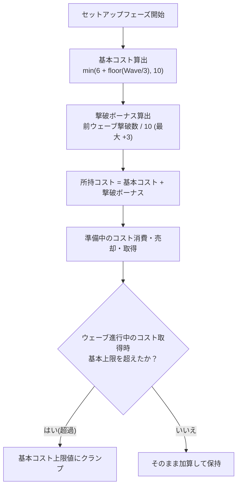
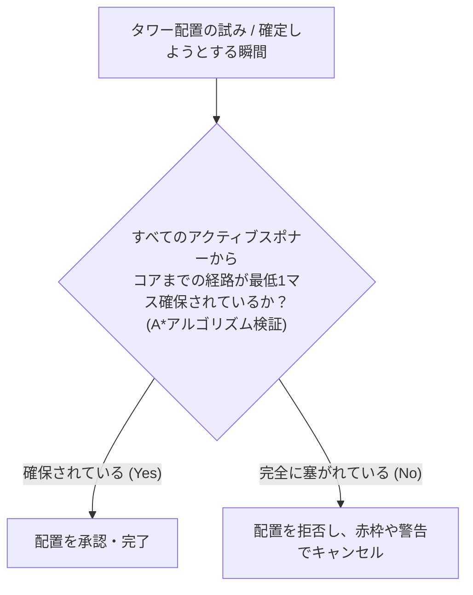
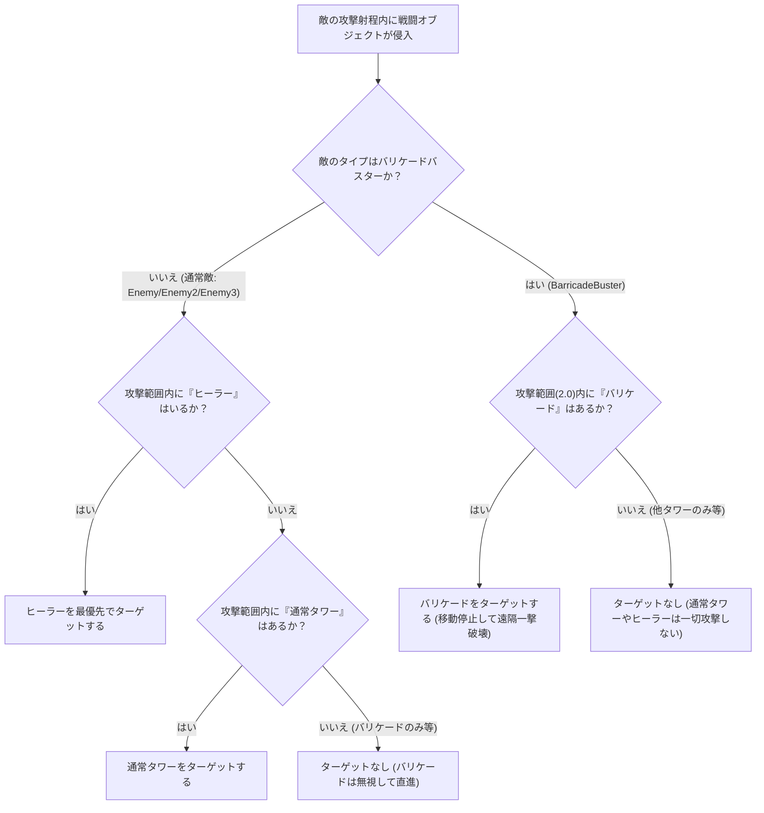
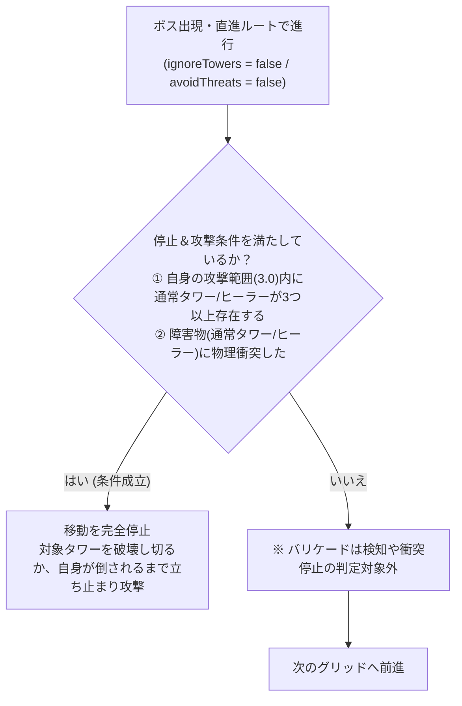
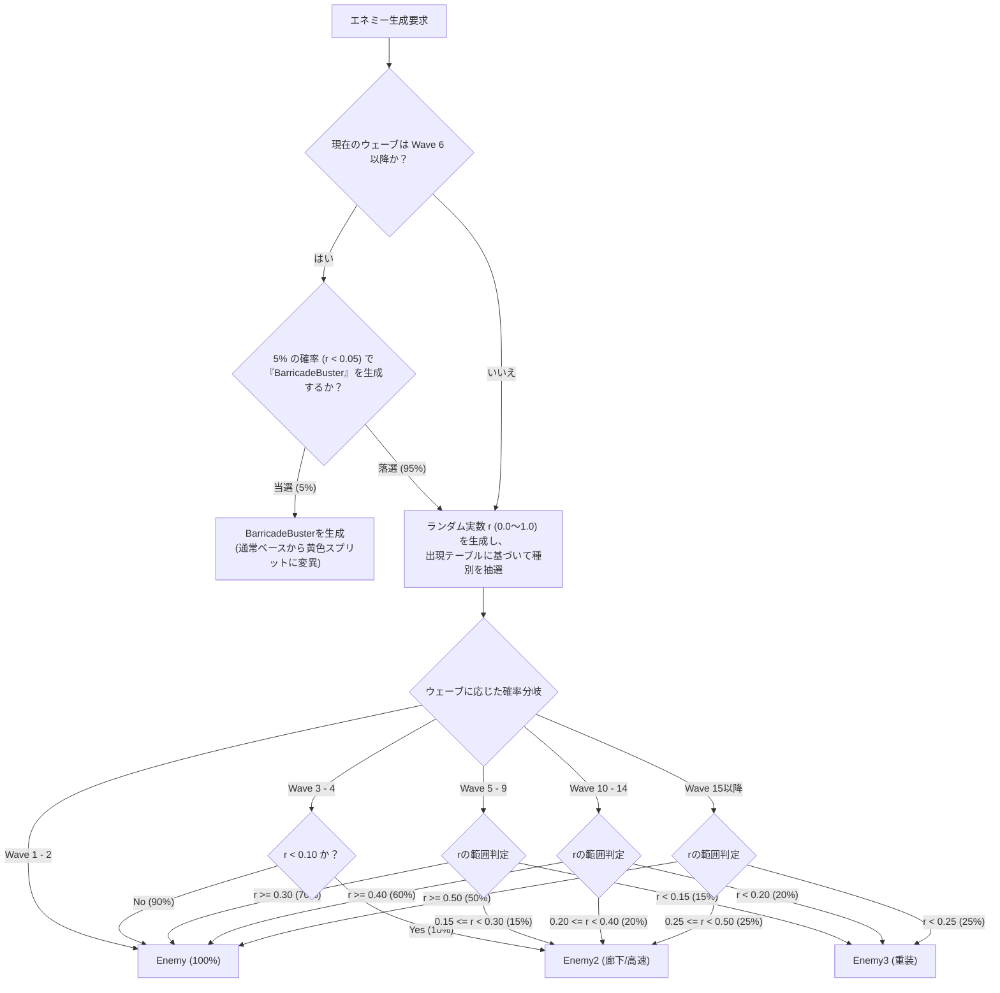
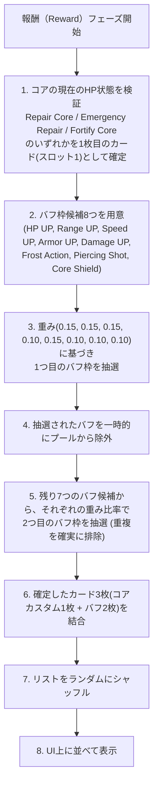

# ゲームバランス調整用仕様書 (Game Balance Reference Manual)

本ドキュメントは、タワーディフェンスゲームのゲームバランスを調整・検証する際に、ゲーム内の各種パラメータ、計算式、および制限事項を一覧で確認するための資料です。

---

## 1. 基本システム仕様 (Core System Settings)

### ■ プレイヤーコアライフ
- **プレイヤー初期ライフ (Core HP):** `10`
  - 敵がコア（画面右端）に到達するとライフが減少し、`0` になった時点でゲームオーバーとなります。

### ■ プレイヤー所持コスト (Cost) 算出ルール
- **基本コスト:** `6`（Wave 1-2）
- **ウェーブスケーリング:** Wave 3以降、3ウェーブごとに+1ずつ増加（最大+4）
  
  $$\text{基本コスト} = \min\left(6 + \lfloor \text{Wave} / 3 \rfloor, 10\right)$$
  
  - Wave 1-2: `6` / Wave 3-5: `7` / Wave 6-8: `8` / Wave 9-11: `9` / Wave 12+: `10`
- **撃破ボーナス:** 前ウェーブの敵撃破数10体ごとに+1コスト（最大+3）が基本コストに加算されます。
- **復帰ルール:** 各ウェーブの準備（Setup）フェーズ開始時に、基本コスト＋撃破ボーナスの合計値にリセットされます。
- **上限値:** ウェーブ中にコストを取得しても、そのウェーブの基本コスト上限**（撃破ボーナス加算前の上限値）**を超過することはありません。（※ただし、準備フェーズ開始時の「撃破ボーナス」は、基本コスト上限を超えて適用されます）



---

## 2. タワー (Tower) のステータス・仕様

タワーは準備（Setup）フェーズ中にコストを支払って配置することができます。

### ■ 基本ステータス（Prefab初期値）

| タワー種類 | 配置コスト | 最大HP | 攻撃力 / 回復量 | 攻撃速度 (回/秒) | 射程範囲 | アーマー (軽減率%) | ターゲット優先度・行動ロジック |
| :--- | :---: | :---: | :---: | :---: | :---: | :---: | :--- |
| **通常タワー** *(Tower)* | 2 | `10.0` | `2.0` | `1.0` | `3.0` | `0%` | 射程内に入ったエネミーのうち、最も近い対象を狙って追尾弾（弾速: `5.0`）を発射します。 |
| **ヒーラー** *(Healer)* | 4 | `5.0` | `1.0` | `1.5` | `3.0` | `0%` | 射程内にある自身を含む全タワー（バリケードを除く）を回復します。回復量は攻撃力（ダメージ）の値に依存します。 |
| **バリケード** *(Barricade)* | 0 | `-` | `-` | `-` | `0.0` | `-` | 敵の進路を遮るための壁です。HPおよびアーマーの概念は持たず、攻撃も行いません。**BarricadeBuster（破壊特化エネミー）の特殊攻撃（9999ダメージ）を除き、一切のダメージを受け付けません。** |

### ■ 配置と売却に関する制限ルール

> [!IMPORTANT]
> **ヒーラーの配置制限 (ウェーブ制限)**
> ヒーラーは **Wave 3 以降** からのみ配置可能です。Wave 1〜2 の間は配置スロットがロックされて半透明で表示され、配置できません。（システム側でのダブルガードも実装されています）

> [!WARNING]
> **完全閉塞の防止 (A*経路チェック)**
> タワーを配置する際、**「すべてのアクティブな敵スポナーから、コアまでの経路」が最低1マスでも確保されているか** が自動検証されます。敵の進路を完全に塞ぎ、コアへの到達を不可能にする配置はシステムによって拒否されます。



#### 1. 売却・削除ルール
- 準備フェーズ中、設置したタワーを右クリックすることで破棄し、配置コストを回収（または削除）できます。
- **通常タワー / ヒーラー:** 「そのタワーが配置されたのと同じウェーブ」に限り全額返還可能です。前のウェーブより前から生き残っているタワーは売却できません。返還されたコストは即座に所持コストに加算されますが、そのウェーブの基本コスト上限を超過した分は切り捨てられます。
- **バリケード:** 配置したウェーブに関わらず、いつでも右クリックで削除可能です。配置コストが0のためコスト返還は発生しません。

#### 2. バリケードの配置数制限
- 各セットアップフェーズで **最大3個** まで配置可能です。
- 現在ウェーブ内に配置したバリケードを削除した場合は、その枠が戻るため再度配置可能です。ただし、過去ウェーブで配置されたバリケードの削除は配置数制限には影響しません。

#### 3. 準備フェーズ中の視覚的区別
セットアップフェーズ中、現在ウェーブで新しく配置されたタワー（売却可能）と、過去ウェーブから残っている配置確定タワー（売却／削除不可 ※バリケードは削除自体は可だが配置カウント不変）を一目で識別できるようにスプライトのカラーが自動変化します。
- **新規配置 (売却可能):** 通常通りの明るいカラーで描画されます。
- **過去に配置済 (売却・削除不可):** スプライト色がブレンドされ、**暗めのトーン（元の明度の50%）かつ半透明（不透明度75%）** で表示されます。
- *※防衛（Defense）フェーズや報酬（Reward）フェーズなど、セットアップフェーズ以外の期間中は、すべてのタワーが元の明るいカラーステートに戻ります。*

### ■ ウェーブ間のHP回復ルール
- **セットアップフェーズ開始時:** 全タワー（バリケード除く）のHPが **最大HPの50%** だけ回復します（全回復ではありません）。
- 報酬（Reward）フェーズでは回復は発生しません。
- ヒーラーの戦略的価値を高めるため、十分なHP管理が求められる設計です。

---

## 3. エネミー (Enemy) のステータス・仕様

敵は画面左端のアクティブなスポナーから出現し、A* pathfinding によって算出された最短ルートを通ってコア（画面右端）へ進撃します。

### ■ 基本ステータス（Prefab初期値）

| エネミー名 | 移動速度 | 最大HP | 攻撃力 | 攻撃速度 (回/秒) | 射程範囲 | アーマー (軽減率%) | コアダメージ | タワー無視 | 特殊挙動・特記事項 |
| :--- | :---: | :---: | :---: | :---: | :---: | :---: | :---: | :---: | :--- |
| **Enemy** (通常) | `2.0` | `6.0` | `1.0` | `0.5` | `2.0` | `0%` | `1` | なし | 最速でコアを目指しながら、射程に入ったタワーを追尾弾で攻撃します。 |
| **Enemy2** (高速) | `3.0` | `6.0` | `1.0` | `0.5` | `1.0` | `0%` | `1` | **あり** | タワーに攻撃しつつも、タワーによる進路妨害を無視してすり抜けて進行します。 |
| **Enemy3** (重装) | `1.0` | `12.0` | `1.0` | `0.5` | `1.0` | `35%` | `1` | **なし** (※1) | タワーを迂回せずコアまで最短直線ルートを移動します。射程内のタワーを攻撃開始すると移動を停止し、対象が壊れるか自身が倒されるまでその場から動きません。 |
| **BarricadeBuster** (破壊特化) | `2.0` | `6.0` (※2) | `9999.0` | `0.1` | `4.0` | `0%` | `1` | なし | バリケード破壊に特化した黄色いエネミー。通常時はコアへ向かいますが、攻撃範囲内（4.0）にバリケードを検知すると移動を停止し、その場で遠隔から1撃で破壊します。バリケード以外のタワーは攻撃しません。 |

- *(※1)* Enemy3は `lockTargetAndStopMoving`（射程内のタワーを検知すると停止して攻撃する）特性を持つ敵として、`ignoreTowers` フラグが常に強制的に無効化されるため、タワーとの衝突を無視せず、通常タワー同様にタワーを迂回せず直線移動しつつも物理的な衝突判定は有効な状態で進みます。
- *(※2)* バリケードバスターの最大HPには、ウェーブスケーリングが適用されます。（Wave 2以降: $\text{HP} = 6.0 \times \left(1 + 0.1 \times \text{Wave}\right)$ ）

### ■ 行動決定ロジックとヘイト（優先ターゲット）

#### 1. エネミーのターゲット優先順位



#### 2. 移動特性（斜め移動の完全防止）
エネミーがA*経路に沿ってグリッド上を移動する際、座標誤差による斜めスライド（ショートカット）移動を完全に防止するため、X軸方向の移動を優先し、X軸がターゲットの中心と揃った後にのみY軸方向の移動を行う直交クランプ移動制御を行っています。これにより、全エネミーは常にグリッドの縦・横軸にスナップしながら直角に綺麗に移動します。

---

### ■ ステータスのウェーブスケーリング

通常エネミー（BarricadeBusterを含む）は、Wave 2 以降、現在のウェーブ数に応じて以下の式でHPと攻撃力が強化されます。

- **スケーリング数式:**
  
  $$\text{強化倍率} = 1.0 + 0.1 \times \text{CurrentWave}$$
  
  $$\text{最大HP} = \text{Prefab初期HP} \times \text{強化倍率}$$
  
  $$\text{攻撃力} = \text{Prefab初期攻撃力} \times \text{強化倍率}$$

- **倍率の具体的な補正スケジュール:**
  - **Wave 1:** $\times 1.0$ (補正なし)
  - **Wave 2:** $\times 1.2$
  - **Wave 3:** $\times 1.3$
  - **Wave 4:** $\times 1.4$
  - **Wave 5:** $\times 1.5$
  - **Wave 10:** $\times 2.0$

---

### ■ ボスエネミーの仕様

**5の倍数ウェーブ (Wave 5, 10, 15, ...)** はボスウェーブとなり、通常のエネミー群の代わりにボスが **1体のみ** 出現します。

- **ビジュアル:** `Enemy3` をベースに、サイズが **`1.8倍`** に拡大され、色が **暗めの赤** `(R:0.85, G:0.15, B:0.15)` に変化します。
- **ステータス算出式 / 固定値:**
  - **最大HP:** *(Enemy3の基準最大HP)* $\times \left(1.0 + 0.1 \times \text{CurrentWave}\right) \times \sqrt{\text{CurrentWave}} \times 3$
    
    $$\text{maxHP} = \left(12.0 \times \left(1.0 + 0.1 \times \text{CurrentWave}\right)\right) \times \sqrt{\text{CurrentWave}} \times 3$$
    
    - *Wave 5:* $(12.0 \times 1.5) \times \sqrt{5} \times 3 \approx$ **`120.7`**
    - *Wave 10:* $(12.0 \times 2.0) \times \sqrt{10} \times 3 \approx$ **`227.7`**
    - *Wave 15:* $(12.0 \times 2.5) \times \sqrt{15} \times 3 \approx$ **`348.6`**
    
    > [!NOTE]
    > ボスの基準最大HPは、Enemy3の実際のPrefab初期値（`12.0`）を使用します（2章参照）。
  - **攻撃力:** *(そのウェーブの通常エネミーのスケーリング後攻撃力)* $\times \left( 1 + \text{CurrentWave} / 5 \times 0.1 \right)$
    
    $$\text{damage} = \left(1.0 \times \left(1.0 + 0.1 \times \text{CurrentWave}\right)\right) \times \left(1.0 + \frac{\text{CurrentWave}}{5.0} \times 0.1\right)$$
    
    - *Wave 5:* $(1.0 \times 1.5) \times (1.0 + 0.1) = 1.5 \times 1.1 =$ **`1.65`**
    - *Wave 10:* $(1.0 \times 2.0) \times (1.0 + 0.2) = 2.0 \times 1.2 =$ **`2.4`**
- **その他のステータス (固定):**
  - **攻撃射程:** `3.0`
  - **攻撃速度:** `1.0回/秒` (クールダウン1秒)
  - **移動速度:** `2.0`
  - **アーマー (被害軽減率):** `0%`
  - **コアダメージ (進入時の被弾量):** **`10`** (到達時点で即座に敗北)

#### ボスエネミーの行動特性・特殊挙動



---

## 4. エネミー出現パターンと確率

ウェーブ進行に伴う出現数と、ランダムで選ばれるエネミーの種別比率です。

- **総出現エネミー数:**
  - **通常ウェーブ:** $5 \times \text{CurrentWave}$ 体
  - **ボスウェーブ:** **`1` 体** 固定

### ■ ウェーブごとの出現テーブル

| ウェーブ数 | 敵総数 | Enemy (通常) | Enemy2 (高速/タワー無視) | Enemy3 (重装/停止攻撃) | ボス |
| :---: | :---: | :---: | :---: | :---: | :---: |
| **Wave 1-2** | 5 / 10 | 100% | 0% | 0% | - |
| **Wave 3-4** | 15 / 20 | 90% | 10% | 0% | - |
| **Wave 5** (ボス) | 1 | - | - | - | 100% (ボス仕様) |
| **Wave 6-9** | 30〜45 | 70% | 15% | 15% | - |
| **Wave 10** (ボス) | 1 | - | - | - | 100% (ボス仕様) |
| **Wave 11-14** | $5 \times \text{Wave}$ | 60% | 20% | 20% | - (5の倍数はボス) |
| **Wave 15+** | $5 \times \text{Wave}$ | 50% | 25% | 25% | - (5の倍数はボス) |

### ■ 出現エネミーのランダム抽選フロー

通常ウェーブで出現するエネミーの種別は、以下の2段階プロセスによって決定されます。



---

## 5. ローグライクアップグレード報酬 (Rewards)

毎ウェーブの防衛フェーズクリア時に、画面に3枚のカードが表示され、その中から任意の効果を1つだけ取得できます。

> [!NOTE]
> **バフの累積・適用対象**
> この報酬によって上昇するステータスバフは、**現在既にマップに配置されているタワー** と、**今後新しく配置されるタワー** の双方に累積かつ恒久的に適用されるグローバル効果です。

### ■ 報酬カードのデータと効果一覧

| 報酬名 *(Title)* | 出現枠仕様 | 抽選の重み | 初期値からの強化効果 (1スタックあたり) |
| :--- | :---: | :---: | :--- |
| **Repair Core** /<br>**Emergency Repair** /<br>**Fortify Core** | 確定枠 (1枚) | - | コアの現在HP状況によって決定。<br>・コアHP > 5:  コアHP **+2** 回復<br>・コアHP $\le$ 5:  コアHP **+3** 回復<br>・コアHP最大時: コア最大HP **+1** (上限上昇) |
| **HP UP** | バフ枠 (2枚抽選) | 15% (0.15) | タワーの最大HPを **+15%** (複利で乗算適用。現在HPもこの割合に応じて増加)。 |
| **Range UP** | バフ枠 (2枚抽選) | 15% (0.15) | タワーの攻撃射程 / ヒーラーの回復範囲を **+10%**。 |
| **Speed UP** | バフ枠 (2枚抽選) | 15% (0.15) | タワーの攻撃速度 / ヒーラーの回復速度を **+10%**。 |
| **Armor UP** | バフ枠 (2枚抽選) | 10% (0.10) | タワーのアーマー（ダメージ軽減率 %）を **+5%** (加算で適用、ステータス上限100%)。 |
| **Damage UP** | バフ枠 (2枚抽選) | 15% (0.15) | タワーの攻撃ダメージ / ヒーラーの回復量を **+10%**。 |
| **Frost Action** | バフ枠 (2枚抽選) | 10% (0.10) | タワーの攻撃が命中したエネミーを、**1秒間**「Frost状態」にしてスロウ（移動・攻撃）させる。スロウ率はスタック数×15%（**上限60%**）で、持続時間は重ね掛けされず更新のみされる。 |
| **Piercing Shot** | バフ枠 (2枚抽選) | 10% (0.10) | タワーの攻撃が近くの別のエネミー1体まで貫通するようになる。貫通時のダメージは初期**50%**、スタックごとに**+10%**（上限100%）。 |
| **Core Shield** | バフ枠 (2枚抽選) | 10% (0.10) | 次にコアがダメージを受ける **1回のみ** を完全に無効化するシールドを付与する（ウェーブ数ではなく "次の1ヒット" が対象。使用されるまで持続）。 |

### ■ 報酬決定プロセス（抽選ロジック）



---

## 6. マップの動的拡張とスポナー解放

ウェーブクリアのたびに防衛マップを遮る壁が、Y軸方向へ向かって上下交互に解放され、エネミーの出現ルート（アクティブなスポナー）が増加します。

### ■ 配置座標関係
- **コア位置:** `(16, -1)` (2x2マスのため、`(16, -1)`, `(17, -1)`, `(16, 0)`, `(17, 0)` の領域を占有)
- **スポナーと初期壁の座標:**

```mermaid
  (Y軸: 上)
  
     スポナー ① [(-18, 7)]  ------------ (隣接壁: [(-16, 8)])
     
     スポナー ② [(-18, 3)]  ------------ (隣接壁: [(-16, 4)])
     
  ★  スポナー ③ [(-18, -1)] ------------ (隣接壁: [(-16, 0)])   【初期開放・フォールバック】
  
     スポナー ④ [(-18, -5)] ------------ (隣接壁: [(-16, -5)])
     
     スポナー ⑤ [(-18, -9)] ------------ (隣接壁: [(-16, -9)])
     
  (Y軸: 下)
```

### ■ 壁の動的削除アルゴリズム
ウェーブ $N$ クリア時に、以下の数式で導出される Y 座標範囲にある壁タイルが破壊されます。

$$\text{minY} = - \left( \lfloor N / 2 \rfloor + 1 \right)$$

$$\text{maxY} = \lfloor (N + 1) / 2 \rfloor$$

> [!NOTE]
> **拡張の最大限界Wave**
> Wave 17 クリア以降（$N \ge 17$）は壁の削除・マップ拡張は発生しません。

### ■ ウェーブごとの解放エリアとアクティブスポナー一覧

| クリアWave | 破壊される Y 座標範囲 | 解放される隣接壁 | 有効化されるスポナー | 出現数 |
| :---: | :--- | :--- | :--- | :---: |
| **初期** | (未拡張) | なし | **スポナー③ (中央)** *(ルート未解放時のフォールバック有効)* | - |
| **Wave 1** | $-1 \le y \le 1$ | 中央壁 `(-16, 0)` | **スポナー③ (中央)** が正式アクティブに | 5 |
| **Wave 2** | $-2 \le y \le 1$ | - | (拡張進行のみ) | 10 |
| **Wave 3** | $-2 \le y \le 2$ | - | (拡張進行のみ) | 15 |
| **Wave 4** | $-3 \le y \le 2$ | - | (拡張進行のみ) | 20 |
| **Wave 5** | $-3 \le y \le 3$ | - | (拡張進行のみ) | 1 (Boss) |
| **Wave 6** | $-4 \le y \le 3$ | - | (拡張進行のみ) | 30 |
| **Wave 7** | $-4 \le y \le 4$ | 中上壁 `(-16, 4)` | **スポナー② (中上)** が解放され、**2WAY**化 | 35 |
| **Wave 8** | $-5 \le y \le 4$ | 中下壁 `(-16, -5)` | **スポナー④ (中下)** が解放され、**3WAY**化 | 40 |
| **Wave 9** | $-5 \le y \le 5$ | - | (拡張進行のみ) | 45 |
| **Wave 10** | $-6 \le y \le 5$ | - | (拡張進行のみ) | 1 (Boss) |
| **Wave 11** | $-6 \le y \le 6$ | - | (拡張進行のみ) | 55 |
| **Wave 12** | $-7 \le y \le 6$ | - | (拡張進行のみ) | 60 |
| **Wave 13** | $-7 \le y \le 7$ | - | (拡張進行のみ) | 65 |
| **Wave 14** | $-8 \le y \le 7$ | - | (拡張進行のみ) | 70 |
| **Wave 15** | $-8 \le y \le 8$ | 上壁 `(-16, 8)` | **スポナー① (上)** が解放され、**4WAY**化 | 1 (Boss) |
| **Wave 16** | $-9 \le y \le 8$ | 下壁 `(-16, -9)` | **スポナー⑤ (下)** が解放され、**最大5WAY**化 | 80 |

> [!TIP]
> **複数スポナー有効化時の出現仕様**
> スポナーが複数解放されている場合、個々の敵の出現時に、アクティブなスポナー群の中から毎度ランダムで出現元が選択されます。ルートの増加に伴い、単一ラインの防衛だけでなく、マップ全域に渡る戦略的かつ多角的な配置・資源配置が求められるようになります。
