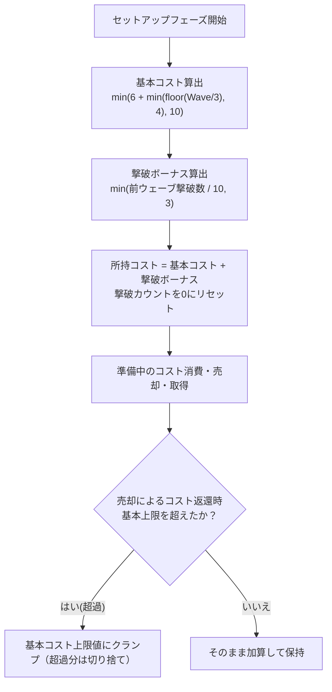
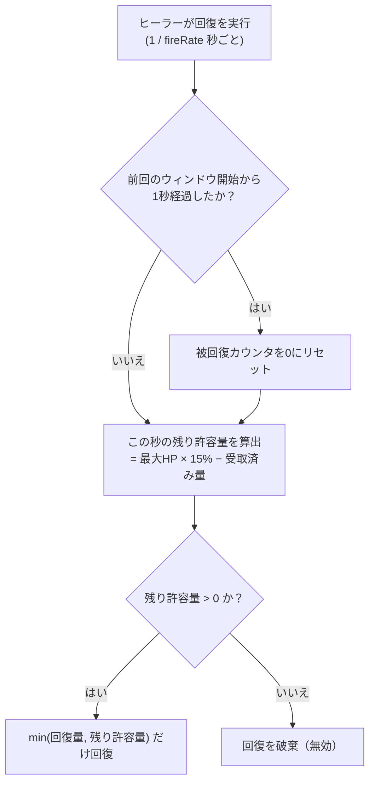
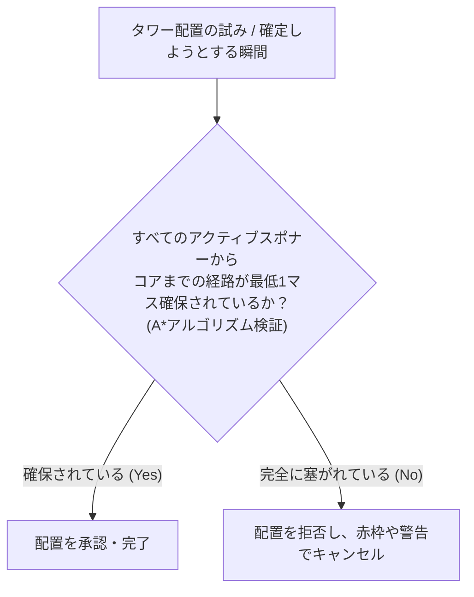
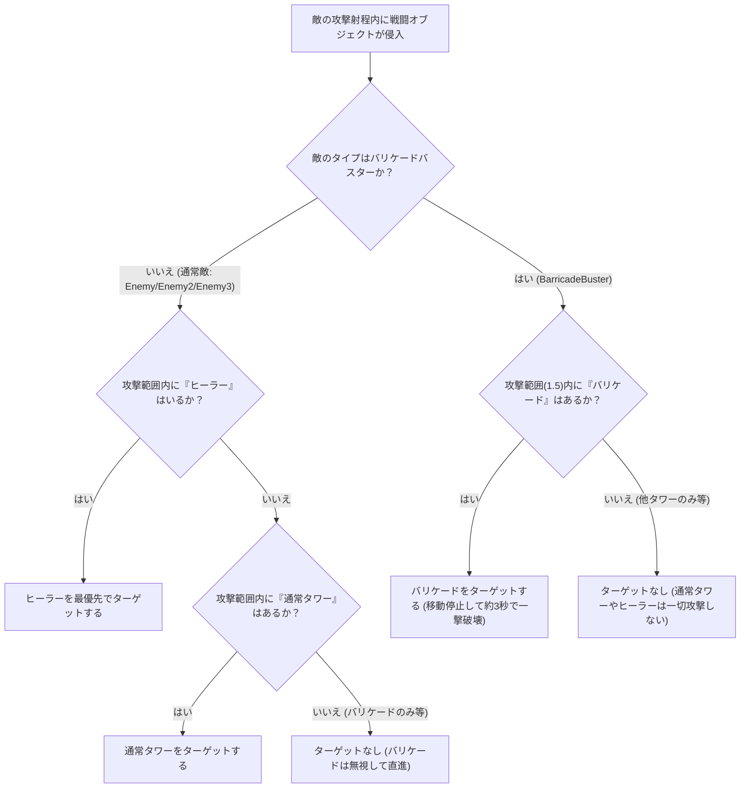
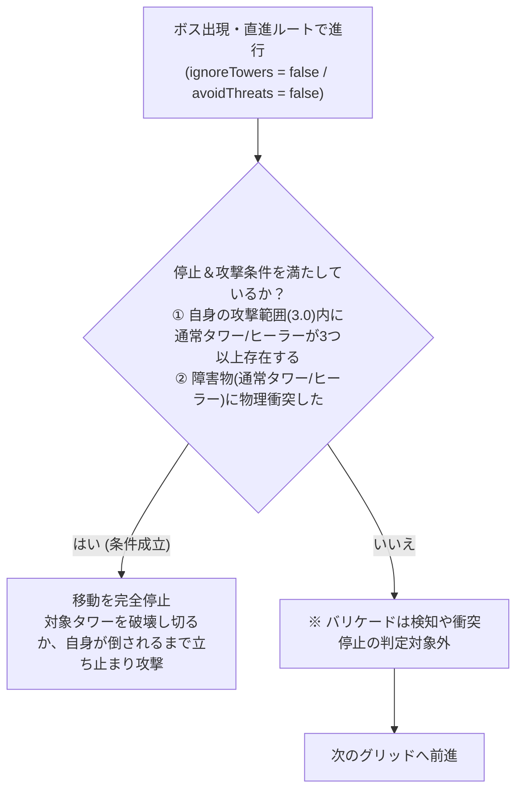
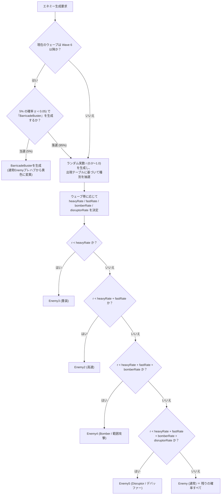
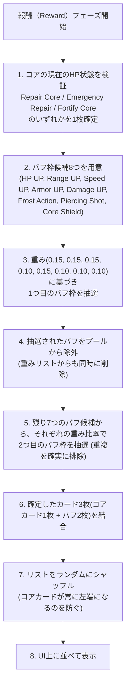

# ゲームバランス調整用仕様書 (Game Balance Reference Manual)

本ドキュメントは、タワーディフェンスゲームのゲームバランスを調整・検証する際に、ゲーム内の各種パラメータ、計算式、および制限事項を一覧で確認するための資料です。

> [!IMPORTANT]
> **本書の記載値の出典**
> 記載されている数値は、すべて実装コード（`Assets/Scripts/*.cs`）およびPrefabのシリアライズ値から抽出した実測値です。
> Prefabに存在しないフィールド（`hpGrowthRatePerWave` など、Prefab作成後にスクリプトへ追加されたもの）については、C#スクリプト側の初期値が適用されます。

---

## 1. 基本システム仕様 (Core System Settings)

### ■ プレイヤーコアライフ
- **プレイヤー初期ライフ (Core HP):** `10` （`GameManager.initialLife`）
  - 敵がコア（画面右端）に到達するとライフが減少し、`0` になった時点でゲームオーバーとなります。
  - 報酬 `Fortify Core` を取得すると最大値そのものが上昇します（後述）。

### ■ ゲームスピード制御
- 画面右下のボタンで、ゲーム速度を **`x1.0` / `x1.2` / `x1.5` / `x2.0` / `x3.0`** の5段階で切り替えられます（`Time.timeScale` を直接操作）。
- 一時停止ボタンも併設されています。
- チュートリアル表示中およびゲームオーバー表示中は、それらのUIが `Time.timeScale = 0` を占有するため、速度ボタンは操作不可になります。

> [!NOTE]
> すべての戦闘処理は `Time.deltaTime` ベースのため、倍速時もバランスは変化しません（弾速・攻撃間隔・移動速度が一律にスケールします）。

### ■ プレイヤー所持コスト (Cost) 算出ルール
- **基本コスト:** `6`（Wave 1-2）
- **ウェーブスケーリング:** Wave 3以降、3ウェーブごとに+1ずつ増加（ボーナス部分の上限は+4）

  $$\text{基本コスト} = \min\left(6 + \min\left(\left\lfloor \frac{\text{Wave}}{3} \right\rfloor,\ 4\right),\ 10\right)$$

  - Wave 1-2: `6` / Wave 3-5: `7` / Wave 6-8: `8` / Wave 9-11: `9` / Wave 12+: `10`
- **撃破ボーナス:** 前ウェーブの敵撃破数10体ごとに+1コスト（最大+3）が基本コストに加算されます。

  $$\text{撃破ボーナス} = \min\left(\left\lfloor \frac{\text{前ウェーブ撃破数}}{10} \right\rfloor,\ 3\right)$$

- **復帰ルール:** 各ウェーブの準備（Setup）フェーズ開始時に、基本コスト＋撃破ボーナスの合計値にリセットされます。撃破カウントはこのタイミングで0に戻ります。
- **上限値:** ウェーブ中にコストを取得（＝タワー売却による返還）しても、そのウェーブの基本コスト上限**（撃破ボーナス加算前の上限値）**を超過することはありません。（※ただし、準備フェーズ開始時の「撃破ボーナス」は、基本コスト上限を超えて適用されます）


```mermaid
flowchart TD
    Start["セットアップフェーズ開始"] --> CalcBase["基本コスト算出<br/>min(6 + min(floor(Wave/3), 4), 10)"]
    CalcBase --> CalcBonus["撃破ボーナス算出<br/>min(前ウェーブ撃破数 / 10, 3)"]
    CalcBonus --> Reset["所持コスト = 基本コスト + 撃破ボーナス<br/>撃破カウントを0にリセット"]
    Reset --> Play["準備中のコスト消費・売却・取得"]
    Play --> LimitCheck{"売却によるコスト返還時<br/>基本上限を超えたか？"}
    LimitCheck -- "はい(超過)" --> Clamp["基本コスト上限値にクランプ（超過分は切り捨て）"]
    LimitCheck -- "いいえ" --> Keep["そのまま加算して保持"]
```

---

## 2. タワー (Tower) のステータス・仕様

タワーは準備（Setup）フェーズ中にコストを支払って配置することができます。

### ■ 基本ステータス（Prefab初期値）

| タワー種類 | `TowerType` | 解禁Wave | 配置コスト | 最大HP | 攻撃力 / 回復量 | 攻撃速度 (回/秒) | 射程範囲 | アーマー | DPS | 役割・行動ロジック |
| :--- | :---: | :---: | :---: | :---: | :---: | :---: | :---: | :---: | :---: | :--- |
| **通常タワー** *(Tower)* | `0` Normal | 1 | 2 | `10.0` | `2.0` | `1.0` | `3.0` | `0%` | `2.00` | 射程内に入ったエネミーのうち、最も近い対象を狙って追尾弾（**弾速: `10.0`**）を発射します。 |
| **タンク** *(TankTower)* | `3` Tank | 1 | 3 | `30.0` | `1.5` | `0.5` | `2.0` | `30%` | `0.75` | 通常タワーと**完全に同じ攻撃ロジック**で動作します。火力を犠牲に耐久へ全振りした前衛用タワーです。 |
| **ヒーラー** *(Healer)* | `1` Healer | 3 | 4 | `5.0` | `1.0` | `1.5` | `3.0` | `0%` | - | 射程内にある自身を含む全タワー（バリケードを除く）を回復します。回復量は攻撃力（ダメージ）の値に依存します。 |
| **スプラッシュ** *(SplashTower)* | `4` Splash | 5 | 4 | `10.0` | `1.5` | `0.5` | `3.5` | `0%` | `0.75` | 着弾地点の**半径 `1.5` 内の全エネミー**へ範囲ダメージを与えます。長射程・低単体DPSで、物量ウェーブ向けです。 |
| **フロスト** *(FrostTower)* | `5` Frost | 4 | 3 | `8.0` | `0.1` | `1.0` | `2.5` | `20%` | `0.10` | ダメージはほぼ与えず、命中したエネミーを **3秒間 50% 減速**させる支援タワーです。 |
| **バリケード** *(Barricade)* | `2` Barricade | 1 | 0 | `-` | `-` | `-` | `0.0` | `-` | - | 敵の進路を遮るための壁です。HPおよびアーマーの概念は持たず、攻撃も行いません。**BarricadeBuster（破壊特化エネミー）の特殊攻撃（9999ダメージ）を除き、一切のダメージを受け付けません。** |

*※ 表の並び順は HUD の配置カードの並び（左から右）と一致します。*

> [!NOTE]
> **バリケードのコストについて**
> `TowerManager` のインスペクタ上では `barricadeCost = 1` が設定されていますが、`OnSingletonAwake()` で実行時に **`0` に強制上書き**されます。実効コストは常に `0` です。

### ■ タワー種別の管理方式（データ駆動）

全6種のタワーは**専用クラスを持たず、すべて `Tower.cs` 1クラス**で動作します。種別は `TowerType` enum で識別され、配置ルールは `TowerDefinition` のリストとして一元管理されます。

```csharp
public enum TowerType { Normal = 0, Healer = 1, Barricade = 2, Tank = 3, Splash = 4, Frost = 5 }
```

- **Prefab側の指定:** 各Prefabの `towerType` フィールドに上記の**数値**が保存されています。この値が種別の唯一の情報源です。

| Prefab | `towerType` |
| :--- | :---: |
| `Tower.prefab` | `0` |
| `Healer.prefab` | `1` |
| `Barricade.prefab` | `2` |
| `TankTower.prefab` | `3` |
| `SplashTower.prefab` | `4` |
| `FrostTower.prefab` | `5` |

- **配置ルールの定義:** `TowerManager.TowerDefinition` が種別ごとに以下を保持します。**新しいタワーを追加する場合、この定義を1件足すだけで、コスト・解禁Wave・設置上限・HUDカードのすべてが連動します。**

| フィールド | 意味 |
| :--- | :--- |
| `type` | 対応する `TowerType` |
| `prefab` | 生成するPrefab |
| `cost` | 配置コスト（売却時の返還額もこの値） |
| `unlockWave` | このWave以降で配置可能 |
| `maxPerSetup` | 1回のSetupフェーズでの設置上限（**`0` = 無制限**） |
| `displayName` | HUDカードに表示する名前（英語） |

- **既定値:** シーン側で `towerDefinitions` が未設定の場合、`TowerManager.CreateDefaultDefinitions()` が上表のパラメータで6件を自動生成します。

> [!NOTE]
> **Prefab 参照の自動解決とビルド時の注意**
> `prefab` が未割り当ての場合、`ResolveMissingPrefabs()` が命名規約（`Assets/{Tower|Healer|Barricade|TankTower|SplashTower|FrostTower}.prefab`）に従って `AssetDatabase` から自動ロードします（`EnemySpawner` と同方式）。
> ただしこれは `#if UNITY_EDITOR` ブロック内のため、**ビルドを行う際は、シーンの `TowerManager` に Prefab 参照を明示的に割り当てる必要があります。**

> [!TIP]
> **`IsBarricade` / `IsHealer` プロパティについて**
> 旧実装の bool フラグは廃止されましたが、`Tower.IsBarricade` / `Tower.IsHealer` は `towerType` から導出される読み取り専用プロパティとして残されています（`Enemy.cs` / `AStarPathfinding.cs` からの参照互換のため）。

#### タンクタワーの設計意図と実効耐久

| 比較項目 | 通常タワー | タンク | 倍率 |
| :--- | :---: | :---: | :---: |
| 配置コスト | `2` | `3` | ×1.5 |
| 最大HP | `10.0` | `30.0` | ×3.0 |
| アーマー | `0%` | `30%` | - |
| **実効耐久** ($\text{HP} \div (1 - \text{アーマー})$) | `10.0` | **`42.9`** | **×4.3** |
| **DPS** (攻撃力 × 攻撃速度) | `2.0` | `0.75` | ×0.375 |
| 射程 | `3.0` | `2.0` | ×0.67 |

- コスト1.5倍で実効耐久4.3倍を得る代わりに、火力は約1/3、射程は2/3に低下します。バリケードやヒーラーを守る**前衛の盾**としての運用を想定しています。
- 射程が `2.0` と短いため、後方に置いても機能しません。必ず敵の進路に接する位置へ配置する必要があります。

> [!NOTE]
> **アーマー上限によるガード**
> アーマーの上限は **90%**（本章「アーマー（ダメージ軽減）の仕様」参照）です。タンクは基礎値 `30%` を持つため `Armor UP` を12スタック取得すると上限に達しますが、被ダメージが0になることはありません。

#### バリケードとの使い分け

| | バリケード | タンク |
| :--- | :--- | :--- |
| コスト | `0` | `3` |
| 設置数制限 | 6個／Setupフェーズ | 制限なし（コストのみ） |
| 被ダメージ | BarricadeBuster以外からは**完全無効** | 通常どおり被弾する |
| 攻撃 | しない | する（DPS `0.75`） |
| 敵の経路への影響 | 物理的な障害物として迂回される | 障害物かつ**脅威（DPS）としても迂回対象**になる |
| 報酬バフ | 対象外 | 対象（HP UP・Armor UP等が乗る） |

### ■ ターゲット探索の共通仕様
- タワー・エネミーともに、ターゲット探索は **0.2秒間隔** でキャッシュ更新されます（毎フレーム探索は行いません）。
- 「最も近い対象」の判定において、**距離差が `0.01` 以内の候補は同格**とみなされ、その中から**ランダムで1体**が選ばれます。これにより、同距離に並んだ敵へ攻撃が偏り続けるのを防いでいます。

### ■ アーマー（ダメージ軽減）の仕様

アーマーはタワー・エネミー双方が持つ共通の被ダメージ軽減ステータスで、**パーセント表記の加算方式**です。

$$\text{最終ダメージ} = \text{元のダメージ} \times \left(1 - \frac{\min(\text{アーマー},\ 90)}{100}\right)$$

> [!IMPORTANT]
> **アーマーの上限は `90%` です**（`CombatUtils.MaxArmor`）。
> 上限を100%にすると被ダメージが完全に0となる無敵状態が成立してしまうため、90%で頭打ちにしています。**アーマーをどれだけ積んでも、元のダメージの10%は必ず通ります。**

- 上限は `CombatUtils.MaxArmor` の **1箇所で定義**され、以下すべてがこれを参照します。値を変更すれば全体が追随します。

| 参照箇所 | 役割 |
| :--- | :--- |
| `CombatUtils.ApplyArmorReduction()` | ダメージ計算時のクランプ（最終的な安全網） |
| `Tower.Armor` プロパティ setter | タワーのアーマー設定時のクランプ |
| `Enemy.Armor` プロパティ setter | エネミーのアーマー設定時のクランプ |
| `RewardManager.CreateOffer()` | 報酬カード `Armor UP` の説明文に上限値を表示 |

- **報酬カードの表示:** `Armor UP` の説明文は `All Tower Armor +5% per stack (max 90%)` と描画されます。この「90」は定数から動的に生成されるため、上限を変更するとカード表記も自動的に更新されます。
- **上限到達に必要なスタック数（`Armor UP` は+5%／スタック）:**

| タワー | 基礎アーマー | 上限90%到達に必要なスタック数 |
| :--- | :---: | :---: |
| 通常タワー / ヒーラー | `0%` | 18 |
| **タンク** | `30%` | **12** |

- 現状、エネミー側のアーマーを上昇させる仕組みは存在しません（`Enemy3` のPrefab値 `35%` が最大値で、ボスは `0%` に固定されます）。上記の定数はタワーと定義を共通化する目的でエネミー側にも適用されています。

### ■ ヒーラーの回復量上限（被回復キャップ）

> [!IMPORTANT]
> **各タワーが1秒間に受け取れる回復量には上限があります。**
> 上限値は **そのタワーの最大HPの15%／秒** です（`Tower.maxHealPercentPerSecond = 0.15`）。
> ヒーラーを複数密集させても、1体のタワーへの回復速度はこの値で頭打ちになります。ヒーラーの過剰な重ね置きによる無敵化を防ぐための仕様です。


```mermaid
flowchart TD
    HealStart["ヒーラーが回復を実行<br/>(1 / fireRate 秒ごと)"] --> Window{"前回のウィンドウ開始から<br/>1秒経過したか？"}
    Window -- "はい" --> ResetW["被回復カウンタを0にリセット"]
    Window -- "いいえ" --> CalcCap
    ResetW --> CalcCap["この秒の残り許容量を算出<br/>= 最大HP × 15% − 受取済み量"]
    CalcCap --> Apply{"残り許容量 > 0 か？"}
    Apply -- "はい" --> DoHeal["min(回復量, 残り許容量) だけ回復"]
    Apply -- "いいえ" --> Ignore["回復を破棄（無効）"]
```

### ■ 配置と売却に関する制限ルール

> [!IMPORTANT]
> **ヒーラーの配置制限 (ウェーブ制限)**
> ヒーラーは **Wave 3 以降** からのみ配置可能です。Wave 1〜2 の間は配置スロットがロックされて半透明で表示され、配置できません。（システム側でのダブルガードも実装されています）

> [!WARNING]
> **完全閉塞の防止 (A*経路チェック)**
> タワーを配置する際、**「すべてのアクティブな敵スポナーから、コアまでの経路」が最低1マスでも確保されているか** が自動検証されます。敵の進路を完全に塞ぎ、コアへの到達を不可能にする配置はシステムによって拒否されます。
> ※この検証は `ignoreTowers = false` の条件（＝タワーをすり抜けない敵の基準）で行われます。


```mermaid
flowchart TD
    Place["タワー配置の試み / 確定しようとする瞬間"] --> PathCheck{"すべてのアクティブスポナーから<br/>コアまでの経路が最低1マス確保されているか？<br/>(A*アルゴリズム検証)"}
    PathCheck -- "確保されている (Yes)" --> Allow["配置を承認・完了"]
    PathCheck -- "完全に塞がれている (No)" --> Deny["配置を拒否し、赤枠や警告でキャンセル"]
```

#### 1. 売却・削除ルール
- 準備フェーズ中、設置したタワーを右クリックすることで破棄し、配置コストを回収（または削除）できます。
- **通常タワー / ヒーラー / タンク:** 「そのタワーが配置されたのと同じウェーブ」に限り全額返還可能です。前のウェーブより前から生き残っているタワーは売却できません。返還されたコストは即座に所持コストに加算されますが、そのウェーブの基本コスト上限を超過した分は切り捨てられます。
- **バリケード:** 配置したウェーブに関わらず、いつでも右クリックで削除可能です。配置コストが0のためコスト返還は発生しません。
- 準備フェーズ中にタワーを**左クリック**すると、そのタワーの射程範囲表示をトグルできます。

> [!NOTE]
> **返還コストの確定方法**
> 各タワーは `Start()` で自身の `towerType` をキーに `TowerManager.GetPlacementCost()` を引き、その値を返還額として保持します。種別が Prefab 自身に保存されているため、**配置元から情報を渡す必要はありません。**

#### 2. 設置数制限（`maxPerSetup`）
- 制限は種別ごとに `TowerDefinition.maxPerSetup` で定義され、**現在制限が掛かっているのはバリケードのみ（各セットアップフェーズで最大6個）**です。他の5種は `0`（無制限）で、コストのみが制約になります。
- カウントは `TowerManager` が種別ごとに保持し、Setupフェーズ開始時にすべてリセットされます。
- HUDのカードには、制限のある種別のみ `Barricade (6 Left)` のように残数が表示されます。制限のない種別は `Tower (Cost: 2)` のようにコストが表示されます。解禁前の種別は `Splash (W5)` のように解禁Waveが表示され、半透明・ドラッグ不可になります。
- 現在ウェーブ内に配置したバリケードを削除した場合は、その枠が戻るため再度配置可能です。ただし、過去ウェーブで配置されたバリケードの削除は配置数制限には影響しません。

#### 3. 準備フェーズ中の視覚的区別
セットアップフェーズ中、現在ウェーブで新しく配置されたタワー（売却可能）と、過去ウェーブから残っている配置確定タワー（売却／削除不可 ※バリケードは削除自体は可だが配置カウント不変）を一目で識別できるようにスプライトのカラーが自動変化します。
- **新規配置 (売却可能):** 通常通りの明るいカラーで描画されます。
- **過去に配置済 (売却・削除不可):** スプライト色がブレンドされ、**暗めのトーン（元の明度の50%）かつ半透明（不透明度75%）** で表示されます。
- *※防衛（Defense）フェーズや報酬（Reward）フェーズなど、セットアップフェーズ以外の期間中は、すべてのタワーが元の明るいカラーステートに戻ります。*

### ■ ウェーブ間のHP回復ルール
- **セットアップフェーズ開始時:** 全タワー（バリケード除く）のHPが **最大HPの50%** だけ回復します（全回復ではありません）。
- 報酬（Reward）フェーズでは回復は発生しません。
- ヒーラーの戦略的価値を高めるため、十分なHP管理が求められる設計です。

### ■ 範囲ダメージ（スプラッシュ）の仕様

弾が着弾した瞬間、着弾地点を中心とした半径内の対象へ追加ダメージを与えます。タワー側（スプラッシュタワー）とエネミー側（Bomber）で**同一の処理**を共有しています。

$$\text{範囲ダメージ} = \text{弾のダメージ} \times \text{SplashDamageRatio}$$

| パラメータ | スプラッシュタワー | Bomber (Enemy4) |
| :--- | :---: | :---: |
| 半径 | `1.5` | `1.5` |
| ダメージ倍率 | `1.0`（直撃と同威力） | `1.0`（直撃と同威力） |
| 波及先 | 射程内外を問わず、着弾点周囲の**全エネミー** | 着弾点周囲の**全タワー** |

- **直撃対象は範囲ダメージの対象から除外**されます（二重ダメージにはなりません）。
- **バリケードは波及対象から除外**されます（9999未満のダメージを受け付けないため）。
- 波及先が「エネミー群」か「タワー群」かは、**直撃対象の型**によって自動的に決まります（`Bullet.ApplySplashDamage()`）。
- Frost効果が乗っている弾の場合、範囲ダメージを受けたエネミーにも**スロウが適用されます**。
- 範囲ダメージによる撃破でリストが変動しうるため、走査はインデックス方式で実装されています。

> [!NOTE]
> **スプラッシュ半径は射程とは別概念です。** 射程（`range`）はターゲットを捕捉できる距離、スプラッシュ半径（`splashRadius`）は着弾後に波及する距離であり、射程インジケータには反映されません。

- 実装上、`splashRadius > 0` のタワー／エネミーが範囲攻撃になります。値を持たないPrefabはスクリプト既定値 `0` により通常の単体攻撃になります。

### ■ 攻撃速度デバフ（被デバフ）の仕様

タワーは、Disruptor（Enemy5）の攻撃を受けると一定時間**攻撃速度が低下**します。エネミー側の Frost（スロウ）と対称の仕組みです。

| 項目 | 実装 |
| :--- | :--- |
| 減速方式 | `fireCooldown -= Time.deltaTime × attackSpeedDebuffMultiplier` |
| 重ね掛け | より強いデバフが優先。持続時間は長い方に更新（加算されない） |
| 効果対象 | 通常タワー・タンク・スプラッシュ・フロストの**攻撃間隔**、およびヒーラーの**回復間隔** |
| 対象外 | バリケード（`ApplyAttackSpeedDebuff()` の冒頭で除外） |

- **発射時の `fireCooldown = 1.0 / fireRate` という代入値そのものは変更せず**、毎フレームの減算量に倍率を掛けています。これによりデバフが切れた瞬間に即座に通常速度へ復帰します（エネミー側のFrostと同じ方式）。
- タイマーはフェーズを問わず実時間で減衰するため、防衛フェーズ終了後に持ち越されることは実質ありません。

### ■ 行動制限
- タワーの攻撃・回復処理は、**防衛（Defense）フェーズ中のみ**実行されます。準備フェーズや報酬フェーズでは一切動作しません。

---

## 3. エネミー (Enemy) のステータス・仕様

敵は画面左端のアクティブなスポナーから出現し、A* pathfinding によって算出されたルートを通ってコア（画面右端）へ進撃します。

### ■ 基本ステータス（Prefab初期値 / Wave 1 相当）

| エネミー名 | 移動速度 | 最大HP | 攻撃力 | 攻撃速度 (回/秒) | 射程範囲 | アーマー (軽減率%) | コアダメージ | タワー無視 | 脅威回避 | 特殊挙動・特記事項 |
| :--- | :---: | :---: | :---: | :---: | :---: | :---: | :---: | :---: | :---: | :--- |
| **Enemy** (通常) | `2.0` | `6.0` | `1.0` | `0.5` | `2.0` | `0%` | `1` | なし | **あり** | 射程に入ったタワーを追尾弾（弾速 `10.0`）で攻撃しつつコアを目指します。**唯一、タワーの砲火が濃いエリアを迂回する経路選択を行います（後述）。** |
| **Enemy2** (高速) | `3.0` | `6.0` | `1.0` | `0.5` | `1.0` | `0%` | `1` | **あり** | なし | タワーに攻撃しつつも、タワーによる進路妨害を無視してすり抜けて進行します。 |
| **Enemy3** (重装) | `1.0` | `12.0` | `1.0` | `0.5` | `1.0` | `35%` | `1` | なし | なし | タワーを迂回せずコアまで最短ルートを移動します。射程内のタワーを検知すると移動を停止し、対象が壊れるか自身が倒されるまでその場から動きません。 |
| **Enemy4** (Bomber / 範囲攻撃) | `1.5` | `8.0` | `1.0` | `0.4` | `2.5` | `0%` | `1` | なし | なし | 濃いオレンジのエネミー。攻撃が着弾すると、**着弾点の半径 `1.5` 内の全タワー**へ直撃と同威力の範囲ダメージを与えます。タワーを密集配置していると一気に削られます。 |
| **Enemy5** (Disruptor / デバッファー) | `2.0` | `5.0` | `0.5` | `0.5` | `2.5` | `0%` | `1` | なし | なし | 紫のエネミー。ダメージは低いものの、命中したタワーの**攻撃速度を3秒間 40% 低下**させます。低耐久のため優先的に処理すべき対象です。 |
| **BarricadeBuster** (破壊特化) | `2.0` | `6.0` (※1) | `9999.0` | `0.33` | `1.5` | `0%` | `1` | なし | なし | バリケード破壊に特化した黄色いエネミー。通常時はコアへ向かいますが、**攻撃範囲 `1.5` 内**にバリケードを検知すると移動を停止し、約3秒かけて1撃で破壊します。バリケード以外のタワーは攻撃しません。 |

- *(※1)* バリケードバスターの最大HPには、通常エネミーと同じウェーブスケーリング（後述の複利式）が適用されます。

> [!WARNING]
> **Enemy3 と「タワー無視」フラグについて**
> Enemy3 は `lockTargetAndStopMoving = true` を持つため、`ScaleStats()` 実行時に **`ignoreTowers` と `avoidThreats` の両方が強制的に `false` に上書き**されます。
> 結果として、タワーをすり抜けることはできず（物理的な障害物として迂回する）、かつ脅威の多いルートを避ける大回りも行いません。

### ■ 経路選択と「脅威回避 (avoidThreats)」

> [!IMPORTANT]
> **通常Enemy のみが、タワーの火力が集中するマスを避けて迂回します。**
> A*の経路コストにタワーのDPS（1秒あたり総ダメージ）が加算されるため、「多少遠回りでも被弾の少ないルート」が選ばれます。バリケードによる誘導設計を考える際の中核となる仕様です。

- **経路コスト計算式:**

  $$\text{セル移動コスト} = 10 + \text{round}\left( \left( \sum_{\text{そのセルを射程に収める通常タワー}} \text{攻撃力} \times \text{攻撃速度} \right) \times 6 \right)$$

  - 基本移動コストは1マスあたり `10` 固定です。
  - DPS集計の対象は**通常タワーのみ**で、バリケードとヒーラーは除外されます。
  - 係数 `6` は `AStarPathfinding.dpsThreatCostMultiplier` です。値を上げすぎると敵が絶対に交戦しなくなるため、「多少の被弾より近道」を選べる水準に調整されています。

- **具体例:** 初期状態の通常タワー1基（攻撃力2.0 × 攻撃速度1.0 = 2.0 DPS）の射程内にあるマスは、コストが `10 + round(2.0 × 6) = 22` となり、安全なマスの **約2.2倍** の通行コストになります。

- **フラグ別の適用状況:**

| エネミー | `avoidThreats` | 挙動 |
| :--- | :---: | :--- |
| **Enemy** (通常) | `true` | タワーの砲火を避けて迂回する |
| **Enemy2** (高速) | `false` | `Awake()` で強制無効化（タワーすり抜け型のため） |
| **Enemy3** (重装) | `false` | `ScaleStats()` で強制無効化 |
| **BarricadeBuster** | `false` | `SetupBarricadeBuster()` で強制無効化 |
| **ボス** | `false` | `SetupBoss()` で強制無効化 |

> [!NOTE]
> **A*の探索上限**
> 経路探索は **最大2000ノード** で打ち切られます。打ち切られた場合は経路なしと判定され、出現時のフォールバックとして「X軸→Y軸の順に進む単純な直線ルート」（`MapManager.GetInitialPath`）が使用されます。

### ■ 行動決定ロジックとヘイト（優先ターゲット）

#### 1. エネミーのターゲット優先順位


```mermaid
flowchart TD
    A["敵の攻撃射程内に戦闘オブジェクトが侵入"] --> B{"敵のタイプはバリケードバスターか？"}

    B -- "いいえ (通常敵: Enemy/Enemy2/Enemy3)" --> C{"攻撃範囲内に『ヒーラー』はいるか？"}
    C -- "はい" --> TargetHealer["ヒーラーを最優先でターゲットする"]
    C -- "いいえ" --> D{"攻撃範囲内に『通常タワー』はあるか？"}
    D -- "はい" --> TargetTower["通常タワーをターゲットする"]
    D -- "いいえ (バリケードのみ等)" --> IgnoreT["ターゲットなし (バリケードは無視して直進)"]

    B -- "はい (BarricadeBuster)" --> E{"攻撃範囲(1.5)内に『バリケード』はあるか？"}
    E -- "はい" --> TargetBarricade["バリケードをターゲットする (移動停止して約3秒で一撃破壊)"]
    E -- "いいえ (他タワーのみ等)" --> IgnoreB["ターゲットなし (通常タワーやヒーラーは一切攻撃しない)"]
```

#### BarricadeBuster の交戦距離設計

> [!IMPORTANT]
> **Busterは「タワーの射程内で足を止める」ことを前提に調整されています。**
> 攻撃範囲を `1.5`（実質、隣接マス相当）としたことで、Busterは必ず通常タワーの射程 `3.0` の内側まで踏み込んで停止します。停止中の約3秒間が、プレイヤーがバリケードを守るための迎撃ウィンドウになります。

| パラメータ | 値 | 設計意図 |
| :--- | :---: | :--- |
| `attackRange` | `1.5` | タワー射程 `3.0` より内側で停止させ、必ず反撃を受ける位置関係にする |
| `fireRate` | `0.33` | 破壊完了までの猶予を約3秒確保する |
| `damage` | `9999` | 発射が成立した時点でバリケードは確実に1撃破壊される |

- **迎撃に必要な火力の目安:** Wave 10 時点の Buster の最大HPは `18.0` です。3秒以内に撃破するには **6.0 DPS** が必要で、これは初期ステータスの通常タワー（`2.0` DPS）**3基分**に相当します。
- **移動停止条件は維持されています。** `attackRange` を縮小したうえで移動を継続させる案も検討されましたが、移動速度 `2.0` ではバリケード脇の通過に約1秒しかかからず、発射がほぼ成立しないため採用していません。

#### 2. 移動特性（斜め移動の完全防止）
エネミーがA*経路に沿ってグリッド上を移動する際、座標誤差による斜めスライド（ショートカット）移動を完全に防止するため、X軸方向の移動を優先し、X軸がターゲットの中心と揃った後にのみY軸方向の移動を行う直交クランプ移動制御を行っています。これにより、全エネミーは常にグリッドの縦・横軸にスナップしながら直角に綺麗に移動します。

#### 3. 準備フェーズ中の挙動
準備フェーズ・報酬フェーズ中、エネミーは**攻撃を行わず、ターゲットロックも解除**されますが、**移動は継続**します。

---

### ■ ステータスのウェーブスケーリング

> [!WARNING]
> **スケーリングは「線形」ではなく「複利（指数）」です。**
> タワー側の強化（HP UP が `1.15^n` の複利で伸びる等）に追随させるため、エネミー側も複利成長する設計になっています。ウェーブが進むほど加速度的に強化されるため、後半ウェーブのバランス試算時は特に注意してください。

通常エネミー（BarricadeBusterを含む）は、Wave 2 以降、現在のウェーブ数に応じて以下の式でHPと攻撃力が強化されます。

- **スケーリング数式:**

  $$\text{最大HP} = \text{Prefab初期HP} \times \left(1 + 0.13\right)^{\text{Wave} - 1}$$

  $$\text{攻撃力} = \text{Prefab初期攻撃力} \times \left(1 + 0.10\right)^{\text{Wave} - 1}$$

  - HP成長率: `hpGrowthRatePerWave = 0.13`（1ウェーブごとに +13%、複利）
  - 攻撃力成長率: `damageGrowthRatePerWave = 0.10`（1ウェーブごとに +10%、複利）
  - *※これらのフィールドはPrefabに保存されていないため、`Enemy.cs` の初期値が適用されます。*

- **倍率の具体的な補正スケジュール:**

| Wave | HP倍率 ($1.13^{W-1}$) | 攻撃力倍率 ($1.10^{W-1}$) | Enemy HP (基準6.0) | Enemy3 HP (基準12.0) |
| :---: | :---: | :---: | :---: | :---: |
| **1** | $\times 1.000$ | $\times 1.000$ | `6.0` | `12.0` |
| **2** | $\times 1.130$ | $\times 1.100$ | `6.8` | `13.6` |
| **3** | $\times 1.277$ | $\times 1.210$ | `7.7` | `15.3` |
| **4** | $\times 1.443$ | $\times 1.331$ | `8.7` | `17.3` |
| **5** | $\times 1.630$ | $\times 1.464$ | `9.8` | `19.6` |
| **6** | $\times 1.842$ | $\times 1.611$ | `11.1` | `22.1` |
| **8** | $\times 2.353$ | $\times 1.949$ | `14.1` | `28.2` |
| **10** | $\times 3.004$ | $\times 2.358$ | `18.0` | `36.0` |
| **15** | $\times 5.535$ | $\times 3.797$ | `33.2` | `66.4` |

---

### ■ ボスエネミーの仕様

**5の倍数ウェーブ (Wave 5, 10, 15, ...)** はボスウェーブとなり、通常のエネミー群の代わりにボスが **1体のみ** 出現します。

- **ビジュアル:** `Enemy3` をベースに、サイズが **`1.8倍`** に拡大され、色が **暗めの赤** `(R:0.85, G:0.15, B:0.15)` に変化します。
- **ステータス算出式 / 固定値:**
  - **最大HP:** *(Enemy3の基準最大HP)* $\times$ *(複利成長倍率)* $\times \sqrt{\text{CurrentWave}} \times 3$

    $$\text{maxHP} = \left(12.0 \times 1.13^{\text{Wave}-1}\right) \times \sqrt{\text{Wave}} \times 3$$

    - *Wave 5:* $(12.0 \times 1.630) \times \sqrt{5} \times 3 \approx$ **`131.3`**
    - *Wave 10:* $(12.0 \times 3.004) \times \sqrt{10} \times 3 \approx$ **`342.0`**
    - *Wave 15:* $(12.0 \times 5.535) \times \sqrt{15} \times 3 \approx$ **`771.7`**
    - *Wave 20:* $(12.0 \times 10.197) \times \sqrt{20} \times 3 \approx$ **`1641.7`**

    > [!NOTE]
    > ボスの基準最大HPは、Enemy3の実際のPrefab初期値（`12.0`）を使用します（2章参照）。

  - **攻撃力:** *(そのウェーブの通常エネミーのスケーリング後攻撃力)* $\times \left( 1 + \text{Wave} / 5 \times 0.1 \right)$

    $$\text{damage} = \left(1.0 \times 1.10^{\text{Wave}-1}\right) \times \left(1.0 + \frac{\text{Wave}}{5.0} \times 0.1\right)$$

    - *Wave 5:* $1.464 \times 1.1 =$ **`1.61`**
    - *Wave 10:* $2.358 \times 1.2 =$ **`2.83`**
    - *Wave 15:* $3.797 \times 1.3 =$ **`4.94`**
- **その他のステータス (固定):**
  - **攻撃射程:** `3.0`
  - **攻撃速度:** `1.0回/秒` (クールダウン1秒)
  - **移動速度:** `2.0`
  - **アーマー (被害軽減率):** `0%`
  - **コアダメージ (進入時の被弾量):** **`10`** (到達時点で即座に敗北)

#### ボスエネミーの行動特性・特殊挙動


```mermaid
flowchart TD
    StartBoss["ボス出現・直進ルートで進行<br/>(ignoreTowers = false / avoidThreats = false)"] --> CheckBossTarget{"停止＆攻撃条件を満たしているか？<br/>① 自身の攻撃範囲(3.0)内に通常タワー/ヒーラーが3つ以上存在する<br/>② 障害物(通常タワー/ヒーラー)に物理衝突した"}
    CheckBossTarget -- "はい (条件成立)" --> StopBossAttack["移動を完全停止<br/>対象タワーを破壊し切るか、自身が倒されるまで立ち止まり攻撃"]
    CheckBossTarget -- "いいえ" --> IgnoreBarricadeCheck["※ バリケードは検知や衝突停止の判定対象外"]
    IgnoreBarricadeCheck --> MoveBoss["次のグリッドへ前進"]
```

#### ボスのエンレイジ機構（膠着状態の打破）

> [!IMPORTANT]
> **ボスは同一ターゲットをロックし続けている間、時間経過で攻撃力が上昇し続けます。**
> ヒーラーによる回復量がボスの与ダメージを上回り、永久に決着がつかない膠着状態に陥るのを防ぐための仕様です。

- **発動条件:** ボスがタワーをロックオンし、攻撃を継続している間。
- **上昇式:** ロック継続 **5秒ごと** に、攻撃力が **×1.3（複利）** される。

  $$\text{攻撃力} = \text{ボス基準攻撃力} \times 1.3^{\left\lfloor \text{ロック継続秒数} / 5 \right\rfloor}$$

  - 5秒後: $\times 1.30$ / 10秒後: $\times 1.69$ / 15秒後: $\times 2.20$ / 30秒後: $\times 6.27$
- **リセット条件:** ロックしていたターゲットが破壊されるか失われると、継続時間とスタック数は **0にリセット**されます（ただし上昇済みの `damage` 値そのものは元に戻りません）。

| 関連パラメータ | 値 |
| :--- | :---: |
| `bossEnrageInterval` (上昇間隔) | `5.0` 秒 |
| `bossEnrageDamageStep` (1段あたり上昇率) | `0.3` (+30%) |

---

## 4. エネミー出現パターンと確率

ウェーブ進行に伴う出現数と、ランダムで選ばれるエネミーの種別比率です。

- **総出現エネミー数:**
  - **通常ウェーブ:** $5 \times \text{CurrentWave}$ 体
  - **ボスウェーブ:** **`1` 体** 固定
- **出現間隔:** **`1.0` 秒**ごとに1体ずつ出現します（`EnemySpawner.spawnInterval`）。
  - ※ Wave 16 では 80体 × 1.0秒 = 出現完了までに **80秒** かかる計算になります。ウェーブ所要時間の試算時に留意してください。

### ■ ウェーブごとの出現テーブル

| ウェーブ数 | 敵総数 | Enemy (通常) | Enemy3 (重装) | Enemy2 (高速) | Enemy4 (Bomber) | Enemy5 (Disruptor) |
| :---: | :---: | :---: | :---: | :---: | :---: | :---: |
| **Wave 1-2** | 5 / 10 | **100%** | 0% | 0% | 0% | 0% |
| **Wave 3-4** | 15 / 20 | **90%** | 0% | 10% | 0% | 0% |
| **Wave 5-7** | 25〜35 | **70%** | 15% | 15% | 0% | 0% |
| **Wave 8-9** | 40 / 45 | **60%** | 15% | 15% | **10%** | 0% |
| **Wave 10-11** | 50 / 55 | **50%** | 20% | 20% | 10% | 0% |
| **Wave 12-14** | 60〜70 | **40%** | 20% | 20% | 10% | **10%** |
| **Wave 15+** | $5 \times \text{Wave}$ | **30%** | 20% | 20% | 15% | 15% |

- *※5の倍数のWaveはボスウェーブとなり、上記の抽選は行われません（ボス1体のみ）。*
- *※上記の比率は BarricadeBuster の抽選に外れた場合（Wave 6以降は95%）の内訳です。*

> [!NOTE]
> **抽選ロジックの実装形式**
> `EnemySpawner.SelectRegularEnemyPrefab()` は、Wave帯ごとに**各種別の単独出現率**を定め、それを順に累積したしきい値で `Random.value` を判定します。合計が `1.0` に満たない残りが通常 Enemy の出現率になります。
> 判定順は **Enemy3 → Enemy2 → Enemy4 → Enemy5 → Enemy(通常)** です。種別を追加する場合は、レート変数と累積判定を1組足すだけで済みます。

> [!TIP]
> **新規エネミーと対抗タワーの解禁タイミング**
> 対策となるタワーが、脅威の出現より先に解禁されるよう設計されています。
>
> | Wave | 出来事 |
> | :---: | :--- |
> | 4 | **フロストタワー**解禁（減速による時間稼ぎが可能に） |
> | 5 | **スプラッシュタワー**解禁（物量対策が可能に） |
> | 8 | **Enemy4 (Bomber)** 出現開始 — タワーの密集配置がリスクになる |
> | 12 | **Enemy5 (Disruptor)** 出現開始 — 火力の維持が課題になる |

### ■ 出現エネミーのランダム抽選フロー

通常ウェーブで出現するエネミーの種別は、以下の2段階プロセスによって決定されます。


```mermaid
flowchart TD
    Gen["エネミー生成要求"] --> WCheck{"現在のウェーブは Wave 6 以降か？"}

    WCheck -- "はい" --> BusterRoll{"5% の確率 (r < 0.05) で<br/>『BarricadeBuster』を生成するか？"}
    BusterRoll -- "当選 (5%)" --> CreateBuster["BarricadeBusterを生成<br/>(通常Enemyプレハブから黄色に変異)"]
    BusterRoll -- "落選 (95%)" --> RollTable["ランダム実数 r (0.0〜1.0) を生成し、<br/>出現テーブルに基づいて種別を抽選"]

    WCheck -- "いいえ" --> RollTable

    RollTable --> RateSelect["ウェーブ帯に応じて<br/>heavyRate / fastRate / bomberRate / disruptorRate を決定"]
    RateSelect --> C1{"r < heavyRate か？"}
    C1 -- "はい" --> SpawnHeavy["Enemy3 (重装)"]
    C1 -- "いいえ" --> C2{"r < heavyRate + fastRate か？"}
    C2 -- "はい" --> SpawnFast["Enemy2 (高速)"]
    C2 -- "いいえ" --> C3{"r < heavyRate + fastRate + bomberRate か？"}
    C3 -- "はい" --> SpawnBomber["Enemy4 (Bomber / 範囲攻撃)"]
    C3 -- "いいえ" --> C4{"r < heavyRate + fastRate<br/>+ bomberRate + disruptorRate か？"}
    C4 -- "はい" --> SpawnDisruptor["Enemy5 (Disruptor / デバッファー)"]
    C4 -- "いいえ" --> SpawnNormal["Enemy (通常) ＝ 残りの確率すべて"]
```

#### Wave帯ごとのレート値

| Wave帯 | `heavyRate` | `fastRate` | `bomberRate` | `disruptorRate` | 残り（通常Enemy） |
| :---: | :---: | :---: | :---: | :---: | :---: |
| 15+ | `0.20` | `0.20` | `0.15` | `0.15` | `0.30` |
| 12-14 | `0.20` | `0.20` | `0.10` | `0.10` | `0.40` |
| 10-11 | `0.20` | `0.20` | `0.10` | `0.00` | `0.50` |
| 8-9 | `0.15` | `0.15` | `0.10` | `0.00` | `0.60` |
| 5-7 | `0.15` | `0.15` | `0.00` | `0.00` | `0.70` |
| 3-4 | `0.00` | `0.10` | `0.00` | `0.00` | `0.90` |
| 1-2 | `0.00` | `0.00` | `0.00` | `0.00` | `1.00` |

- **出現位置:** 1体ごとに、現在アクティブなスポナー群の中から**毎回ランダムで**出現元が選択されます。

---

## 5. ローグライクアップグレード報酬 (Rewards)

毎ウェーブの防衛フェーズクリア時に、画面に3枚のカードが表示され、その中から任意の効果を1つだけ取得できます。

> [!NOTE]
> **バフの累積・適用対象**
> この報酬によって上昇するステータスバフは、**現在既にマップに配置されているタワー** と、**今後新しく配置されるタワー** の双方に累積かつ恒久的に適用されるグローバル効果です。
> バリケードはすべてのバフの対象外です。

### ■ 報酬カードのデータと効果一覧

| 報酬名 *(Title)* | 出現枠仕様 | 抽選の重み | 初期値からの強化効果 |
| :--- | :---: | :---: | :--- |
| **Repair Core** /<br>**Emergency Repair** /<br>**Fortify Core** | 確定枠 (1枚) | - | コアの現在HP状況によって決定。<br>・コアHPが最大未満かつ > 5:  コアHP **+2** 回復<br>・コアHPが最大未満かつ $\le$ 5:  コアHP **+3** 回復<br>・コアHP最大時: コア最大HP **+1** (上限上昇。現在HPも+1) |
| **HP UP** | バフ枠 (2枚抽選) | 15% (0.15) | タワーの最大HPを **$1.15^n$ 倍**（複利、1スタックあたり+15%）。最大HPの増減比率に応じて現在HPも同時に増減します。 |
| **Range UP** | バフ枠 (2枚抽選) | 15% (0.15) | タワーの攻撃射程 / ヒーラーの回復範囲を **$(1 + 0.10n)$ 倍**（加算、基準値からの倍率）。 |
| **Speed UP** | バフ枠 (2枚抽選) | 15% (0.15) | タワーの攻撃速度 / ヒーラーの回復速度を **$(1 + 0.10n)$ 倍**（加算、基準値からの倍率）。 |
| **Armor UP** | バフ枠 (2枚抽選) | 10% (0.10) | タワーのアーマー（ダメージ軽減率 %）を **+5%×n**（加算で適用、**上限90%**）。カード説明文に上限値が明記されます。 |
| **Damage UP** | バフ枠 (2枚抽選) | 15% (0.15) | タワーの攻撃ダメージ / ヒーラーの回復量を **$(1 + 0.10n)$ 倍**（加算、基準値からの倍率）。 |
| **Frost Action** | バフ枠 (2枚抽選) | 10% (0.10) | タワーの攻撃が命中したエネミーを、**1秒間**「Frost状態」にして**移動速度・攻撃速度の両方**を低下させる。スロウ率は $\min(15\% \times n,\ 60\%)$。より強いスロウが優先され、持続時間は重ね掛けされず更新のみされる。 |
| **Piercing Shot** | バフ枠 (2枚抽選) | 10% (0.10) | タワーの攻撃が、**着弾点から半径 `1.5` 以内**の別のエネミー1体まで貫通する。貫通時のダメージ倍率は $\min(50\% + 10\% \times (n-1),\ 100\%)$。貫通先にもFrost効果が適用される。 |
| **Core Shield** | バフ枠 (2枚抽選) | 10% (0.10) | 次にコアがダメージを受ける **1回のみ** を完全に無効化するシールドを付与する（ウェーブ数ではなく "次の1ヒット" が対象。使用されるまで永続）。 |

*※ $n$ = その報酬の累積獲得スタック数*

### ■ Frost Action（スロウ）の適用メカニクス

`Enemy.ApplySlow()` で設定される `slowMultiplier`（= $1 - \text{スロウ率}$）は、**移動速度と攻撃速度の両方**に作用します。

| 適用先 | 実装箇所 | 計算式 |
| :--- | :--- | :--- |
| **移動速度** | `Enemy.MoveAlongPath()` | `step = speed * slowMultiplier * Time.deltaTime` |
| **攻撃速度** | `Enemy.Update()` | `fireCooldown -= Time.deltaTime * slowMultiplier` |

> [!NOTE]
> **攻撃速度は「クールダウンの進行速度」を減速させる方式です。**
> 発射時の `fireCooldown = 1.0f / fireRate` という代入値そのものは変更せず、毎フレームの減算量にスロウ倍率を掛けています。
> これにより、**スロウが途中で切れた瞬間に即座に通常の攻撃速度へ復帰**し、移動速度の扱いと処理が対称になります。「発射直後にスロウをかけても、そのクールダウンには効かない」といった不整合も発生しません。

- **実効値の例（スタック数別）:**

| スタック数 $n$ | スロウ率 | `slowMultiplier` | 実効移動速度 | 実効攻撃間隔（通常Enemy: 2.0秒基準） |
| :---: | :---: | :---: | :---: | :---: |
| 1 | 15% | `0.85` | ×0.85 | 2.35秒 |
| 2 | 30% | `0.70` | ×0.70 | 2.86秒 |
| 3 | 45% | `0.55` | ×0.55 | 3.64秒 |
| 4以上 | **60%（上限）** | `0.40` | ×0.40 | **5.00秒** |

- スロウ率は上限60%のため `slowMultiplier` の最小値は `0.40` であり、ゼロ除算や敵の完全停止は発生しません。
- **重ね掛けの挙動:** より強いスロウ（＝より小さい `slowMultiplier`）が優先されます。持続時間は加算されず、より長い方に更新されます。

#### フロストタワーとの関係

スロウの発生源は2つあり、**同じ `Enemy.ApplySlow()` に集約**されます。

| 発生源 | スロウ率 | 持続時間 | 適用範囲 |
| :--- | :---: | :---: | :--- |
| 報酬 `Frost Action` | $\min(15\% \times n,\ 60\%)$ | `1.0` 秒 | **全タワー**の攻撃 |
| **フロストタワー** | `50%` | `3.0` 秒 | そのタワーの攻撃のみ |

- タワーが弾を撃つ際、`Tower.Shoot()` は**両者の強い方・長い方**を採用して弾に載せます（`Mathf.Max`）。
- 着弾後は `ApplySlow()` の「より強いスロウが優先」ルールにより、複数の発生源が混在しても矛盾なく解決されます。
- フロストタワー（`50% / 3秒`）は、報酬を最大まで積んだ場合（`60% / 1秒`）よりも**持続時間で大きく上回る**ため、両者は補完関係にあります。

### ■ 報酬決定プロセス（抽選ロジック）


```mermaid
flowchart TD
    RewardStart["報酬（Reward）フェーズ開始"] --> SelectCoreCard["1. コアの現在のHP状態を検証<br/>Repair Core / Emergency Repair / Fortify Core<br/>のいずれかを1枚確定"]
    SelectCoreCard --> Pool8["2. バフ枠候補8つを用意<br/>(HP UP, Range UP, Speed UP, Armor UP, Damage UP,<br/>Frost Action, Piercing Shot, Core Shield)"]
    Pool8 --> Draw1["3. 重み(0.15, 0.15, 0.15, 0.10, 0.15, 0.10, 0.10, 0.10)に基づき<br/>1つ目のバフ枠を抽選"]
    Draw1 --> Remove1["4. 抽選されたバフをプールから除外<br/>(重みリストからも同時に削除)"]
    Remove1 --> Draw2["5. 残り7つのバフ候補から、それぞれの重み比率で<br/>2つ目のバフ枠を抽選 (重複を確実に排除)"]
    Draw2 --> Combine["6. 確定したカード3枚(コアカード1枚 + バフ2枚)を結合"]
    Combine --> Shuffle["7. リストをランダムにシャッフル<br/>(コアカードが常に左端になるのを防ぐ)"]
    Shuffle --> DisplayCards["8. UI上に並べて表示"]
```

---

## 6. マップの動的拡張とスポナー解放

ウェーブクリアのたびに防衛マップを遮る壁が、Y軸方向へ向かって上下交互に解放され、エネミーの出現ルート（アクティブなスポナー）が増加します。

### ■ プレイフィールドの論理範囲

> [!IMPORTANT]
> **フィールド境界: `x: -18 〜 17` / `y: -9 〜 8`（36 × 18 マス、中心は原点 `(0, 0)`）**
> GroundTilemap にはこの範囲の外側にも壁の無い床タイルが残っていますが、そのままだとエネミーが画面外を大回りしてコアの背後へ回り込めてしまうため、`MapManager.fieldMin` / `fieldMax` で論理的なアリーナ範囲を固定しています。
> **この範囲外のセルは、床タイルがあってもタワー設置・通行ともに不可**です。

### ■ カメラ表示範囲の自動フィット (`CameraFitter`)

プレイフィールド全体が、HUDの上下バーに隠れることなく画面内へ収まるよう、カメラの `orthographicSize` と位置が**実行時に自動算出**されます。エディタ上で設定された `orthographicSize` の値は起動時に上書きされるため、手動調整は不要です。

- **取り付け:** `MapManager.Start()` が `InitializeGrid()` の直後に `Camera.main` へ `CameraFitter` を `AddComponent` します（シーンへの事前配置は不要）。
- **追随:** 毎フレーム `Screen.width` / `Screen.height` の変化を監視し、解像度やウィンドウサイズが変わると再計算します。

#### 算出式

$$\text{横方向の要件} = \frac{\text{フィールド幅} / 2}{\text{アスペクト比}} \qquad \text{縦方向の要件} = \frac{\text{フィールド高} / 2}{1 - 2 \times \text{HUDバー占有率}}$$

$$\text{orthographicSize} = \max\left(\text{横方向の要件},\ \text{縦方向の要件}\right) \times \text{margin}$$

- **HUDバー占有率** は、`CanvasScaler`（`ScaleWithScreenSize` / 基準解像度 `1920×1080` / `matchWidthOrHeight = 0.5`）のスケール係数を再現して求めます。

  $$\text{スケール係数} = \sqrt{\frac{\text{Screen.width}}{1920} \times \frac{\text{Screen.height}}{1080}} \qquad \text{占有率} = \frac{\text{HUDManager.BarHeight} \times \text{スケール係数}}{\text{Screen.height}}$$

- **margin:** `1.02`（`CameraFitter.margin`）。フィールド外周が画面端へ密着しないための余白です。
- カメラ位置は `GetFieldWorldBounds()` の中心（＝原点）へ合わせられます。上下バーの高さが等しいため、可視帯も画面中央に来ます。

#### 解像度別の算出結果

| 解像度 | アスペクト比 | 横方向の要件 | 縦方向の要件 | **確定 `orthographicSize`** | 決定要因 |
| :--- | :---: | :---: | :---: | :---: | :--- |
| 1920×1080 | 16:9 | `10.125` | `10.000` | **`10.33`** | 横 |
| 1920×1200 | 16:10 | `11.250` | `9.989` | **`11.48`** | 横 |
| 1600×1200 | 4:3 | `13.500` | `9.983` | **`13.77`** | 横 |
| 2560×1080 | 21:9 | `7.594` | `10.023` | **`10.22`** | 縦 |

> [!NOTE]
> 横長のアスペクト比ほど「横方向の要件」が小さくなり、21:9 以上では縦方向（HUDバー回避）が支配的になります。いずれの場合もフィールド全域が可視になります。

### ■ 配置座標関係
- **コア位置:** `(16, -1)` (2x2マスのため、`(16, -1)`, `(17, -1)`, `(16, 0)`, `(17, 0)` の領域を占有)
- **スポナーと初期壁の座標:** *(スポナーも2x2マスを占有)*

```mermaid
  (Y軸: 上)

     スポナー ① [(-18, 7)]  ------------ (隣接壁: [(-16, 8)])

     スポナー ② [(-18, 3)]  ------------ (隣接壁: [(-16, 4)])

  ★  スポナー ③ [(-18, -1)] ------------ (隣接壁: [(-16, 0)])   【初期開放・フォールバック】

     スポナー ④ [(-18, -5)] ------------ (隣接壁: [(-16, -5)])

     スポナー ⑤ [(-18, -9)] ------------ (隣接壁: [(-16, -9)])

  (Y軸: 下)
```

### ■ 壁の動的削除アルゴリズム
ウェーブ $N$ クリア時に、以下の数式で導出される Y 座標範囲にある壁タイルが破壊されます（削除対象はプレイフィールド範囲内に限られます）。

$$\text{minY} = - \left( \lfloor N / 2 \rfloor + 1 \right)$$

$$\text{maxY} = \lfloor (N + 1) / 2 \rfloor$$

> [!NOTE]
> **拡張の最大限界Wave**
> Wave 17 クリア以降（$N \ge 17$）は壁の削除・マップ拡張は発生しません。

### ■ ウェーブごとの解放エリアとアクティブスポナー一覧

| クリアWave | 破壊される Y 座標範囲 | 解放される隣接壁 | 有効化されるスポナー | 出現数 |
| :---: | :--- | :--- | :--- | :---: |
| **初期** | (未拡張) | なし | **スポナー③ (中央)** *(ルート未解放時のフォールバック有効)* | - |
| **Wave 1** | $-1 \le y \le 1$ | 中央壁 `(-16, 0)` | **スポナー③ (中央)** が正式アクティブに | 5 |
| **Wave 2** | $-2 \le y \le 1$ | - | (拡張進行のみ) | 10 |
| **Wave 3** | $-2 \le y \le 2$ | - | (拡張進行のみ) | 15 |
| **Wave 4** | $-3 \le y \le 2$ | - | (拡張進行のみ) | 20 |
| **Wave 5** | $-3 \le y \le 3$ | - | (拡張進行のみ) | 1 (Boss) |
| **Wave 6** | $-4 \le y \le 3$ | - | (拡張進行のみ) | 30 |
| **Wave 7** | $-4 \le y \le 4$ | 中上壁 `(-16, 4)` | **スポナー② (中上)** が解放され、**2WAY**化 | 35 |
| **Wave 8** | $-5 \le y \le 4$ | 中下壁 `(-16, -5)` | **スポナー④ (中下)** が解放され、**3WAY**化 | 40 |
| **Wave 9** | $-5 \le y \le 5$ | - | (拡張進行のみ) | 45 |
| **Wave 10** | $-6 \le y \le 5$ | - | (拡張進行のみ) | 1 (Boss) |
| **Wave 11** | $-6 \le y \le 6$ | - | (拡張進行のみ) | 55 |
| **Wave 12** | $-7 \le y \le 6$ | - | (拡張進行のみ) | 60 |
| **Wave 13** | $-7 \le y \le 7$ | - | (拡張進行のみ) | 65 |
| **Wave 14** | $-8 \le y \le 7$ | - | (拡張進行のみ) | 70 |
| **Wave 15** | $-8 \le y \le 8$ | 上壁 `(-16, 8)` | **スポナー① (上)** が解放され、**4WAY**化 | 1 (Boss) |
| **Wave 16** | $-9 \le y \le 8$ | 下壁 `(-16, -9)` | **スポナー⑤ (下)** が解放され、**最大5WAY**化 | 80 |

> [!TIP]
> **複数スポナー有効化時の出現仕様**
> スポナーが複数解放されている場合、個々の敵の出現時に、アクティブなスポナー群の中から毎度ランダムで出現元が選択されます。ルートの増加に伴い、単一ラインの防衛だけでなく、マップ全域に渡る戦略的かつ多角的な配置・資源配置が求められるようになります。

---

## 付録: 主要パラメータの所在一覧

バランス調整時に変更するべきファイル・フィールドの対応表です。

| 調整したい項目 | 所在 | フィールド / 定数 |
| :--- | :--- | :--- |
| コア初期ライフ | `GameManager.cs` (Inspector) | `initialLife` |
| 基本コスト・上限 | `GameManager.cs` | `BASE_COST` / `MAX_COST_CAP` |
| 撃破ボーナス係数 | `GameManager.cs` | `GetMaxCostForWave` 周辺のリテラル |
| 各タワーのステータス | `Tower.prefab` / `Healer.prefab` / `TankTower.prefab` / `SplashTower.prefab` / `FrostTower.prefab` / `Barricade.prefab` | `range` / `fireRate` / `damage` / `maxHp` / `armor` / `towerType` |
| **タワーの配置コスト・解禁Wave・設置上限・表示名** | `TowerManager.cs` | `CreateDefaultDefinitions()` の `TowerDefinition` 一覧（シーン側で `towerDefinitions` を設定した場合はそちらが優先） |
| **タワーの新規追加** | `Tower.cs` + `TowerManager.cs` + 新規Prefab | `TowerType` にenum値を追加 → `GetPrefabFileName()` にファイル名を追加 → `CreateDefaultDefinitions()` に1件追加 → Prefabを作成し `towerType` を設定 |
| スプラッシュ（タワー） | 各タワーPrefab | `splashRadius` / `splashDamageRatio` （0で無効） |
| スロウ付与（タワー） | 各タワーPrefab | `debuffSlowPercent` / `debuffSlowDuration` （0で無効） |
| 被回復キャップ | `Tower.cs` | `maxHealPercentPerSecond` |
| ウェーブ間HP回復率 | `Tower.cs` | `HandlePhaseChanged` 内の `HealPartial(0.5f)` |
| 各エネミーのステータス | `Enemy.prefab` 〜 `Enemy5.prefab` | `speed` / `maxHp` / `damage` / `attackRange` / `armor` 等 |
| スプラッシュ（エネミー） | `Enemy4.prefab` | `attackSplashRadius` / `attackSplashDamageRatio` （0で無効） |
| 攻撃速度デバフ（エネミー） | `Enemy5.prefab` | `towerAttackSpeedDebuffPercent` / `towerAttackSpeedDebuffDuration` （0で無効） |
| 敵のウェーブ成長率 | `Enemy.cs` | `hpGrowthRatePerWave` / `damageGrowthRatePerWave` |
| ボスのステータス式 | `Enemy.cs` | `SetupBoss()` |
| ボスのエンレイジ | `Enemy.cs` | `bossEnrageInterval` / `bossEnrageDamageStep` |
| BarricadeBusterの性能 | `Enemy.cs` | `SetupBarricadeBuster()` |
| 敵の脅威回避の強さ | `AStarPathfinding.cs` (Inspector) | `dpsThreatCostMultiplier` |
| 出現数・出現間隔 | `EnemySpawner.cs` (Inspector) | `StartWave()` の `5 * waveNumber` / `spawnInterval` |
| 敵種別の出現比率 | `EnemySpawner.cs` | `SelectRegularEnemyPrefab()` |
| BarricadeBuster出現率 | `EnemySpawner.cs` | `SpawnWaveCoroutine()` 内の `Random.value < 0.05f` |
| 報酬の抽選重み | `RewardManager.cs` | `ShowRewardSelection()` の `weights` |
| 報酬の効果量 | `Tower.cs` | `UpdateStatsFromRewards()` |
| **アーマーの上限** | `CombatUtils.cs` | `MaxArmor` （クランプ3箇所と報酬カード表記が全て参照） |
| 弾速 | `Bullet.prefab` / `EnemyBullet.prefab` | `speed` |
| 貫通範囲 | `Bullet.cs` | `ApplyPiercingDamage()` の `piercingRange` |
| マップ境界 | `MapManager.cs` | `OnSingletonAwake()` の `fieldMin` / `fieldMax` |
| マップ拡張の停止Wave | `MapManager.cs` | `ExpandMap()` の `if (waveNumber > 16)` |
| ゲーム速度の段階 | `GameSpeedController.cs` | `SpeedSteps` |
| カメラの表示余白 | `CameraFitter.cs` (Inspector) | `margin` |
| HUDバーの高さ | `HUDManager.cs` | `BarHeight` （`CameraFitter` の算出にも使用） |
| 配置カードの並び位置 | `HUDManager.cs` | `CreateHUDLayout()` 内の `CreatePlacementCard` のx座標 |
